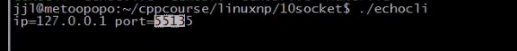
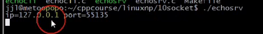
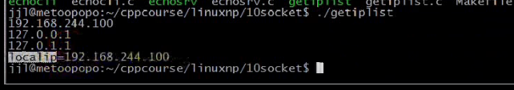

### 文章目录


[TOC]


## 1.read，write与recv，send

- man recv
- read函数可以用于任何io，recv只能用于套接口io
- recv函数比read函数多了个flag，该flag可以指定接收的行为，比较有用的2个选项是：  
  （1）**MSG\_OOB：指定接收带外数据，也就是通过紧急指针发送的数据（tcp头部有个紧急指针）**  
  （2）<font color='red'>**MSG\_PEEK：可以接收缓冲区的数据，但不将数据从缓冲区清除。（偷看缓冲区数据）**  </font>
  <font color='red'>**read则是：若数据从缓冲区读走，那么缓冲区就会被清除**</font>

## 2.用readline实现回射客户/服务器

 -    **readline按行读取\(读取到\\n，也可以解决粘包问题\)，** 借助于recv\_peek来实现
 -    eg：NetworkProgramming-master \(1\)\\LinuxNetworkProgramming\\P10echosrv5.c

```cpp
//
// Created by wangji on 19-8-6.
//

#include <iostream>
#include <stdio.h>
#include <string.h>
#include <unistd.h>
#include <sys/types.h>
#include <sys/socket.h>
#include <netinet/in.h>
#include <arpa/inet.h>


using namespace std;
//消息通过键盘输出，消息之间的边界就是/n，就不需要下面的结构体
// struct packet
// {
//     int len;
//     char buf[1024];
// };

#define ERR_EXIT(m) \
        do  \
        {   \
            perror(m);  \
            exit(EXIT_FAILURE); \
        } while(0);

ssize_t readn(int fd, void *buf, size_t count)
{
    size_t nleft = count;   // 剩余字节数
    ssize_t nread;
    char *bufp = (char*) buf;

    while (nleft > 0)
    {
        nread = read(fd, bufp, nleft);
        if (nread < 0)
        {
            if (errno == EINTR)
            {
                continue;
            }
            return  -1;
        } else if (nread == 0)
        {
            return count - nleft;
        }

        bufp += nread;
        nleft -= nread;
    }
    return count;
}

ssize_t writen(int fd, const void *buf, size_t count)
{
    size_t nleft = count;
    ssize_t nwritten;
    char* bufp = (char*)buf;

    while (nleft > 0)
    {
        if ((nwritten = write(fd, bufp, nleft)) < 0)
        {
            if (errno == EINTR)
            {
                continue;
            }
            return -1;
        }
        else if (nwritten == 0)
        {
            continue;
        }
        bufp += nwritten;
        nleft -= nwritten;
    }
    return count;
}

ssize_t recv_peek(int sockfd, void *buf, size_t len)
{
    while (1)
    {
        // recv有数据就返回，没有数据就阻塞
        //若对方套接口关闭，则返回为0
        //recv只能用于套接口
        int ret = recv(sockfd, buf, len, MSG_PEEK); 
        if (ret == -1 && errno == EINTR)//EINTR表示被信号中断
        {
            continue;
        }
        return ret;
    }
}

//readline只能用于套接口，因为使用了recv_peek函数
ssize_t readline(int sockfd, void *buf, size_t maxline)
{
    int ret;
    int nread;
    char *bufp = (char*)buf;    // 当前指针位置
    int nleft = maxline;//maxline一行最大的字节数，但是读取到\n就可以返回
    while (1)
    {
        ret = recv_peek(sockfd, bufp, nleft);//这里只是偷窥了缓冲区的数据，但是没有移走
        if (ret < 0)
        {
            return ret;
        }
        else if (ret == 0)//ret == 0表示对方关闭套接口
        {
            return ret;
        }
        nread = ret;

        //判断接收缓冲区是否有\n
        int i;
        for (i = 0; i < nread; i++)
        {
            if (bufp[i] == '\n')//若有\n，则将其作为一条消息读走
            {
                ret = readn(sockfd, bufp, i+1);//将数据从缓冲区移除，读取到i，说明有i+1个数据，包括\n
                if (ret != i+1)//接收到的字节数不等于i+1,说明失败
                {
                    exit(EXIT_FAILURE);
                }
                return ret;//返回一条消息
            }
        }
        
        //  若没有\n，说明还不满一条消息，也需要将数据读出来，放到缓冲区bufp

        if (nread > nleft)//从缓冲区读到的字节数要小于剩余字节数，否则有问题
        {
            exit(EXIT_FAILURE);
        }
        nleft -= nread;
        ret = readn(sockfd, bufp, nread);
        if (ret != nread)
        {
            exit(EXIT_FAILURE);
        }
        bufp += nread;//指针偏移，将数据放到屁股后面
    }
    return -1;
}

void echo_srv(int connfd)
{
    char recvbuf[1024];

    int n;
    while (1)
    {
        memset(recvbuf, 0, sizeof recvbuf);
        int ret = readline(connfd, recvbuf, 1024);//按行接收到缓冲区
        if (ret == -1)
        {
            ERR_EXIT("readline");
        }
        if (ret == 0)
        {
            printf("client close\n");
            break;
        }

        fputs(recvbuf, stdout);
        writen(connfd, recvbuf, strlen(recvbuf));
    }

}

int main(int argc, char** argv) {
    // 1. 创建套接字
    int listenfd;
    if ((listenfd = socket(AF_INET, SOCK_STREAM, IPPROTO_TCP)) < 0) {
        ERR_EXIT("socket");
    }

    // 2. 分配套接字地址
    struct sockaddr_in servaddr;
    memset(&servaddr, 0, sizeof servaddr);
    servaddr.sin_family = AF_INET;
    servaddr.sin_port = htons(6666);
    servaddr.sin_addr.s_addr = htonl(INADDR_ANY);
    // servaddr.sin_addr.s_addr = inet_addr("127.0.0.1");
    // inet_aton("127.0.0.1", &servaddr.sin_addr);

    int on = 1;
    // 确保time_wait状态下同一端口仍可使用
    if (setsockopt(listenfd, SOL_SOCKET, SO_REUSEADDR, &on, sizeof on) < 0) {
        ERR_EXIT("setsockopt");
    }

    // 3. 绑定套接字地址
    if (bind(listenfd, (struct sockaddr *) &servaddr, sizeof servaddr) < 0) {
        ERR_EXIT("bind");
    }
    // 4. 等待连接请求状态
    if (listen(listenfd, SOMAXCONN) < 0) {
        ERR_EXIT("listen");
    }
    // 5. 允许连接
    struct sockaddr_in peeraddr;
    socklen_t peerlen = sizeof peeraddr;


    // 6. 数据交换
    pid_t pid;
    while (1) {
        int connfd;
        if ((connfd = accept(listenfd, (struct sockaddr *) &peeraddr, &peerlen)) < 0) {
            ERR_EXIT("accept");
        }

        printf("id = %s, ", inet_ntoa(peeraddr.sin_addr));
        printf("port = %d\n", ntohs(peeraddr.sin_port));

        pid = fork();

        if (pid == -1) {
            ERR_EXIT("fork");
        }
        if (pid == 0)   // 子进程
        {
            close(listenfd);
            echo_srv(connfd);
            //printf("child exit\n");
            exit(EXIT_SUCCESS);
        } else {
            //printf("parent exit\n");
            close(connfd);
        }


    }
    // 7. 断开连接
    close(listenfd);


    return 0;
}
```

 -    eg：NetworkProgramming-master \(1\)\\LinuxNetworkProgramming\\P10echocli5.c

```cpp
//
// Created by wangji on 19-8-6.
//

#include <iostream>
#include <stdio.h>
#include <string.h>
#include <unistd.h>
#include <sys/types.h>
#include <sys/socket.h>
#include <netinet/in.h>
#include <arpa/inet.h>


using namespace std;

struct packet
{
    int len;
    char buf[1024];
};

#define ERR_EXIT(m) \
        do  \
        {   \
            perror(m);  \
            exit(EXIT_FAILURE); \
        } while(0);

ssize_t readn(int fd, void *buf, size_t count)
{
    size_t nleft = count;   // 剩余字节数
    ssize_t nread;
    char *bufp = (char*) buf;

    while (nleft > 0)
    {
        nread = read(fd, bufp, nleft);
        if (nread < 0)
        {
            if (errno == EINTR)
            {
                continue;
            }
            return  -1;
        } else if (nread == 0)
        {
            return count - nleft;
        }

        bufp += nread;
        nleft -= nread;
    }
    return count;
}

ssize_t writen(int fd, const void *buf, size_t count)
{
    size_t nleft = count;
    ssize_t nwritten;
    char* bufp = (char*)buf;

    while (nleft > 0)
    {
        if ((nwritten = write(fd, bufp, nleft)) < 0)
        {
            if (errno == EINTR)
            {
                continue;
            }
            return -1;
        }
        else if (nwritten == 0)
        {
            continue;
        }
        bufp += nwritten;
        nleft -= nwritten;
    }
    return count;
}


ssize_t recv_peek(int sockfd, void *buf, size_t len)
{
    while (1)
    {
        int ret = recv(sockfd, buf, len, MSG_PEEK); // 查看传入消息
        if (ret == -1 && errno == EINTR)
        {
            continue;
        }
        return ret;
    }
}

ssize_t readline(int sockfd, void *buf, size_t maxline)
{
    int ret;
    int nread;
    char *bufp = (char*)buf;    // 当前指针位置
    int nleft = maxline;
    while (1)
    {
        ret = recv_peek(sockfd, buf, nleft);
        if (ret < 0)
        {
            return ret;
        }
        else if (ret == 0)
        {
            return ret;
        }
        nread = ret;
        int i;
        for (i = 0; i < nread; i++)
        {
            if (bufp[i] == '\n')
            {
                ret = readn(sockfd, bufp, i+1);
                if (ret != i+1)
                {
                    exit(EXIT_FAILURE);
                }
                return ret;
            }
        }
        if (nread > nleft)
        {
            exit(EXIT_FAILURE);
        }
        nleft -= nread;
        ret = readn(sockfd, bufp, nread);
        if (ret != nread)
        {
            exit(EXIT_FAILURE);
        }
        bufp += nread;
    }
    return -1;
}

int main(int argc, char** argv) {
    // 1. 创建套接字
    int sockfd;
    if ((sockfd = socket(AF_INET, SOCK_STREAM, IPPROTO_TCP)) < 0) {
        ERR_EXIT("socket");
    }

    // 2. 分配套接字地址
    struct sockaddr_in servaddr;
    memset(&servaddr, 0, sizeof servaddr);
    servaddr.sin_family = AF_INET;
    servaddr.sin_port = htons(6666);
    // servaddr.sin_addr.s_addr = htonl(INADDR_ANY);
    servaddr.sin_addr.s_addr = inet_addr("127.0.0.1");
    // inet_aton("127.0.0.1", &servaddr.sin_addr);

    // 3. 请求链接
    if (connect(sockfd, (struct sockaddr *) &servaddr, sizeof servaddr) < 0) {
        ERR_EXIT("connect");
    }

    struct sockaddr_in localaddr;//本地地址
    socklen_t addrlen = sizeof(localaddr);//要有初始值，和accept是一样的

    //已连接的套接口sockfd，既有本地地址，又有对等方的地址
    if (getsockname(sockfd, (struct sockaddr*)&localaddr, &addrlen) < 0)
    {
        ERR_EXIT("getsockname");
    }
    printf("id = %s, ", inet_ntoa(localaddr.sin_addr));
    printf("port = %d\n", ntohs(localaddr.sin_port));

    // 4. 数据交换
    char recvbuf[1024]= [0];
    char sendbuf[1024]= [0];
    // struct packet recvbuf;
    // struct packet sendbuf;
    memset(recvbuf, 0, sizeof recvbuf);
    memset(sendbuf, 0, sizeof sendbuf);
    int n = 0;
    while (fgets(sendbuf, sizeof(sendbuf), stdin) != NULL)   // 键盘输入获取,默认带\n
    {
        writen(sockfd, sendbuf, strlen(sendbuf)); // 写入服务器

        int ret = readline(sockfd, recvbuf, sizeof(recvbuf));    // 服务器读取
        if (ret == -1)
        {
            ERR_EXIT("readline");
        }
        if (ret == 0)
        {
            printf("server close\n");
            break;
        }

        fputs(recvbuf, stdout); // 服务器返回数据输出

        // 清空
        memset(recvbuf, 0, sizeof(recvbuf));
        memset(sendbuf, 0, sizeof(sendbuf));
    }

    // 5. 断开连接
    close(sockfd);


    return 0;
}
```

 -    eg：NetworkProgramming-master \(1\)\\LinuxNetworkProgramming\\P10echocli5.c

```cpp
//
// Created by wangji on 19-8-6.
//

#include <iostream>
#include <stdio.h>
#include <string.h>
#include <unistd.h>
#include <sys/types.h>
#include <sys/socket.h>
#include <netinet/in.h>
#include <arpa/inet.h>


using namespace std;

struct packet
{
    int len;
    char buf[1024];
};

#define ERR_EXIT(m) \
        do  \
        {   \
            perror(m);  \
            exit(EXIT_FAILURE); \
        } while(0);

ssize_t readn(int fd, void *buf, size_t count)
{
    size_t nleft = count;   // 剩余字节数
    ssize_t nread;
    char *bufp = (char*) buf;

    while (nleft > 0)
    {
        nread = read(fd, bufp, nleft);
        if (nread < 0)
        {
            if (errno == EINTR)
            {
                continue;
            }
            return  -1;
        } else if (nread == 0)
        {
            return count - nleft;
        }

        bufp += nread;
        nleft -= nread;
    }
    return count;
}

ssize_t writen(int fd, const void *buf, size_t count)
{
    size_t nleft = count;
    ssize_t nwritten;
    char* bufp = (char*)buf;

    while (nleft > 0)
    {
        if ((nwritten = write(fd, bufp, nleft)) < 0)
        {
            if (errno == EINTR)
            {
                continue;
            }
            return -1;
        }
        else if (nwritten == 0)
        {
            continue;
        }
        bufp += nwritten;
        nleft -= nwritten;
    }
    return count;
}


ssize_t recv_peek(int sockfd, void *buf, size_t len)
{
    while (1)
    {
        int ret = recv(sockfd, buf, len, MSG_PEEK); // 查看传入消息
        if (ret == -1 && errno == EINTR)
        {
            continue;
        }
        return ret;
    }
}

ssize_t readline(int sockfd, void *buf, size_t maxline)
{
    int ret;
    int nread;
    char *bufp = (char*)buf;    // 当前指针位置
    int nleft = maxline;
    while (1)
    {
        ret = recv_peek(sockfd, buf, nleft);
        if (ret < 0)
        {
            return ret;
        }
        else if (ret == 0)
        {
            return ret;
        }
        nread = ret;
        int i;
        for (i = 0; i < nread; i++)
        {
            if (bufp[i] == '\n')
            {
                ret = readn(sockfd, bufp, i+1);
                if (ret != i+1)
                {
                    exit(EXIT_FAILURE);
                }
                return ret;
            }
        }
        if (nread > nleft)
        {
            exit(EXIT_FAILURE);
        }
        nleft -= nread;
        ret = readn(sockfd, bufp, nread);
        if (ret != nread)
        {
            exit(EXIT_FAILURE);
        }
        bufp += nread;
    }
    return -1;
}

int main(int argc, char** argv) {
    // 1. 创建套接字
    int sockfd;
    if ((sockfd = socket(AF_INET, SOCK_STREAM, IPPROTO_TCP)) < 0) {
        ERR_EXIT("socket");
    }

    // 2. 分配套接字地址
    struct sockaddr_in servaddr;
    memset(&servaddr, 0, sizeof servaddr);
    servaddr.sin_family = AF_INET;
    servaddr.sin_port = htons(6666);
    // servaddr.sin_addr.s_addr = htonl(INADDR_ANY);
    servaddr.sin_addr.s_addr = inet_addr("127.0.0.1");
    // inet_aton("127.0.0.1", &servaddr.sin_addr);

    // 3. 请求链接
    if (connect(sockfd, (struct sockaddr *) &servaddr, sizeof servaddr) < 0) {
        ERR_EXIT("connect");
    }

    struct sockaddr_in localaddr;//本地地址
    socklen_t addrlen = sizeof(localaddr);//要有初始值，和accept是一样的

    //已连接的套接口sockfd，既有本地地址，又有对等方的地址
    if (getsockname(sockfd, (struct sockaddr*)&localaddr, &addrlen) < 0)
    {
        ERR_EXIT("getsockname");
    }
    printf("id = %s, ", inet_ntoa(localaddr.sin_addr));
    printf("port = %d\n", ntohs(localaddr.sin_port));

    // 4. 数据交换
    char recvbuf[1024]= [0];
    char sendbuf[1024]= [0];
    // struct packet recvbuf;
    // struct packet sendbuf;
    memset(recvbuf, 0, sizeof recvbuf);
    memset(sendbuf, 0, sizeof sendbuf);
    int n = 0;
    while (fgets(sendbuf, sizeof(sendbuf), stdin) != NULL)   // 键盘输入获取,默认带/n
    {
        writen(sockfd, sendbuf, strlen(sendbuf)); // 写入服务器

        int ret = readline(sockfd, recvbuf, sizeof(recvbuf));    // 服务器读取
        if (ret == -1)
        {
            ERR_EXIT("readline");
        }
        if (ret == 0)
        {
            printf("server close\n");
            break;
        }

        fputs(recvbuf, stdout); // 服务器返回数据输出

        // 清空
        memset(recvbuf, 0, sizeof(recvbuf));
        memset(sendbuf, 0, sizeof(sendbuf));
    }

    // 5. 断开连接
    close(sockfd);


    return 0;
}
```

## 3.getsockname，getpeername

- 前提是：该套接口必须是成功连接的套接口，对于客户端而言，是通过connect成功连接的套接口，或者accept成功的套接口connfd，才可以调用这俩函数；  
  此外，accept\(listenfd,NULL,NULL\)后面2个参数必须都是空指针，要么都不是空指针，才可以使用getpeername获取对等方的地址
- getsockname：获取本地套接口的地址
- getpeername：获取套接口所关联的对等方的地址
- 代码在上面
- 测试：  
    
  

## 4.gethostname，gethostbyname，gethostbyaddr

 -    gethostname：获取主机名
 -    gethostbyname:通过主机名，获取主机上所有的ip地址\(**该ip来自/etc/hosts文件内容，所以并不能获取所有ip，获取所有ip的方式见[链接](https://blog.csdn.net/swartz_lubel/article/details/50414354)**\)
 -    gethostbyaddr\(了解\)：通过一个给定的地址结构，可以获取本机的所有地址，保存到结构体指针中
 -    eg：NetworkProgramming-master \(1\)\\LinuxNetworkProgramming\\P10gethostbyname\_test.c

```cpp
//
// Created by wangji on 19-8-6.
//

#include <iostream>
#include <stdio.h>
#include <string.h>
#include <unistd.h>
#include <sys/types.h>
#include <sys/socket.h>
#include <netinet/in.h>
#include <arpa/inet.h>
#include <netdb.h>

#define ERR_EXIT(m) \
        do \
        { \
            perror(m); \
            exit(EXIT_FAILURE); \
        } while (0);

int getlocalip(char *ip)
{
    char host[100] = {0};
    if (gethostname(host, sizeof host) < 0)
    {
        ERR_EXIT("gethostname");
    }

    struct hostent *hp;
    if ((hp = gethostbyname(host)) == NULL)
    {
        ERR_EXIT("gethostbyname");
    }
    strcpy(ip, inet_ntoa(*(struct in_addr*)hp->h_addr_list[0]));//获取第一条ip
    //等价于strcpy(ip, inet_ntoa(*(struct in_addr*)hp->h_addr)); man gethostbyname可以看到#define h_addr h_addr_list[0]


    return 0;
}

int main(void)
{
   char host[100] = {0};
   if (gethostname(host, sizeof host) < 0)
   {
       ERR_EXIT("gethostname");
   }

   struct hostent *hp;
   if ((hp = gethostbyname(host)) == NULL)
   {
       ERR_EXIT("gethostbyname");
   }
   int i = 0;//若不初始化，会出现段错误
   while (hp->h_addr_list[i] != NULL)//hp->h_addr_list[i] 是char*的，是ip地址的一种结构，不是点分十进制的
   {
           // 先强转为struct in_addr*，解析取个*，就可以得到struct in_addr地址结构
       printf("%s\n", inet_ntoa(*(struct in_addr*)hp->h_addr_list[i]));//这里转换成点分十进制
       ++i;
   }

    char ip[16] = {0};
    getlocalip(ip);
    printf("localip = %s\n", ip);

    return 0;
}

```

- 测试结果：  
  
  - Makefile文件

```cpp
.PHONY:clean all
CC=gcc
CFLAGS=-Wall -g
BIN=echosrv echocli getip
all:$(BIN)
%.o:%.c
	$(CC) $(CFLAGS) -c $< -o $@
clean:
	rm -f *.o $(BIN)
```