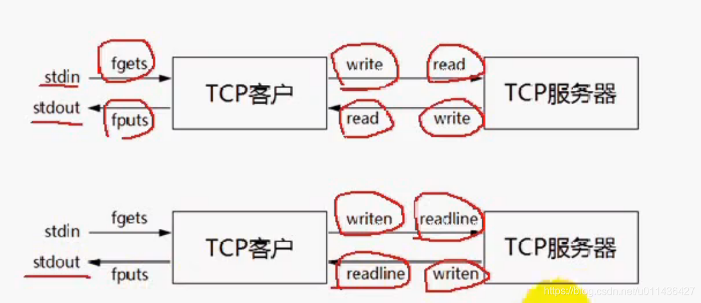
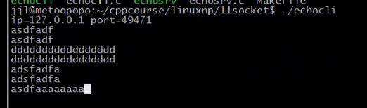
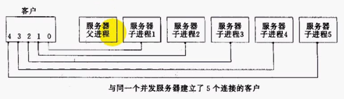
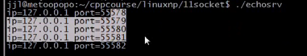
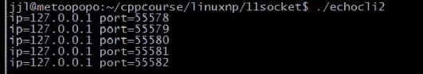
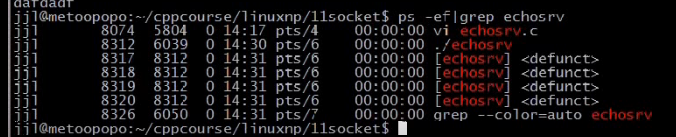
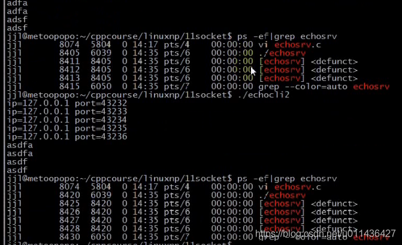
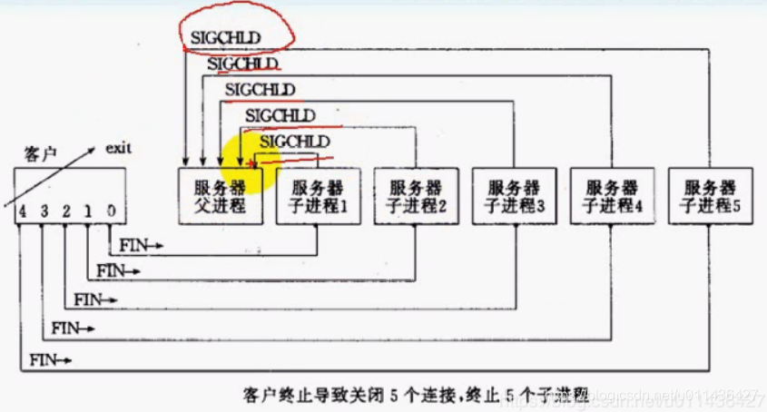
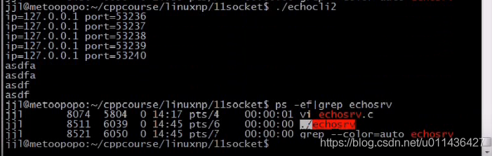

### 文章目录


[TOC]


## 1.TCP回射客户/服务器

- TCP客户/服务器程序  
  （1）TCP是基于流的，消息与消息之间是没有边界的，我们不能假定一次读操作就返回了整个消息。  
  **所以可以用\\n来区分消息之间的边界**，**每一行都有一个\\n字符**，所以就封装了readline方法来按行读取。

- **发送不能保证一次调用write方法就将** tcp应用层的所有缓冲区拷贝至套接口缓冲区，所以封装了writen方法了，进行了更可靠的发送  
  

  - eg：NetworkProgramming-master \(1\)\\LinuxNetworkProgramming\\P11echo\_srv.c

```cpp
//
// Created by wangji on 19-8-6.
//

#include <iostream>
#include <stdio.h>
#include <string.h>
#include <unistd.h>
#include <sys/types.h>
#include <sys/socket.h>
#include <netinet/in.h>
#include <arpa/inet.h>
#include <signal.h>

#include <sys/wait.h>

using namespace std;
//消息通过键盘输出，消息之间的边界就是\n，就不需要下面的结构体
// struct packet
// {
//     int len;
//     char buf[1024];
// };

#define ERR_EXIT(m) \
        do  \
        {   \
            perror(m);  \
            exit(EXIT_FAILURE); \
        } while(0);

ssize_t readn(int fd, void *buf, size_t count)
{
    size_t nleft = count;   // 剩余字节数
    ssize_t nread;
    char *bufp = (char*) buf;

    while (nleft > 0)
    {
        nread = read(fd, bufp, nleft);
        if (nread < 0)
        {
            if (errno == EINTR)
            {
                continue;
            }
            return  -1;
        } else if (nread == 0)
        {
            return count - nleft;
        }

        bufp += nread;
        nleft -= nread;
    }
    return count;
}

ssize_t writen(int fd, const void *buf, size_t count)
{
    size_t nleft = count;
    ssize_t nwritten;
    char* bufp = (char*)buf;

    while (nleft > 0)
    {
        if ((nwritten = write(fd, bufp, nleft)) < 0)
        {
            if (errno == EINTR)
            {
                continue;
            }
            return -1;
        }
        else if (nwritten == 0)
        {
            continue;
        }
        bufp += nwritten;
        nleft -= nwritten;
    }
    return count;
}

ssize_t recv_peek(int sockfd, void *buf, size_t len)
{
    while (1)
    {
        // recv有数据就返回，没有数据就阻塞
        //若对方套接口关闭，则返回为0
        //recv只能用于套接口
        int ret = recv(sockfd, buf, len, MSG_PEEK); 
        if (ret == -1 && errno == EINTR)//EINTR表示被信号中断
        {
            continue;
        }
        return ret;
    }
}

//readline只能用于套接口，因为使用了recv_peek函数
ssize_t readline(int sockfd, void *buf, size_t maxline)
{
    int ret;
    int nread;
    char *bufp = (char*)buf;    // 当前指针位置
    int nleft = maxline;//maxline一行最大的字节数，但是读取到\n就可以返回
    while (1)
    {
        ret = recv_peek(sockfd, bufp, nleft);//这里只是偷窥了缓冲区的数据，但是没有移走
        if (ret < 0)
        {
            return ret;
        }
        else if (ret == 0)//ret == 0表示对方关闭套接口
        {
            return ret;
        }
        nread = ret;

        //判断接收缓冲区是否有\n
        int i;
        for (i = 0; i < nread; i++)
        {
            if (bufp[i] == '\n')//若有\n，则将其作为一条消息读走
            {
                ret = readn(sockfd, bufp, i+1);//将数据从缓冲区移除，读取到i，说明有i+1个数据，包括\n
                if (ret != i+1)//接收到的字节数不等于i+1,说明失败
                {
                    exit(EXIT_FAILURE);
                }
                return ret;//返回一条消息
            }
        }
        
        //  若没有\n，说明还不满一条消息，也需要将数据读出来，放到缓冲区bufp

        if (nread > nleft)//从缓冲区读到的字节数要小于剩余字节数，否则有问题
        {
            exit(EXIT_FAILURE);
        }
        nleft -= nread;
        ret = readn(sockfd, bufp, nread);
        if (ret != nread)
        {
            exit(EXIT_FAILURE);
        }
        bufp += nread;//指针偏移，将数据放到屁股后面
    }
    return -1;
}

void echo_srv(int connfd)
{
    char recvbuf[1024];

    int n;
    while (1)
    {
        memset(recvbuf, 0, sizeof recvbuf);
        int ret = readline(connfd, recvbuf, 1024);//按行接收到缓冲区
        if (ret == -1)
        {
            ERR_EXIT("readline");
        }
        if (ret == 0)
        {
            printf("client close\n");
            break;
        }

        fputs(recvbuf, stdout);
        writen(connfd, recvbuf, strlen(recvbuf));
    }

}

// void handle_sigchld(int sig)
// {
//     // wait(NULL);//捕获子进程的退出状态。man 2 wait，NULL：这里退出状态不关心
//     // waitpid(-1, NULL, WNOHANG);//可以等待所有子进程,WNOHANG表示不挂起

//     //轮询子进程的退出状态
//     while (waitpid(-1, NULL, WNOHANG) > 0 )//将所有子进程的退出状态进行返回, >0表示等待到了一个子进程
//         ;//由于指定WNOHANG，则没有子进程退出则返回-1，退出while
// }


int main(int argc, char** argv) {

    // signal(SIGCHLD , SIG_IGN);//SIGCHLD可以忽略僵尸进程，不建议采用
    // signal(SIGCHLD, handle_sigchld);

    // 1. 创建套接字
    int listenfd;
    if ((listenfd = socket(AF_INET, SOCK_STREAM, IPPROTO_TCP)) < 0) {
        ERR_EXIT("socket");
    }

    // 2. 分配套接字地址
    struct sockaddr_in servaddr;
    memset(&servaddr, 0, sizeof servaddr);
    servaddr.sin_family = AF_INET;
    servaddr.sin_port = htons(6666);
    servaddr.sin_addr.s_addr = htonl(INADDR_ANY);
    // servaddr.sin_addr.s_addr = inet_addr("127.0.0.1");
    // inet_aton("127.0.0.1", &servaddr.sin_addr);

    int on = 1;
    // 确保time_wait状态下同一端口仍可使用
    if (setsockopt(listenfd, SOL_SOCKET, SO_REUSEADDR, &on, sizeof on) < 0) {
        ERR_EXIT("setsockopt");
    }

    // 3. 绑定套接字地址
    if (bind(listenfd, (struct sockaddr *) &servaddr, sizeof servaddr) < 0) {
        ERR_EXIT("bind");
    }
    // 4. 等待连接请求状态
    if (listen(listenfd, SOMAXCONN) < 0) {
        ERR_EXIT("listen");
    }
    // 5. 允许连接
    struct sockaddr_in peeraddr;
    socklen_t peerlen = sizeof peeraddr;


    // 6. 数据交换
    pid_t pid;
    while (1) {
        int connfd;
        if ((connfd = accept(listenfd, (struct sockaddr *) &peeraddr, &peerlen)) < 0) {
            ERR_EXIT("accept");
        }

        printf("id = %s, ", inet_ntoa(peeraddr.sin_addr));
        printf("port = %d\n", ntohs(peeraddr.sin_port));

        pid = fork();

        if (pid == -1) {
            ERR_EXIT("fork");
        }
        if (pid == 0)   // 子进程
        {
            close(listenfd);
            echo_srv(connfd);
            //printf("child exit\n");
            exit(EXIT_SUCCESS);
        } else {
            //printf("parent exit\n");
            close(connfd);
        }


    }
    // 7. 断开连接
    close(listenfd);


    return 0;
}
```

 -    NetworkProgramming-master \(1\)\\LinuxNetworkProgramming\\P11echo\_cli.c

```cpp
//
// Created by wangji on 19-8-6.
//

#include <iostream>
#include <stdio.h>
#include <string.h>
#include <unistd.h>
#include <sys/types.h>
#include <sys/socket.h>
#include <netinet/in.h>
#include <arpa/inet.h>


using namespace std;

struct packet
{
    int len;
    char buf[1024];
};

#define ERR_EXIT(m) \
        do  \
        {   \
            perror(m);  \
            exit(EXIT_FAILURE); \
        } while(0);

ssize_t readn(int fd, void *buf, size_t count)
{
    size_t nleft = count;   // 剩余字节数
    ssize_t nread;
    char *bufp = (char*) buf;

    while (nleft > 0)
    {
        nread = read(fd, bufp, nleft);
        if (nread < 0)
        {
            if (errno == EINTR)
            {
                continue;
            }
            return  -1;
        } else if (nread == 0)
        {
            return count - nleft;
        }

        bufp += nread;
        nleft -= nread;
    }
    return count;
}

ssize_t writen(int fd, const void *buf, size_t count)
{
    size_t nleft = count;
    ssize_t nwritten;
    char* bufp = (char*)buf;

    while (nleft > 0)
    {
        if ((nwritten = write(fd, bufp, nleft)) < 0)
        {
            if (errno == EINTR)
            {
                continue;
            }
            return -1;
        }
        else if (nwritten == 0)
        {
            continue;
        }
        bufp += nwritten;
        nleft -= nwritten;
    }
    return count;
}


ssize_t recv_peek(int sockfd, void *buf, size_t len)
{
    while (1)
    {
        int ret = recv(sockfd, buf, len, MSG_PEEK); // 查看传入消息
        if (ret == -1 && errno == EINTR)
        {
            continue;
        }
        return ret;
    }
}

ssize_t readline(int sockfd, void *buf, size_t maxline)
{
    int ret;
    int nread;
    char *bufp = (char*)buf;    // 当前指针位置
    int nleft = maxline;
    while (1)
    {
        ret = recv_peek(sockfd, buf, nleft);
        if (ret < 0)
        {
            return ret;
        }
        else if (ret == 0)
        {
            return ret;
        }
        nread = ret;
        int i;
        for (i = 0; i < nread; i++)
        {
            if (bufp[i] == '\n')
            {
                ret = readn(sockfd, bufp, i+1);
                if (ret != i+1)
                {
                    exit(EXIT_FAILURE);
                }
                return ret;
            }
        }
        if (nread > nleft)
        {
            exit(EXIT_FAILURE);
        }
        nleft -= nread;
        ret = readn(sockfd, bufp, nread);
        if (ret != nread)
        {
            exit(EXIT_FAILURE);
        }
        bufp += nread;
    }
    return -1;
}

void echo_cli(int sock)
{
    char recvbuf[1024]= [0];
    char sendbuf[1024]= [0];
    // struct packet recvbuf;
    // struct packet sendbuf;
    memset(recvbuf, 0, sizeof recvbuf);
    memset(sendbuf, 0, sizeof sendbuf);
    int n = 0;
    while (fgets(sendbuf, sizeof(sendbuf), stdin) != NULL)   // 键盘输入获取,默认带\n
    {
        writen(sockfd, sendbuf, strlen(sendbuf)); // 写入服务器

        int ret = readline(sockfd, recvbuf, sizeof(recvbuf));    // 服务器读取
        if (ret == -1)
        {
            ERR_EXIT("readline");
        }
        if (ret == 0)
        {
            printf("server close\n");
            break;
        }

        fputs(recvbuf, stdout); // 服务器返回数据输出

        // 清空
        memset(recvbuf, 0, sizeof(recvbuf));
        memset(sendbuf, 0, sizeof(sendbuf));
    }
}

int main(int argc, char** argv) {
    // 1. 创建套接字
    int sockfd;
    if ((sockfd = socket(AF_INET, SOCK_STREAM, IPPROTO_TCP)) < 0) {
        ERR_EXIT("socket");
    }

    // 2. 分配套接字地址
    struct sockaddr_in servaddr;
    memset(&servaddr, 0, sizeof servaddr);
    servaddr.sin_family = AF_INET;
    servaddr.sin_port = htons(6666);
    // servaddr.sin_addr.s_addr = htonl(INADDR_ANY);
    servaddr.sin_addr.s_addr = inet_addr("127.0.0.1");
    // inet_aton("127.0.0.1", &servaddr.sin_addr);

    // 3. 请求链接
    if (connect(sockfd, (struct sockaddr *) &servaddr, sizeof servaddr) < 0) {
        ERR_EXIT("connect");
    }

    struct sockaddr_in localaddr;//本地地址
    socklen_t addrlen = sizeof(localaddr);//要有初始值，和accept是一样的

    //已连接的套接口sockfd，既有本地地址，又有对等方的地址
    if (getsockname(sockfd, (struct sockaddr*)&localaddr, &addrlen) < 0)
    {
        ERR_EXIT("getsockname");
    }
    printf("id = %s, ", inet_ntoa(localaddr.sin_addr));
    printf("port = %d\n", ntohs(localaddr.sin_port));

    // 4. 数据交换
    echo_cli(sockfd);

    // 5. 断开连接
    close(sockfd);


    return 0;
}
```

- 测试：  
  

## 2.TCP是个流协议

- TCP是基于字节流传输的，只维护发送出去多少，确认了多少，没有维护消息与消息之间的边界，**因而可能导致粘包问题**
- 粘包问题解决方案是在应用层维护消息边界

## 3.僵进程与SIGCHLD信号

 -    （1）方法1，**不建议采用**

```cpp
signal(SIGCHLD , SIG_IGN);
忽略SIGCHLD信号；
```

 -    （2）方法2：

```cpp
signal(SIGCHLD, handle_sigchld);
捕捉SIGCHLD信号，来避免僵尸进程
```

 -    方法1的eg：NetworkProgramming-master \(1\)\\LinuxNetworkProgramming\\P11echo\_srv.c

```cpp
//
// Created by wangji on 19-8-6.
//

#include <iostream>
#include <stdio.h>
#include <string.h>
#include <unistd.h>
#include <sys/types.h>
#include <sys/socket.h>
#include <netinet/in.h>
#include <arpa/inet.h>
#include <signal.h>

#include <sys/wait.h>

using namespace std;
//消息通过键盘输出，消息之间的边界就是\n，就不需要下面的结构体
// struct packet
// {
//     int len;
//     char buf[1024];
// };

#define ERR_EXIT(m) \
        do  \
        {   \
            perror(m);  \
            exit(EXIT_FAILURE); \
        } while(0);

ssize_t readn(int fd, void *buf, size_t count)
{
    size_t nleft = count;   // 剩余字节数
    ssize_t nread;
    char *bufp = (char*) buf;

    while (nleft > 0)
    {
        nread = read(fd, bufp, nleft);
        if (nread < 0)
        {
            if (errno == EINTR)
            {
                continue;
            }
            return  -1;
        } else if (nread == 0)
        {
            return count - nleft;
        }

        bufp += nread;
        nleft -= nread;
    }
    return count;
}

ssize_t writen(int fd, const void *buf, size_t count)
{
    size_t nleft = count;
    ssize_t nwritten;
    char* bufp = (char*)buf;

    while (nleft > 0)
    {
        if ((nwritten = write(fd, bufp, nleft)) < 0)
        {
            if (errno == EINTR)
            {
                continue;
            }
            return -1;
        }
        else if (nwritten == 0)
        {
            continue;
        }
        bufp += nwritten;
        nleft -= nwritten;
    }
    return count;
}

ssize_t recv_peek(int sockfd, void *buf, size_t len)
{
    while (1)
    {
        // recv有数据就返回，没有数据就阻塞
        //若对方套接口关闭，则返回为0
        //recv只能用于套接口
        int ret = recv(sockfd, buf, len, MSG_PEEK); 
        if (ret == -1 && errno == EINTR)//EINTR表示被信号中断
        {
            continue;
        }
        return ret;
    }
}

//readline只能用于套接口，因为使用了recv_peek函数
ssize_t readline(int sockfd, void *buf, size_t maxline)
{
    int ret;
    int nread;
    char *bufp = (char*)buf;    // 当前指针位置
    int nleft = maxline;//maxline一行最大的字节数，但是读取到\n就可以返回
    while (1)
    {
        ret = recv_peek(sockfd, bufp, nleft);//这里只是偷窥了缓冲区的数据，但是没有移走
        if (ret < 0)
        {
            return ret;
        }
        else if (ret == 0)//ret == 0表示对方关闭套接口
        {
            return ret;
        }
        nread = ret;

        //判断接收缓冲区是否有\n
        int i;
        for (i = 0; i < nread; i++)
        {
            if (bufp[i] == '\n')//若有\n，则将其作为一条消息读走
            {
                ret = readn(sockfd, bufp, i+1);//将数据从缓冲区移除，读取到i，说明有i+1个数据，包括\n
                if (ret != i+1)//接收到的字节数不等于i+1,说明失败
                {
                    exit(EXIT_FAILURE);
                }
                return ret;//返回一条消息
            }
        }
        
        //  若没有\n，说明还不满一条消息，也需要将数据读出来，放到缓冲区bufp

        if (nread > nleft)//从缓冲区读到的字节数要小于剩余字节数，否则有问题
        {
            exit(EXIT_FAILURE);
        }
        nleft -= nread;
        ret = readn(sockfd, bufp, nread);
        if (ret != nread)
        {
            exit(EXIT_FAILURE);
        }
        bufp += nread;//指针偏移，将数据放到屁股后面
    }
    return -1;
}

void echo_srv(int connfd)
{
    char recvbuf[1024];

    int n;
    while (1)
    {
        memset(recvbuf, 0, sizeof recvbuf);
        int ret = readline(connfd, recvbuf, 1024);//按行接收到缓冲区
        if (ret == -1)
        {
            ERR_EXIT("readline");
        }
        if (ret == 0)
        {
            printf("client close\n");
            break;
        }

        fputs(recvbuf, stdout);
        writen(connfd, recvbuf, strlen(recvbuf));
    }

}

void handle_sigchld(int sig)
{
    wait(NULL);//捕获子进程的退出状态。man 2 wait，NULL：这里退出状态不关心
    // waitpid(-1, NULL, WNOHANG);//可以等待所有子进程,WNOHANG表示不挂起

    //轮询子进程的退出状态
    // while (waitpid(-1, NULL, WNOHANG) > 0 )//将所有子进程的退出状态进行返回, >0表示等待到了一个子进程
        ;//由于指定WNOHANG，则没有子进程退出则返回-1，退出while
}


int main(int argc, char** argv) {

    signal(SIGCHLD , SIG_IGN);//SIGCHLD可以忽略僵尸进程，不建议采用
    // signal(SIGCHLD, handle_sigchld);

    // 1. 创建套接字
    int listenfd;
    if ((listenfd = socket(AF_INET, SOCK_STREAM, IPPROTO_TCP)) < 0) {
        ERR_EXIT("socket");
    }

    // 2. 分配套接字地址
    struct sockaddr_in servaddr;
    memset(&servaddr, 0, sizeof servaddr);
    servaddr.sin_family = AF_INET;
    servaddr.sin_port = htons(6666);
    servaddr.sin_addr.s_addr = htonl(INADDR_ANY);
    // servaddr.sin_addr.s_addr = inet_addr("127.0.0.1");
    // inet_aton("127.0.0.1", &servaddr.sin_addr);

    int on = 1;
    // 确保time_wait状态下同一端口仍可使用
    if (setsockopt(listenfd, SOL_SOCKET, SO_REUSEADDR, &on, sizeof on) < 0) {
        ERR_EXIT("setsockopt");
    }

    // 3. 绑定套接字地址
    if (bind(listenfd, (struct sockaddr *) &servaddr, sizeof servaddr) < 0) {
        ERR_EXIT("bind");
    }
    // 4. 等待连接请求状态
    if (listen(listenfd, SOMAXCONN) < 0) {
        ERR_EXIT("listen");
    }
    // 5. 允许连接
    struct sockaddr_in peeraddr;
    socklen_t peerlen = sizeof peeraddr;


    // 6. 数据交换
    pid_t pid;
    while (1) {
        int connfd;
        if ((connfd = accept(listenfd, (struct sockaddr *) &peeraddr, &peerlen)) < 0) {
            ERR_EXIT("accept");
        }

        printf("id = %s, ", inet_ntoa(peeraddr.sin_addr));
        printf("port = %d\n", ntohs(peeraddr.sin_port));

        pid = fork();

        if (pid == -1) {
            ERR_EXIT("fork");
        }
        if (pid == 0)   // 子进程
        {
            close(listenfd);
            echo_srv(connfd);
            //printf("child exit\n");
            exit(EXIT_SUCCESS);
        } else {
            //printf("parent exit\n");
            close(connfd);
        }


    }
    // 7. 断开连接
    close(listenfd);


    return 0;
}
```

- 客户端代码同：NetworkProgramming-master \(1\)\\LinuxNetworkProgramming\\P11echo\_cli.c

- 测试：**将客户端关闭，服务端就没有僵尸进程了**  
  

- 若服务端的多个子进程同时退出，则wait仅仅等待第一个子进程退出就返回了，**此时需要waitpid**  
  有5个客户端连接服务器，同时退出的情况  
  5个客户端的并发连接如下：  
  

  - eg：5个客户端的代码：NetworkProgramming-master \(1\)\\LinuxNetworkProgramming\\P11echocli5.cpp

```cpp
//
// Created by wangji on 19-8-6.
//

#include <iostream>
#include <stdio.h>
#include <string.h>
#include <unistd.h>
#include <sys/types.h>
#include <sys/socket.h>
#include <netinet/in.h>
#include <arpa/inet.h>
#include <signal.h>
#include <sys/wait.h>


using namespace std;

struct packet
{
    int len;
    char buf[1024];
};

#define ERR_EXIT(m) \
        do  \
        {   \
            perror(m);  \
            exit(EXIT_FAILURE); \
        } while(0);

ssize_t readn(int fd, void *buf, size_t count)
{
    size_t nleft = count;   // 剩余字节数
    ssize_t nread;
    char *bufp = (char*) buf;

    while (nleft > 0)
    {
        nread = read(fd, bufp, nleft);
        if (nread < 0)
        {
            if (errno == EINTR)
            {
                continue;
            }
            return  -1;
        } else if (nread == 0)
        {
            return count - nleft;
        }

        bufp += nread;
        nleft -= nread;
    }
    return count;
}

ssize_t writen(int fd, const void *buf, size_t count)
{
    size_t nleft = count;
    ssize_t nwritten;
    char* bufp = (char*)buf;

    while (nleft > 0)
    {
        if ((nwritten = write(fd, bufp, nleft)) < 0)
        {
            if (errno == EINTR)
            {
                continue;
            }
            return -1;
        }
        else if (nwritten == 0)
        {
            continue;
        }
        bufp += nwritten;
        nleft -= nwritten;
    }
    return count;
}


ssize_t recv_peek(int sockfd, void *buf, size_t len)
{
    while (1)
    {
        int ret = recv(sockfd, buf, len, MSG_PEEK); // 查看传入消息
        if (ret == -1 && errno == EINTR)
        {
            continue;
        }
        return ret;
    }
}

ssize_t readline(int sockfd, void *buf, size_t maxline)
{
    int ret;
    int nread;
    char *bufp = (char*)buf;    // 当前指针位置
    int nleft = maxline;
    while (1)
    {
        ret = recv_peek(sockfd, buf, nleft);
        if (ret < 0)
        {
            return ret;
        }
        else if (ret == 0)
        {
            return ret;
        }
        nread = ret;
        int i;
        for (i = 0; i < nread; i++)
        {
            if (bufp[i] == '\n')
            {
                ret = readn(sockfd, bufp, i+1);
                if (ret != i+1)
                {
                    exit(EXIT_FAILURE);
                }
                return ret;
            }
        }
        if (nread > nleft)
        {
            exit(EXIT_FAILURE);
        }
        nleft -= nread;
        ret = readn(sockfd, bufp, nread);
        if (ret != nread)
        {
            exit(EXIT_FAILURE);
        }
        bufp += nread;
    }
    return -1;
}

void ehco_cli(int sockfd)
{
    char recvbuf[1024];
    char sendbuf[1024];
    // struct packet recvbuf;
    // struct packet sendbuf;
    memset(recvbuf, 0, sizeof recvbuf);
    memset(sendbuf, 0, sizeof sendbuf);
    int n = 0;
    while (fgets(sendbuf, sizeof sendbuf, stdin) != NULL)   // 键盘输入获取
    {
        writen(sockfd, sendbuf, strlen(sendbuf)); // 写入服务器

        int ret = readline(sockfd, recvbuf, sizeof recvbuf);    // 服务器读取
        if (ret == -1)
        {
            ERR_EXIT("readline");
        }
        if (ret == 0)
        {
            printf("server close\n");
            break;
        }

        fputs(recvbuf, stdout); // 服务器返回数据输出

        // 清空
        memset(recvbuf, 0, sizeof recvbuf);
        memset(sendbuf, 0, sizeof sendbuf);
    }
}

int main(int argc, char** argv) {
    // 1. 创建套接字
    int sockfd[5];
    int i;
    for (i = 0; i < 5; ++i)
    {
        if ((sockfd[i] = socket(AF_INET, SOCK_STREAM, IPPROTO_TCP)) < 0) {
            ERR_EXIT("socket");
        }

        // 2. 分配套接字地址
        struct sockaddr_in servaddr;
        memset(&servaddr, 0, sizeof servaddr);
        servaddr.sin_family = AF_INET;
        servaddr.sin_port = htons(6666);
        // servaddr.sin_addr.s_addr = htonl(INADDR_ANY);
        servaddr.sin_addr.s_addr = inet_addr("127.0.0.1");
        // inet_aton("127.0.0.1", &servaddr.sin_addr);

        // 3. 请求链接
        if (connect(sockfd[i], (struct sockaddr *) &servaddr, sizeof servaddr) < 0) {
            ERR_EXIT("connect");
        }

        struct sockaddr_in localaddr;
        socklen_t addrlen = sizeof localaddr;
        if (getsockname(sockfd[i], (struct sockaddr*)&localaddr, &addrlen) < 0)
        {
            ERR_EXIT("getsockname");
        }
        printf("id = %s, ", inet_ntoa(localaddr.sin_addr));
        printf("port = %d\n", ntohs(localaddr.sin_port));

    }
    // 4. 数据交换
    ehco_cli(sockfd[0]);

    // 5. 断开连接
    close(sockfd[0]);


    return 0;
}
```

 -    eg：服务端代码

```cpp
//
// Created by wangji on 19-8-6.
//

#include <iostream>
#include <stdio.h>
#include <string.h>
#include <unistd.h>
#include <sys/types.h>
#include <sys/socket.h>
#include <netinet/in.h>
#include <arpa/inet.h>
#include <signal.h>

#include <sys/wait.h>

using namespace std;
//消息通过键盘输出，消息之间的边界就是\n，就不需要下面的结构体
// struct packet
// {
//     int len;
//     char buf[1024];
// };

#define ERR_EXIT(m) \
        do  \
        {   \
            perror(m);  \
            exit(EXIT_FAILURE); \
        } while(0);

ssize_t readn(int fd, void *buf, size_t count)
{
    size_t nleft = count;   // 剩余字节数
    ssize_t nread;
    char *bufp = (char*) buf;

    while (nleft > 0)
    {
        nread = read(fd, bufp, nleft);
        if (nread < 0)
        {
            if (errno == EINTR)
            {
                continue;
            }
            return  -1;
        } else if (nread == 0)
        {
            return count - nleft;
        }

        bufp += nread;
        nleft -= nread;
    }
    return count;
}

ssize_t writen(int fd, const void *buf, size_t count)
{
    size_t nleft = count;
    ssize_t nwritten;
    char* bufp = (char*)buf;

    while (nleft > 0)
    {
        if ((nwritten = write(fd, bufp, nleft)) < 0)
        {
            if (errno == EINTR)
            {
                continue;
            }
            return -1;
        }
        else if (nwritten == 0)
        {
            continue;
        }
        bufp += nwritten;
        nleft -= nwritten;
    }
    return count;
}

ssize_t recv_peek(int sockfd, void *buf, size_t len)
{
    while (1)
    {
        // recv有数据就返回，没有数据就阻塞
        //若对方套接口关闭，则返回为0
        //recv只能用于套接口
        int ret = recv(sockfd, buf, len, MSG_PEEK); 
        if (ret == -1 && errno == EINTR)//EINTR表示被信号中断
        {
            continue;
        }
        return ret;
    }
}

//readline只能用于套接口，因为使用了recv_peek函数
ssize_t readline(int sockfd, void *buf, size_t maxline)
{
    int ret;
    int nread;
    char *bufp = (char*)buf;    // 当前指针位置
    int nleft = maxline;//maxline一行最大的字节数，但是读取到\n就可以返回
    while (1)
    {
        ret = recv_peek(sockfd, bufp, nleft);//这里只是偷窥了缓冲区的数据，但是没有移走
        if (ret < 0)
        {
            return ret;
        }
        else if (ret == 0)//ret == 0表示对方关闭套接口
        {
            return ret;
        }
        nread = ret;

        //判断接收缓冲区是否有\n
        int i;
        for (i = 0; i < nread; i++)
        {
            if (bufp[i] == '\n')//若有\n，则将其作为一条消息读走
            {
                ret = readn(sockfd, bufp, i+1);//将数据从缓冲区移除，读取到i，说明有i+1个数据，包括\n
                if (ret != i+1)//接收到的字节数不等于i+1,说明失败
                {
                    exit(EXIT_FAILURE);
                }
                return ret;//返回一条消息
            }
        }
        
        //  若没有\n，说明还不满一条消息，也需要将数据读出来，放到缓冲区bufp

        if (nread > nleft)//从缓冲区读到的字节数要小于剩余字节数，否则有问题
        {
            exit(EXIT_FAILURE);
        }
        nleft -= nread;
        ret = readn(sockfd, bufp, nread);
        if (ret != nread)
        {
            exit(EXIT_FAILURE);
        }
        bufp += nread;//指针偏移，将数据放到屁股后面
    }
    return -1;
}

void echo_srv(int connfd)
{
    char recvbuf[1024];

    int n;
    while (1)
    {
        memset(recvbuf, 0, sizeof recvbuf);
        int ret = readline(connfd, recvbuf, 1024);//按行接收到缓冲区
        if (ret == -1)
        {
            ERR_EXIT("readline");
        }
        if (ret == 0)
        {
            printf("client close\n");
            break;
        }

        fputs(recvbuf, stdout);
        writen(connfd, recvbuf, strlen(recvbuf));
    }

}

void handle_sigchld(int sig)
{
    wait(NULL);//捕获子进程的退出状态。man 2 wait，NULL：这里退出状态不关心
    // waitpid(-1, NULL, WNOHANG);//可以等待所有子进程,WNOHANG表示不挂起

    //轮询子进程的退出状态
    // while (waitpid(-1, NULL, WNOHANG) > 0 )//将所有子进程的退出状态进行返回, >0表示等待到了一个子进程
        ;//由于指定WNOHANG，则没有子进程退出则返回-1，退出while
}


int main(int argc, char** argv) {

    signal(SIGCHLD , SIG_IGN);//SIGCHLD可以忽略僵尸进程，不建议采用
    // signal(SIGCHLD, handle_sigchld);

    // 1. 创建套接字
    int listenfd;
    if ((listenfd = socket(AF_INET, SOCK_STREAM, IPPROTO_TCP)) < 0) {
        ERR_EXIT("socket");
    }

    // 2. 分配套接字地址
    struct sockaddr_in servaddr;
    memset(&servaddr, 0, sizeof servaddr);
    servaddr.sin_family = AF_INET;
    servaddr.sin_port = htons(6666);
    servaddr.sin_addr.s_addr = htonl(INADDR_ANY);
    // servaddr.sin_addr.s_addr = inet_addr("127.0.0.1");
    // inet_aton("127.0.0.1", &servaddr.sin_addr);

    int on = 1;
    // 确保time_wait状态下同一端口仍可使用
    if (setsockopt(listenfd, SOL_SOCKET, SO_REUSEADDR, &on, sizeof on) < 0) {
        ERR_EXIT("setsockopt");
    }

    // 3. 绑定套接字地址
    if (bind(listenfd, (struct sockaddr *) &servaddr, sizeof servaddr) < 0) {
        ERR_EXIT("bind");
    }
    // 4. 等待连接请求状态
    if (listen(listenfd, SOMAXCONN) < 0) {
        ERR_EXIT("listen");
    }
    // 5. 允许连接
    struct sockaddr_in peeraddr;
    socklen_t peerlen = sizeof peeraddr;


    // 6. 数据交换
    pid_t pid;
    while (1) {
        int connfd;
        if ((connfd = accept(listenfd, (struct sockaddr *) &peeraddr, &peerlen)) < 0) {
            ERR_EXIT("accept");
        }

        printf("id = %s, ", inet_ntoa(peeraddr.sin_addr));
        printf("port = %d\n", ntohs(peeraddr.sin_port));

        pid = fork();

        if (pid == -1) {
            ERR_EXIT("fork");
        }
        if (pid == 0)   // 子进程
        {
            close(listenfd);
            echo_srv(connfd);
            //printf("child exit\n");
            exit(EXIT_SUCCESS);
        } else {
            //printf("parent exit\n");
            close(connfd);
        }


    }
    // 7. 断开连接
    close(listenfd);


    return 0;
}
```

- 测试：  
    
    
  退出一个客户端，但是有4个服务端子进程处于僵尸状态。**因为服务端程序的wait只能返回一个子进程**  
  

  - 若不加while循环直接使用waitpid。5个客户端代码不变，服务端需要修改的代码如下：

```cpp
void handle_sigchld(int sig)
{
    // wait(NULL);//捕获子进程的退出状态。man 2 wait，NULL：这里退出状态不关心
    waitpid(-1, NULL, WNOHANG);//可以等待所有子进程,WNOHANG表示不挂起

    //轮询子进程的退出状态
    // while (waitpid(-1, NULL, WNOHANG) > 0 )//将所有子进程的退出状态进行返回, >0表示等待到了一个子进程
        ;//由于指定WNOHANG，则没有子进程退出则返回-1，退出while
}


int main(int argc, char** argv) {

    // signal(SIGCHLD , SIG_IGN);//SIGCHLD可以忽略僵尸进程，不建议采用
    signal(SIGCHLD, handle_sigchld);


```

 -    结果：  
        
 -    原因解释如下：  
        关闭客户端后，服务器段出现了3个或者4个僵尸进程的原因。  
        当客户端终止时，会向服务器端发送FIN，服务器端收到FIN=0，就会退出子进程，会向父进程发送SIGCHLD信号，**若这些信号同时到达的话，则只可能处理一个，因为这些不可靠信号不支持排队的，只处理一个则出现了4个僵尸进程，若不是同时到达，若SIGCHLD被执行2次，那么就出现了3个僵尸进程**  
        
 -    5个客户端不变，服务端修改为：waitpid加上while循环

```cpp
void handle_sigchld(int sig)
{
    // wait(NULL);//捕获子进程的退出状态。man 2 wait，NULL：这里退出状态不关心
    // waitpid(-1, NULL, WNOHANG);//可以等待所有子进程,WNOHANG表示不挂起

    //轮询子进程的退出状态
    while (waitpid(-1, NULL, WNOHANG) > 0 )//将所有子进程的退出状态进行返回, >0表示等待到了一个子进程
        ;//由于指定WNOHANG，则没有子进程退出则返回-1，退出while
}


int main(int argc, char** argv) {

    // signal(SIGCHLD , SIG_IGN);//SIGCHLD可以忽略僵尸进程，不建议采用
    signal(SIGCHLD, handle_sigchld);

```

- 结果：  
  此时没有僵尸进程了  
  

  - Makefile文件

```cpp
.PHONY:clean all
CC=gcc
CFLAGS=-Wall -g
BIN=echosrv echocli echocli2
all:$(BIN)
%.o:%.c
	$(CC) $(CFLAGS) -c $< -o $@
clean:
	rm -f *.o $(BIN)
```