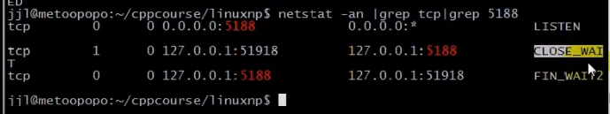

### 文章目录


[TOC]


## 1.TCP 11种状态,连接建立三次握手，连接终止四次握手

- 还有一种状态是closing：产生该状态的原因比较特殊
- connect打开的是主动套接口，用于发起连接，listen打开的是被动套接口，此套接口只能用于接受连接
- SYN段，ACK段
- ESTABLISH：将未连接队列的一个条目移动至已连接队列中，accept从已连接队列的队头返回第一个连接
- 双方都可以发起关闭
- TIME\_WAIT时间：2MSL：TCP段的最大生存期的2倍时间，**为什么要保留2倍的时间？因为最后一个ACK不能保证对方能接收，有这个时间可以保证能够重传ACK**  
  服务端处于CLOSED的状态不代表客户端也处于CLOSED的状态，所以客户端要在2MSL的时间后，才会出现CLOSED的状态


- closing状态：双方同时关闭  
  一旦收到对方ACK，就会处于TIME\_WAIT\(**TIME\_WAIT是由CLOSE发起的一方产生的状态**\)，但是两方都处于TIME\_WAIT的状态  
  

## 2.TIME\_WAIT与SO\_REUSEADDR

 -    eg：NetworkProgramming-master \(1\)\\LinuxNetworkProgramming\\P11echo\_srv.c

```cpp
//
// Created by wangji on 19-8-6.
//

#include <iostream>
#include <stdio.h>
#include <string.h>
#include <unistd.h>
#include <sys/types.h>
#include <sys/socket.h>
#include <netinet/in.h>
#include <arpa/inet.h>
#include <signal.h>

#include <sys/wait.h>

using namespace std;
//消息通过键盘输出，消息之间的边界就是/n，就不需要下面的结构体
// struct packet
// {
//     int len;
//     char buf[1024];
// };

#define ERR_EXIT(m) \
        do  \
        {   \
            perror(m);  \
            exit(EXIT_FAILURE); \
        } while(0);

ssize_t readn(int fd, void *buf, size_t count)
{
    size_t nleft = count;   // 剩余字节数
    ssize_t nread;
    char *bufp = (char*) buf;

    while (nleft > 0)
    {
        nread = read(fd, bufp, nleft);
        if (nread < 0)
        {
            if (errno == EINTR)
            {
                continue;
            }
            return  -1;
        } else if (nread == 0)
        {
            return count - nleft;
        }

        bufp += nread;
        nleft -= nread;
    }
    return count;
}

ssize_t writen(int fd, const void *buf, size_t count)
{
    size_t nleft = count;
    ssize_t nwritten;
    char* bufp = (char*)buf;

    while (nleft > 0)
    {
        if ((nwritten = write(fd, bufp, nleft)) < 0)
        {
            if (errno == EINTR)
            {
                continue;
            }
            return -1;
        }
        else if (nwritten == 0)
        {
            continue;
        }
        bufp += nwritten;
        nleft -= nwritten;
    }
    return count;
}

ssize_t recv_peek(int sockfd, void *buf, size_t len)
{
    while (1)
    {
        // recv有数据就返回，没有数据就阻塞
        //若对方套接口关闭，则返回为0
        //recv只能用于套接口
        int ret = recv(sockfd, buf, len, MSG_PEEK); 
        if (ret == -1 && errno == EINTR)//EINTR表示被信号中断
        {
            continue;
        }
        return ret;
    }
}

//readline只能用于套接口，因为使用了recv_peek函数
ssize_t readline(int sockfd, void *buf, size_t maxline)
{
    int ret;
    int nread;
    char *bufp = (char*)buf;    // 当前指针位置
    int nleft = maxline;//maxline一行最大的字节数，但是读取到\n就可以返回
    while (1)
    {
        ret = recv_peek(sockfd, bufp, nleft);//这里只是偷窥了缓冲区的数据，但是没有移走
        if (ret < 0)
        {
            return ret;
        }
        else if (ret == 0)//ret == 0表示对方关闭套接口
        {
            return ret;
        }
        nread = ret;

        //判断接收缓冲区是否有\n
        int i;
        for (i = 0; i < nread; i++)
        {
            if (bufp[i] == '\n')//若有\n，则将其作为一条消息读走
            {
                ret = readn(sockfd, bufp, i+1);//将数据从缓冲区移除，读取到i，说明有i+1个数据，包括\n
                if (ret != i+1)//接收到的字节数不等于i+1,说明失败
                {
                    exit(EXIT_FAILURE);
                }
                return ret;//返回一条消息
            }
        }
        
        //  若没有\n，说明还不满一条消息，也需要将数据读出来，放到缓冲区bufp

        if (nread > nleft)//从缓冲区读到的字节数要小于剩余字节数，否则有问题
        {
            exit(EXIT_FAILURE);
        }
        nleft -= nread;
        ret = readn(sockfd, bufp, nread);
        if (ret != nread)
        {
            exit(EXIT_FAILURE);
        }
        bufp += nread;//指针偏移，将数据放到屁股后面
    }
    return -1;
}

void echo_srv(int connfd)
{
    char recvbuf[1024];

    int n;
    while (1)
    {
        memset(recvbuf, 0, sizeof recvbuf);
        int ret = readline(connfd, recvbuf, 1024);//按行接收到缓冲区
        if (ret == -1)
        {
            ERR_EXIT("readline");
        }
        if (ret == 0)
        {
            printf("client close\n");
            break;
        }

        fputs(recvbuf, stdout);
        writen(connfd, recvbuf, strlen(recvbuf));
    }

}

void handle_sigchld(int sig)
{
    // wait(NULL);//捕获子进程的退出状态。man 2 wait，NULL：这里退出状态不关心
    // waitpid(-1, NULL, WNOHANG);//可以等待所有子进程,WNOHANG表示不挂起

    //轮询子进程的退出状态
    while (waitpid(-1, NULL, WNOHANG) > 0 )//将所有子进程的退出状态进行返回, >0表示等待到了一个子进程
        ;//由于指定WNOHANG，则没有子进程退出则返回-1，退出while
}


int main(int argc, char** argv) {

    // signal(SIGCHLD , SIG_IGN);//SIGCHLD可以忽略僵尸进程，不建议采用
    signal(SIGCHLD, handle_sigchld);

    // 1. 创建套接字
    int listenfd;
    if ((listenfd = socket(AF_INET, SOCK_STREAM, IPPROTO_TCP)) < 0) {
        ERR_EXIT("socket");
    }

    // 2. 分配套接字地址
    struct sockaddr_in servaddr;
    memset(&servaddr, 0, sizeof servaddr);
    servaddr.sin_family = AF_INET;
    servaddr.sin_port = htons(6666);
    servaddr.sin_addr.s_addr = htonl(INADDR_ANY);
    // servaddr.sin_addr.s_addr = inet_addr("127.0.0.1");
    // inet_aton("127.0.0.1", &servaddr.sin_addr);

    int on = 1;
    // 确保time_wait状态下同一端口仍可使用
    if (setsockopt(listenfd, SOL_SOCKET, SO_REUSEADDR, &on, sizeof on) < 0) {
        ERR_EXIT("setsockopt");
    }

    // 3. 绑定套接字地址
    if (bind(listenfd, (struct sockaddr *) &servaddr, sizeof servaddr) < 0) {
        ERR_EXIT("bind");
    }
    // 4. 等待连接请求状态
    if (listen(listenfd, SOMAXCONN) < 0) {
        ERR_EXIT("listen");
    }
    // 5. 允许连接
    struct sockaddr_in peeraddr;
    socklen_t peerlen = sizeof peeraddr;


    // 6. 数据交换
    pid_t pid;
    while (1) {
        int connfd;
        if ((connfd = accept(listenfd, (struct sockaddr *) &peeraddr, &peerlen)) < 0) {
            ERR_EXIT("accept");
        }

        printf("id = %s, ", inet_ntoa(peeraddr.sin_addr));
        printf("port = %d\n", ntohs(peeraddr.sin_port));

        pid = fork();

        if (pid == -1) {
            ERR_EXIT("fork");
        }
        if (pid == 0)   // 子进程
        {
            close(listenfd);
            echo_srv(connfd);
            //printf("child exit\n");
            exit(EXIT_SUCCESS);
        } else {
            //printf("parent exit\n");
            close(connfd);
        }


    }
    // 7. 断开连接
    close(listenfd);


    return 0;
}
```

 -    eg：NetworkProgramming-master \(1\)\\LinuxNetworkProgramming\\P11echo\_cli.c

```cpp
//
// Created by wangji on 19-8-6.
//

#include <iostream>
#include <stdio.h>
#include <string.h>
#include <unistd.h>
#include <sys/types.h>
#include <sys/socket.h>
#include <netinet/in.h>
#include <arpa/inet.h>


using namespace std;

struct packet
{
    int len;
    char buf[1024];
};

#define ERR_EXIT(m) \
        do  \
        {   \
            perror(m);  \
            exit(EXIT_FAILURE); \
        } while(0);

ssize_t readn(int fd, void *buf, size_t count)
{
    size_t nleft = count;   // 剩余字节数
    ssize_t nread;
    char *bufp = (char*) buf;

    while (nleft > 0)
    {
        nread = read(fd, bufp, nleft);
        if (nread < 0)
        {
            if (errno == EINTR)
            {
                continue;
            }
            return  -1;
        } else if (nread == 0)
        {
            return count - nleft;
        }

        bufp += nread;
        nleft -= nread;
    }
    return count;
}

ssize_t writen(int fd, const void *buf, size_t count)
{
    size_t nleft = count;
    ssize_t nwritten;
    char* bufp = (char*)buf;

    while (nleft > 0)
    {
        if ((nwritten = write(fd, bufp, nleft)) < 0)
        {
            if (errno == EINTR)
            {
                continue;
            }
            return -1;
        }
        else if (nwritten == 0)
        {
            continue;
        }
        bufp += nwritten;
        nleft -= nwritten;
    }
    return count;
}


ssize_t recv_peek(int sockfd, void *buf, size_t len)
{
    while (1)
    {
        int ret = recv(sockfd, buf, len, MSG_PEEK); // 查看传入消息
        if (ret == -1 && errno == EINTR)
        {
            continue;
        }
        return ret;
    }
}

ssize_t readline(int sockfd, void *buf, size_t maxline)
{
    int ret;
    int nread;
    char *bufp = (char*)buf;    // 当前指针位置
    int nleft = maxline;
    while (1)
    {
        ret = recv_peek(sockfd, buf, nleft);
        if (ret < 0)
        {
            return ret;
        }
        else if (ret == 0)
        {
            return ret;
        }
        nread = ret;
        int i;
        for (i = 0; i < nread; i++)
        {
            if (bufp[i] == '\n')
            {
                ret = readn(sockfd, bufp, i+1);
                if (ret != i+1)
                {
                    exit(EXIT_FAILURE);
                }
                return ret;
            }
        }
        if (nread > nleft)
        {
            exit(EXIT_FAILURE);
        }
        nleft -= nread;
        ret = readn(sockfd, bufp, nread);
        if (ret != nread)
        {
            exit(EXIT_FAILURE);
        }
        bufp += nread;
    }
    return -1;
}

void echo_cli(int sock)
{
    char recvbuf[1024]= [0];
    char sendbuf[1024]= [0];
    // struct packet recvbuf;
    // struct packet sendbuf;
    memset(recvbuf, 0, sizeof recvbuf);
    memset(sendbuf, 0, sizeof sendbuf);
    int n = 0;
    while (fgets(sendbuf, sizeof(sendbuf), stdin) != NULL)   // 键盘输入获取,默认带\n
    {
        writen(sockfd, sendbuf, strlen(sendbuf)); // 写入服务器

        int ret = readline(sockfd, recvbuf, sizeof(recvbuf));    // 服务器读取
        if (ret == -1)
        {
            ERR_EXIT("readline");
        }
        if (ret == 0)
        {
            printf("server close\n");
            break;
        }

        fputs(recvbuf, stdout); // 服务器返回数据输出

        // 清空
        memset(recvbuf, 0, sizeof(recvbuf));
        memset(sendbuf, 0, sizeof(sendbuf));
    }
}

int main(int argc, char** argv) {
    // 1. 创建套接字
    int sockfd;
    if ((sockfd = socket(AF_INET, SOCK_STREAM, IPPROTO_TCP)) < 0) {
        ERR_EXIT("socket");
    }

    // 2. 分配套接字地址
    struct sockaddr_in servaddr;
    memset(&servaddr, 0, sizeof servaddr);
    servaddr.sin_family = AF_INET;
    servaddr.sin_port = htons(6666);
    // servaddr.sin_addr.s_addr = htonl(INADDR_ANY);
    servaddr.sin_addr.s_addr = inet_addr("127.0.0.1");
    // inet_aton("127.0.0.1", &servaddr.sin_addr);

    // 3. 请求链接
    if (connect(sockfd, (struct sockaddr *) &servaddr, sizeof servaddr) < 0) {
        ERR_EXIT("connect");
    }

    struct sockaddr_in localaddr;//本地地址
    socklen_t addrlen = sizeof(localaddr);//要有初始值，和accept是一样的

    //已连接的套接口sockfd，既有本地地址，又有对等方的地址
    if (getsockname(sockfd, (struct sockaddr*)&localaddr, &addrlen) < 0)
    {
        ERR_EXIT("getsockname");
    }
    printf("id = %s, ", inet_ntoa(localaddr.sin_addr));
    printf("port = %d\n", ntohs(localaddr.sin_port));

    // 4. 数据交换
    echo_cli(sockfd);

    // 5. 断开连接
    close(sockfd);


    return 0;
}
```

- 测试1：模拟服务端用CLOSE  
  （1）第2个是：客户端的连接状态（应该出现在客户端主机上面，但是这是在同一台机器上）  
  （2）第3个是：服务端的连接状态  
    
  模拟服务端调用CLOSE：kill掉与客户端通信的进程，相当于向客户端发送了一个FIN的TCP段  
    
    
  （3）为什么服务端是FIN\_WAIT2状态，而不是TIME\_WAIT状态，**是因为客户端read没有返回0**  
  因为客户端的代码阻塞在while \(fgets\(sendbuf, sizeof\(sendbuf\), stdin\) \!= NULL\) ，没有机会调用readline来返回0，也就意味着客户端也没有机会去调用close，也就没有机会发送FIN段给服务端，所以服务器端服务没有进入TIME\_WAIT状态，所以保留在FIN\_WAIT2状态  
    
    
  （4）敲一个字符，按下回车，服务端的FIN\_WAIT2和客户端的CLOSE\_WAIT的状态都消失了。  
  因为输入a，会导致客户端代码while \(fgets\(sendbuf, sizeof\(sendbuf\), stdin\) \!= NULL\) 中fgets返回，从而有机会调用readline，此时就能将服务端发来的FIN段进行接收，read就返回为0，这里是readline返回0，则会最终调用close，发送FIN段给服务端，但是此时服务端不存在TIME\_WAIT状态

- 测试2：模拟客户端调用close  
    
    
  （1）模拟客户端调用close  
  **在客户端输入ctrl d,ctrl d会导致fgets返回为0**  
    
  （2）下面是客户端的TIME\_WAIT状态  
    
  （3）客户端发起close请求，服务器端收到等于0，**除了进行确认外，还会发起close** ，客户端收到服务器端发送的FIN，就会处于TIME\_WAIT状态  
  若服务器端处于TIME\_WAIT状态，即保留2MSL的时间，会导致服务器端无法重新启动，**所以一般要使用REUSEADDR**

## 3.SIGPIPE

 -    往一个已经接收FIN的套接字中写是允许的，接收到FIN仅仅代表对方不再发送数据了。  
        若发送数据给对方，然而对方进程不存在了，会导致TCP重置。导致对方会发送RST段（含义：连接重置）给我们
 -    在收到RST段之后，如果再调用write就会产生SIGPIPE信号，对于这个信号的处理，我们通过忽略即可。

```cpp
//一般忽略SIGPIPE信号即可
signale(SIGPIPE, SIG_IGN);
```

 -    测试代码：客户端：NetworkProgramming-master \(1\)\\LinuxNetworkProgramming\\P11echo\_cli.c  
        服务端还是上面的服务端程序

```cpp
//
// Created by wangji on 19-8-6.
//

#include <iostream>
#include <stdio.h>
#include <string.h>
#include <unistd.h>
#include <sys/types.h>
#include <sys/socket.h>
#include <netinet/in.h>
#include <arpa/inet.h>
#include <signal.h>

using namespace std;

struct packet
{
    int len;
    char buf[1024];
};

#define ERR_EXIT(m) \
        do  \
        {   \
            perror(m);  \
            exit(EXIT_FAILURE); \
        } while(0);

ssize_t readn(int fd, void *buf, size_t count)
{
    size_t nleft = count;   // 剩余字节数
    ssize_t nread;
    char *bufp = (char*) buf;

    while (nleft > 0)
    {
        nread = read(fd, bufp, nleft);
        if (nread < 0)
        {
            if (errno == EINTR)
            {
                continue;
            }
            return  -1;
        } else if (nread == 0)
        {
            return count - nleft;
        }

        bufp += nread;
        nleft -= nread;
    }
    return count;
}

ssize_t writen(int fd, const void *buf, size_t count)
{
    size_t nleft = count;
    ssize_t nwritten;
    char* bufp = (char*)buf;

    while (nleft > 0)
    {
        if ((nwritten = write(fd, bufp, nleft)) < 0)
        {
            if (errno == EINTR)
            {
                continue;
            }
            return -1;
        }
        else if (nwritten == 0)
        {
            continue;
        }
        bufp += nwritten;
        nleft -= nwritten;
    }
    return count;
}


ssize_t recv_peek(int sockfd, void *buf, size_t len)
{
    while (1)
    {
        int ret = recv(sockfd, buf, len, MSG_PEEK); // 查看传入消息
        if (ret == -1 && errno == EINTR)
        {
            continue;
        }
        return ret;
    }
}

ssize_t readline(int sockfd, void *buf, size_t maxline)
{
    int ret;
    int nread;
    char *bufp = (char*)buf;    // 当前指针位置
    int nleft = maxline;
    while (1)
    {
        ret = recv_peek(sockfd, buf, nleft);
        if (ret < 0)
        {
            return ret;
        }
        else if (ret == 0)
        {
            return ret;
        }
        nread = ret;
        int i;
        for (i = 0; i < nread; i++)
        {
            if (bufp[i] == '\n')
            {
                ret = readn(sockfd, bufp, i+1);
                if (ret != i+1)
                {
                    exit(EXIT_FAILURE);
                }
                return ret;
            }
        }
        if (nread > nleft)
        {
            exit(EXIT_FAILURE);
        }
        nleft -= nread;
        ret = readn(sockfd, bufp, nread);
        if (ret != nread)
        {
            exit(EXIT_FAILURE);
        }
        bufp += nread;
    }
    return -1;
}

//测试收到SIGPIPE信号
void handle_sigpipe(int sig)
{
    printf("recv a sig = %d\n", sig);
}

void echo_cli(int sock)
{
    //测试收到SIGPIPE信号
    signale(SIGPIPE, handle_sigpipe);

    //一般忽略SIGPIPE信号即可
    signale(SIGPIPE, SIG_IGN);

    char recvbuf[1024]= [0];
    char sendbuf[1024]= [0];
    // struct packet recvbuf;
    // struct packet sendbuf;
    memset(recvbuf, 0, sizeof recvbuf);
    memset(sendbuf, 0, sizeof sendbuf);
    int n = 0;
    while (fgets(sendbuf, sizeof(sendbuf), stdin) != NULL)   // 键盘输入获取,默认带\n
    {
        //writen(sockfd, sendbuf, strlen(sendbuf)); // 写入服务器

         /*模拟SIGPIPE
        若服务端已经关闭了，客户端收到了FIN，客户端调用第一个writen，会导致服务端发送一个RST段
        过来，再次调用第二个writen，会导致SIGPIPE信号的产生，此信号会终止当前进程，所以不会走
        下面的readline
        */
        writen(sockfd, sendbuf, 1);//首先发送一个字节
        writen(sockfd, sendbuf+1, strlen(sendbuf) - 1);//接着发送剩余字节


        int ret = readline(sockfd, recvbuf, sizeof(recvbuf));    // 服务器读取
        if (ret == -1)
        {
            ERR_EXIT("readline");
        }
        if (ret == 0)
        {
            printf("server close\n");
            break;
        }

        fputs(recvbuf, stdout); // 服务器返回数据输出

        // 清空
        memset(recvbuf, 0, sizeof(recvbuf));
        memset(sendbuf, 0, sizeof(sendbuf));
    }
}

int main(int argc, char** argv) {
    // 1. 创建套接字
    int sockfd;
    if ((sockfd = socket(AF_INET, SOCK_STREAM, IPPROTO_TCP)) < 0) {
        ERR_EXIT("socket");
    }

    // 2. 分配套接字地址
    struct sockaddr_in servaddr;
    memset(&servaddr, 0, sizeof servaddr);
    servaddr.sin_family = AF_INET;
    servaddr.sin_port = htons(6666);
    // servaddr.sin_addr.s_addr = htonl(INADDR_ANY);
    servaddr.sin_addr.s_addr = inet_addr("127.0.0.1");
    // inet_aton("127.0.0.1", &servaddr.sin_addr);

    // 3. 请求链接
    if (connect(sockfd, (struct sockaddr *) &servaddr, sizeof servaddr) < 0) {
        ERR_EXIT("connect");
    }

    struct sockaddr_in localaddr;//本地地址
    socklen_t addrlen = sizeof(localaddr);//要有初始值，和accept是一样的

    //已连接的套接口sockfd，既有本地地址，又有对等方的地址
    if (getsockname(sockfd, (struct sockaddr*)&localaddr, &addrlen) < 0)
    {
        ERR_EXIT("getsockname");
    }
    printf("id = %s, ", inet_ntoa(localaddr.sin_addr));
    printf("port = %d\n", ntohs(localaddr.sin_port));

    // 4. 数据交换
    echo_cli(sockfd);

    // 5. 断开连接
    close(sockfd);


    return 0;
}
```

- 测试1：  
    
  此时处于连接的状态  
    
  关闭通信进程  
    
    
  客户端：随便敲一行，然后回车，但是没有输出**server close**？  
  这是因为由于客户端捕捉到了一个SIGPIPE信号，若没有捕捉到SIGPIPE信号，客户端的readline应该返回为0，并输出**server close**  
  

- 测试2：  
    
    
    
    
    
    
  为什么能输出**server close？**  
  因为客户端捕捉到了SIGPIPE信号，并没有终止进程，所以客户端继续调用readline，最终调用close

- 在管道中如何产生SIGPIPE信号？  
  如果没有任何读端进程，然后我们往管道中写入数据，此时就会出现断开的管道。  
  **可以把TCP看成是一个全双工的管道**，当某一端收到FIN后，并不能确定对等方的进程已经消失了，**因为对方调用close并不意味着对方的进程会退出**，此时客户端调用write，当他发现对等方的进程不存在了（也可以看成读端进程不存在了），此时对等方的TCP协议栈会发送一个RST段，**再次调用write，会导致SIGPIPE信号的产生**