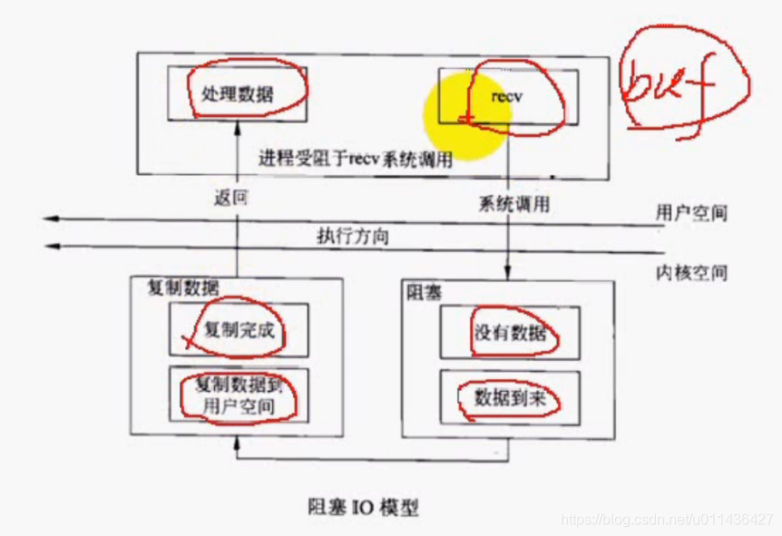
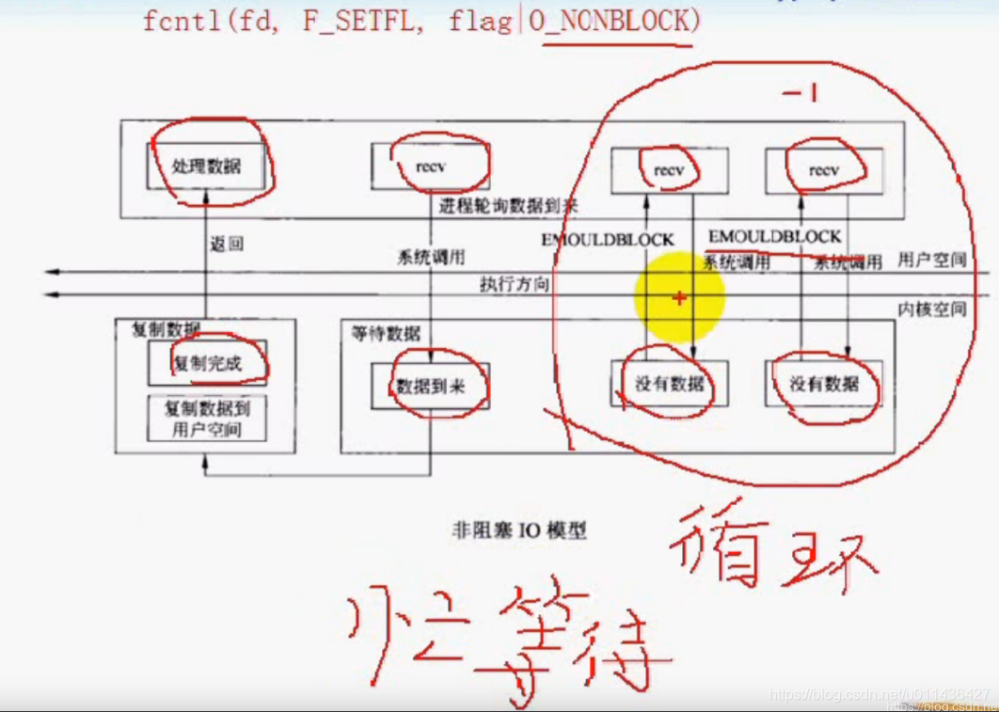
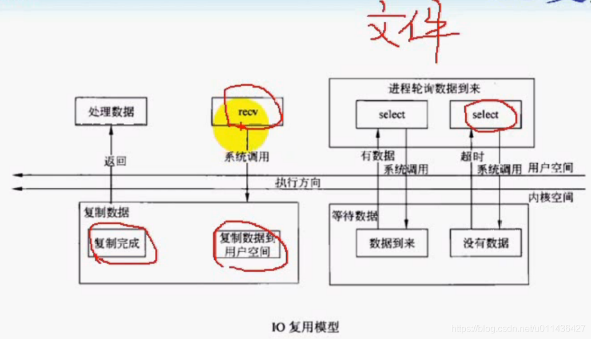
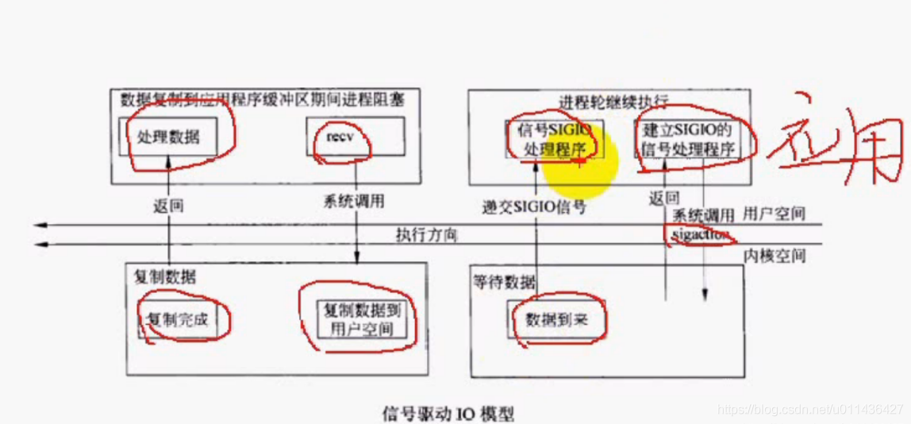
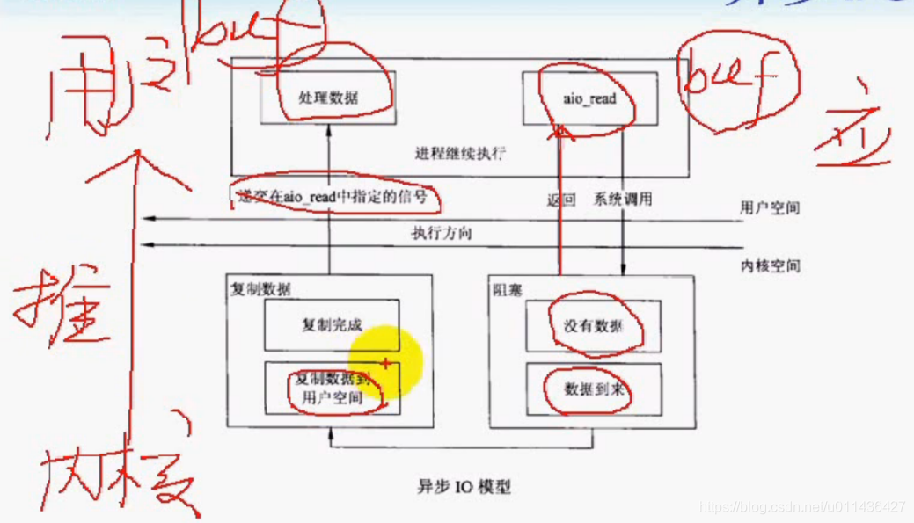
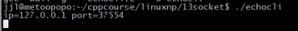
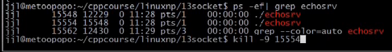
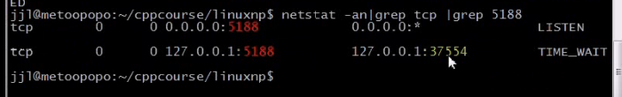

### 文章目录

- - [1.五种I/O模型](#1IO_3)
  - [2.select](#2select_41)
  - [3.用select改进回射客户端程序](#3select_79)

## 1.五种I/O模型

 -    （1）阻塞IO  
        1）一递交读操作，读操作就阻塞了，直到对方有数据到来；  
        2）将套接口接收缓冲区拷贝到用户空间缓冲区buff中，拷贝完成，recv函数就返回了；  
        
 -    （2）非阻塞IO  
        1）recv函数即使没有数据到来，也不会阻塞，因为把他设置为了非阻塞模式了  
        2）EMOULDBLOCK：改正为：EWOULDBLOCK  
        3）忙等待：想等待一定的数据，而这些数据又没有到来，**又需要占用CPU时间片**，这种等待称之为忙等待  
        4）**不推荐使用这种非阻塞IO模型，应用很窄**  
        5）将套接口设置非阻塞方式

```cpp
fcntl(fd, F_SETFL, flag|O_NONBLOCK)
```



- （3）I/O复用\(select和poll\)  
  1）select管理多个文件描述符  
  2）阻塞的位置提前到了select，一旦监测到事件，recv则不再阻塞了  
  

- （4）信号驱动IO  
  1）不经常用  
  2）调用sigaction来安装信号处理程序，安装完毕后，程序可以做其它的事情  
  3）当数据到来时，以信号的方式通知应用进程，应用进程要在信号处理程序中处理接收数据的细节，使得异步处理得到可能（因为信号是异步处理的方式，当提交信号后，应用进程可以处理其它事情，直到有数据到来，通过信号处理程序来处理到来的事件）  
  

- （5）异步IO  
  1）效率最高  
  2）会提交一个应用层的缓冲区buf，即使内核没有数据，也会立刻返回，一旦返回，应用进程就处理其它的事情，达到了异步处理的能力；  
  当有数据到来，内核会将数据**自动拷贝**到应用层buff缓冲区，一旦复制完成，会通过信号等方式来通知应用进程的程序，这取决于aio\_read的实现\(**大多数的系统实现，或多或少会有些问题，与windows的完成端口IOCP基本一样**\)  
  3）异步IO与信号驱动IO的区别  
  异步IO是推的机制，  
  一旦内核接收到数据，会**主动**的将数据从内核返还给用户的buf缓冲区，**用户空间没有必要调用recv方法来接收他**  
  信号驱动IO是拉的机制。  
  一旦有数据到来，仅仅是通过SIGIO信号通知应用进程，应用进程还得调用recv函数将数据从内核空间**拉**到用户空间中  
  **拉比推，可能多一些延迟**  
  

## 2.select

 -    select

```cpp
int select(int nfds, fd_set *readfds, fd_set *writefds,
                 fd_set *exceptfds, struct timeval *timeout);

void FD_CLR(int fd, fd_set *set);将文件描述符从集合set中移除；
int  FD_ISSET(int fd, fd_set *set);判断fd是否在集合set中？
void FD_SET(int fd, fd_set *set);将fd添加到集合set中
void FD_ZERO(fd_set *set);清空fd集合


nfds：读，写，异常集合中的文件描述符的最大值+1

可读集合：检测到有数据可读的套接口，放到readfds集合中，一旦有数据可读，select就可以返回。
		IO中的缓冲区有数据了，就会产生可读事件。
		若关心某个IO的可读事件，就将其fd放到readfds集合中。
		是输入输出参数。

可写集合：是输入输出参数。

异常集合：NULL；
		是输入输出参数。
		
超时时间：若有超时时间，在超时时间到来时，若没有监测到任何一个事件也可以返回，返回事件个数为0，select失败返回-1；
		NULL表示不会超时，表示一定要检测到某个事件才会返回
				是输入输出参数。
```

- **select可以管理多个文件描述符，也就是管理多个IO。**  
  eg：select会监测1，2，3，4，5。。等io，如果select监测到了其中的某些IO发生了事件，select就会立刻返回，并将感兴趣的事件填充到readfds中，并且返回事件的个数，通过轮询这些事件，一个个来处理，**这时候处理基本不会阻塞了，因为select提前阻塞了，他的返回意味着事件已经到来**
- select是个管理者，是个中心  
  （1）用select来管理多个IO，一旦其中的一个I/O或者多个I/O检测到我们所感兴趣的事件，select函数会返回，返回值为检测到的事件的个数  
  （2）并且返回哪些I/O发生了事件，遍历这些事件，进而处理事件  
  （3）与信号集的集合操作函数类似

## 3.用select改进回射客户端程序

 -    eg：客户端：NetworkProgramming-master \(1\)\\LinuxNetworkProgramming\\P13echocli6.cpp  
        服务端还是：NetworkProgramming-master \(1\)\\LinuxNetworkProgramming\\P11echo\_srv.c

```cpp
//
// Created by wangji on 19-8-6.
//

// socket编程 8 select模型

#include <iostream>
#include <stdio.h>
#include <string.h>
#include <unistd.h>
#include <sys/types.h>
#include <sys/socket.h>
#include <netinet/in.h>
#include <arpa/inet.h>
#include <signal.h>
#include <sys/wait.h>


using namespace std;

struct packet
{
    int len;
    char buf[1024];
};

#define ERR_EXIT(m) \
        do  \
        {   \
            perror(m);  \
            exit(EXIT_FAILURE); \
        } while(0);

ssize_t readn(int fd, void *buf, size_t count)
{
    size_t nleft = count;   // 剩余字节数
    ssize_t nread;
    char *bufp = (char*) buf;

    while (nleft > 0)
    {
        nread = read(fd, bufp, nleft);
        if (nread < 0)
        {
            if (errno == EINTR)
            {
                continue;
            }
            return  -1;
        } else if (nread == 0)
        {
            return count - nleft;
        }

        bufp += nread;
        nleft -= nread;
    }
    return count;
}

ssize_t writen(int fd, const void *buf, size_t count)
{
    size_t nleft = count;
    ssize_t nwritten;
    char* bufp = (char*)buf;

    while (nleft > 0)
    {
        if ((nwritten = write(fd, bufp, nleft)) < 0)
        {
            if (errno == EINTR)
            {
                continue;
            }
            return -1;
        }
        else if (nwritten == 0)
        {
            continue;
        }
        bufp += nwritten;
        nleft -= nwritten;
    }
    return count;
}


ssize_t recv_peek(int sockfd, void *buf, size_t len)
{
    while (1)
    {
        int ret = recv(sockfd, buf, len, MSG_PEEK); // 查看传入消息
        if (ret == -1 && errno == EINTR)
        {
            continue;
        }
        return ret;
    }
}

ssize_t readline(int sockfd, void *buf, size_t maxline)
{
    int ret;
    int nread;
    char *bufp = (char*)buf;    // 当前指针位置
    int nleft = maxline;
    while (1)
    {
        ret = recv_peek(sockfd, buf, nleft);
        if (ret < 0)
        {
            return ret;
        }
        else if (ret == 0)
        {
            return ret;
        }
        nread = ret;
        int i;
        for (i = 0; i < nread; i++)
        {
            if (bufp[i] == '\n')
            {
                ret = readn(sockfd, bufp, i+1);
                if (ret != i+1)
                {
                    exit(EXIT_FAILURE);
                }
                return ret;
            }
        }
        if (nread > nleft)
        {
            exit(EXIT_FAILURE);
        }
        nleft -= nread;
        ret = readn(sockfd, bufp, nread);
        if (ret != nread)
        {
            exit(EXIT_FAILURE);
        }
        bufp += nread;
    }
    return -1;
}

void ehco_cli(int sockfd)
{
//    char recvbuf[1024];
//    char sendbuf[1024];
//    // struct packet recvbuf;
//    // struct packet sendbuf;
//    memset(recvbuf, 0, sizeof recvbuf);
//    memset(sendbuf, 0, sizeof sendbuf);
//    int n = 0;
//    while (fgets(sendbuf, sizeof sendbuf, stdin) != NULL)   // 键盘输入获取
//    {
//        writen(sockfd, sendbuf, strlen(sendbuf)); // 写入服务器
//
//        int ret = readline(sockfd, recvbuf, sizeof recvbuf);    // 服务器读取
//        if (ret == -1)
//        {
//            ERR_EXIT("readline");
//        }
//        if (ret == 0)
//        {
//            printf("server close\n");
//            break;
//        }
//
//        fputs(recvbuf, stdout); // 服务器返回数据输出
//
//        // 清空
//        memset(recvbuf, 0, sizeof recvbuf);
//        memset(sendbuf, 0, sizeof sendbuf);
//    }
    fd_set rset;
    FD_ZERO(&rset);

    int nready;//检测到的事件个数
    int maxfd;
    int fd_stdin = fileno(stdin);//fileno：获取标准输入的文件描述符
    if (fd_stdin > sockfd)
    {
        maxfd = fd_stdin;
    } else {
        maxfd = sockfd;
    }

    char sendbuf[1024] = {0};
    char recvbuf[1024] = {0};
	
	//标准输入IO和网络IO
    while (1)//检测套接口是否有可读事件，检测标准输入是否有可读事件
    {
        FD_SET(fd_stdin, &rset);//将fd_stdin放到读的集合rset中，关心fd_stdin文件描述符的事件
        FD_SET(sockfd, &rset);//将sockfd放到读的集合rset中
        nready = select(maxfd+1, &rset, NULL, NULL, NULL);//读集合中最大文件描述+1
        //到底是哪一个套接口检测到事件？rset集合是会改变的！！返回的是哪一些io或者套接口检测到了事件
        //说明rset是输入输出参数
        if (nready == -1)
        {
            ERR_EXIT("select");
        }
        if (nready == 0)
        {
            continue;
        }
        
        //判断标准输入产生的可读事件，还是套接口产生的可读事件？
        if (FD_ISSET(sockfd, &rset))    // 套接口产生的可读事件
        {
            int ret = readline(sockfd, recvbuf, sizeof(recvbuf));    // 服务器读取
            if (ret == -1)
            {
                ERR_EXIT("readline");
            }
            if (ret == 0)
            {
                printf("server close\n");
                break;
            }

            fputs(recvbuf, stdout); // 服务器返回数据输出
            memset(recvbuf, 0, sizeof(recvbuf));
        }

        if (FD_ISSET(fd_stdin, &rset))//判断标准输入产生的可读事件
        {
            if (fgets(sendbuf, sizeof(sendbuf), stdin) == NULL)   //等于NULL，说明客户端已经得到一个EOF结束符
            {
                break;
            }
            writen(sockfd, sendbuf, strlen(sendbuf)); // 写入服务器
            memset(sendbuf, 0, sizeof(sendbuf));
        }
    }
    close(sockfd);
};

void handle_sigchld(int sig)
{
    // wait(NULL);
    while (waitpid(-1, NULL, WNOHANG) > 0);
}

int main(int argc, char** argv) {
    // signal(SIGCHLD, SIG_IGN);
    signal(SIGCHLD, handle_sigchld);
    // 1. 创建套接字
    int sockfd;
    if ((sockfd = socket(AF_INET, SOCK_STREAM, IPPROTO_TCP)) < 0) {
        ERR_EXIT("socket");
    }

    // 2. 分配套接字地址
    struct sockaddr_in servaddr;
    memset(&servaddr, 0, sizeof(servaddr));
    servaddr.sin_family = AF_INET;
    servaddr.sin_port = htons(6666);
    // servaddr.sin_addr.s_addr = htonl(INADDR_ANY);
    servaddr.sin_addr.s_addr = inet_addr("127.0.0.1");
    // inet_aton("127.0.0.1", &servaddr.sin_addr);

    // 3. 请求链接
    if (connect(sockfd, (struct sockaddr *) &servaddr, sizeof(servaddr)) < 0) {
        ERR_EXIT("connect");
    }

    struct sockaddr_in localaddr;
    socklen_t addrlen = sizeof localaddr;
    if (getsockname(sockfd, (struct sockaddr*)&localaddr, &addrlen) < 0)
    {
        ERR_EXIT("getsockname");
    }
    printf("id = %s, ", inet_ntoa(localaddr.sin_addr));
    printf("port = %d\n", ntohs(localaddr.sin_port));

    // 4. 数据交换
    ehco_cli(sockfd);

    // 5. 断开连接
    close(sockfd);


    return 0;
}
```

- 测试：  
    
    
    
  不再有FIN\_WAIT2和CLOSE\_WAIT状态了，服务器端的FIN\_WAIT状态已经变成了TIME\_WAIT状态了，客户端的CLOSE\_WAIT状态向前推进，变成了close的状态，其结束了，就不再显示出来了  
  
- select优点  
  本质上用单进程的方式处理IO比较方便，单进程可以轮询事件，然后对这些事件进行处理