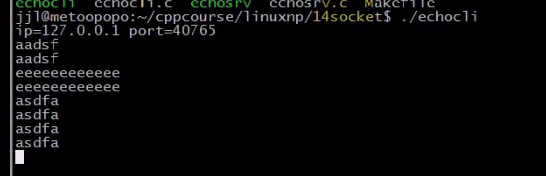
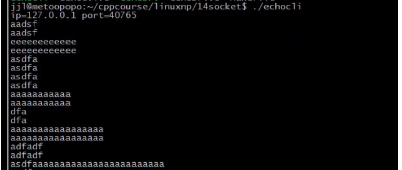
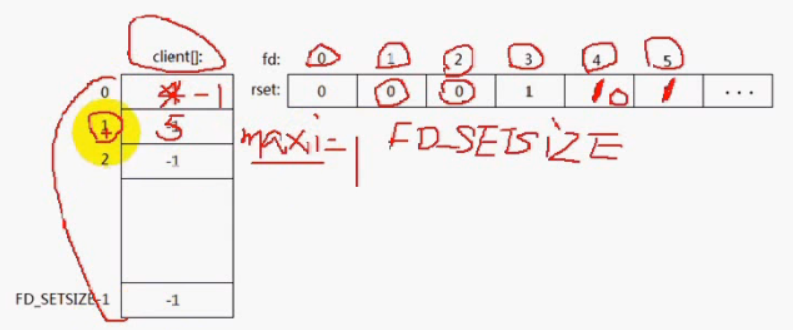

### 文章目录


[TOC]


## 1.select

- 单核CPU是不可以并行处理；
- select是并发服务器，对于多核CPU而言，select是无法充分利用的，除非使用多进程select，或者多线程select

## 2.select函数读，写，异常事件发生条件

- 可读：**关注前三个**  
  （1）套接口缓冲区有数据可读（对等方发数据过来，填充了套接口缓冲区；）  
  （2）连接的读一半关闭，即**接收到FIN段，读操作将返回0**（对方调用close，返回为0表示对等方关闭；）  
  （3）如果是监听套接口，已完成连接队列不为空时。  
  （4）套接口上发生了一个错误待处理，错误可以通过getsockopt指定SO\_ERROR选项来获取

- 可写：**关注第一个**  
  （1）套接口发送缓冲区有空间容纳数据。（大多数时候缓冲区是不满的，会不断产生可写事件；）  
  （2）连接的写一半关闭。即收到RST段之后，再次调用write操作。  
  （3）套接口上发生了一个错误待处理。错误可以通过getsockopt指定SO\_ERROR选项来获取。

- 异常  
  （1）套接口存在带外数据

## 3.用select改进回射服务器程序

 -    eg：服务端代码：NetworkProgramming-master \(1\)\\LinuxNetworkProgramming\\P14echosrv7.c  
        客户端代码：NetworkProgramming-master \(1\)\\LinuxNetworkProgramming\\P13echocli6.c

```cpp
//
// Created by wangji on 19-8-7.
//

// socket编程 9

#include <iostream>
#include <stdio.h>
#include <string.h>
#include <unistd.h>
#include <sys/types.h>
#include <sys/socket.h>
#include <netinet/in.h>
#include <arpa/inet.h>


using namespace std;

struct packet
{
    int len;
    char buf[1024];
};

#define ERR_EXIT(m) \
        do  \
        {   \
            perror(m);  \
            exit(EXIT_FAILURE); \
        } while(0);

ssize_t readn(int fd, void *buf, size_t count)
{
    size_t nleft = count;   // 剩余字节数
    ssize_t nread;
    char *bufp = (char*) buf;

    while (nleft > 0)
    {
        nread = read(fd, bufp, nleft);
        if (nread < 0)
        {
            if (errno == EINTR)
            {
                continue;
            }
            return  -1;
        } else if (nread == 0)
        {
            return count - nleft;
        }

        bufp += nread;
        nleft -= nread;
    }
    return count;
}

ssize_t writen(int fd, const void *buf, size_t count)
{
    size_t nleft = count;
    ssize_t nwritten;
    char* bufp = (char*)buf;

    while (nleft > 0)
    {
        if ((nwritten = write(fd, bufp, nleft)) < 0)
        {
            if (errno == EINTR)
            {
                continue;
            }
            return -1;
        }
        else if (nwritten == 0)
        {
            continue;
        }
        bufp += nwritten;
        nleft -= nwritten;
    }
    return count;
}

ssize_t recv_peek(int sockfd, void *buf, size_t len)
{
    while (1)
    {
        int ret = recv(sockfd, buf, len, MSG_PEEK); // 查看传入消息
        if (ret == -1 && errno == EINTR)
        {
            continue;
        }
        return ret;
    }
}

ssize_t readline(int sockfd, void *buf, size_t maxline)
{
    int ret;
    int nread;
    char *bufp = (char*)buf;    // 当前指针位置
    int nleft = maxline;
    while (1)
    {
        ret = recv_peek(sockfd, buf, nleft);
        if (ret < 0)
        {
            return ret;
        }
        else if (ret == 0)
        {
            return ret;
        }
        nread = ret;
        int i;
        for (i = 0; i < nread; i++)
        {
            if (bufp[i] == '\n')
            {
                ret = readn(sockfd, bufp, i+1);
                if (ret != i+1)
                {
                    exit(EXIT_FAILURE);
                }
                return ret;
            }
        }
        if (nread > nleft)
        {
            exit(EXIT_FAILURE);
        }
        nleft -= nread;
        ret = readn(sockfd, bufp, nread);
        if (ret != nread)
        {
            exit(EXIT_FAILURE);
        }
        bufp += nread;
    }
    return -1;
}

void echo_srv(int connfd)
{
    char recvbuf[1024];
    // struct packet recvbuf;
    int n;
    while (1)
    {
        memset(recvbuf, 0, sizeof recvbuf);
        int ret = readline(connfd, recvbuf, 1024);
        if (ret == -1)
        {
            ERR_EXIT("readline");
        }
        if (ret == 0)
        {
            printf("client close\n");
            break;
        }

        fputs(recvbuf, stdout);
        writen(connfd, recvbuf, strlen(recvbuf));
    }

}

int main(int argc, char** argv) {
    // 1. 创建套接字
    int listenfd;
    if ((listenfd = socket(AF_INET, SOCK_STREAM, IPPROTO_TCP)) < 0) {
        ERR_EXIT("socket");
    }

    // 2. 分配套接字地址
    struct sockaddr_in servaddr;
    memset(&servaddr, 0, sizeof servaddr);
    servaddr.sin_family = AF_INET;
    servaddr.sin_port = htons(6666);
    servaddr.sin_addr.s_addr = htonl(INADDR_ANY);
    // servaddr.sin_addr.s_addr = inet_addr("127.0.0.1");
    // inet_aton("127.0.0.1", &servaddr.sin_addr);

    int on = 1;
    // 确保time_wait状态下同一端口仍可使用
    if (setsockopt(listenfd, SOL_SOCKET, SO_REUSEADDR, &on, sizeof on) < 0) {
        ERR_EXIT("setsockopt");
    }

    // 3. 绑定套接字地址
    if (bind(listenfd, (struct sockaddr *) &servaddr, sizeof servaddr) < 0) {
        ERR_EXIT("bind");
    }
    // 4. 等待连接请求状态
    if (listen(listenfd, SOMAXCONN) < 0) {
        ERR_EXIT("listen");
    }
    // 5. 允许连接
    struct sockaddr_in peeraddr;
    socklen_t peerlen;


    // 6. 数据交换
    int nready;//检测到的事件个数
    int maxfd = listenfd;//默认套接口0，1，2已经打开了，所以listenfd为3
    fd_set rset;
    fd_set allset;
    FD_ZERO(&rset);
    FD_ZERO(&allset);
    FD_SET(listenfd, &allset);
    int connfd;
    int i;
    int client[FD_SETSIZE];//rset集合中最大容量为FD_SETSIZE
    // int ret;
    int Max = 0;
    // memset(client, -1, sizeof(client));
    for (i = 0; i < FD_SETSIZE; i++)
    {   
        client[i] = -1;//等于-1表示空闲的
    }
    while (1)
    {
        rset = allset;//若没有把所有感兴趣的fd保存至allset中，那么下一次select，rset里面其实是已经改变过的fd的集合
        //rset只保留当前改变事件的IO集合，并没有监听所有的套接口
        nready = select(maxfd + 1, &rset, NULL, NULL, NULL);
        if (nready == -1)
        {
            if (errno == EINTR)//被信号中断，还可以执行
            {
                continue;
            }
            ERR_EXIT("select");
        }

        if (nready == 0)
        {
            continue;
        }

        //监听套接口发生可读事件，意味着对方connect已经完成，这边已完成连接队列的条目不为空
        //此时，调用accept方法就不再阻塞
        if (FD_ISSET(listenfd, &rset))//rset是输入输出参数：输出参数表示：哪些fd产生了事件，输入参数表示：我们关心哪些文件描述符fd
        {
            peerlen = sizeof(peeraddr);
            //peerlen是输入输出参数，要有初始值，返回的是对方地址的长度
            connfd = accept(listenfd, (struct sockaddr *)&peeraddr, &peerlen);
            if (connfd == -1)
            {
                ERR_EXIT("accept");
            }
            for (i = 0; i < FD_SETSIZE; i++)
            {
                if (client[i] < 0)
                {
                    client[i] = connfd;//将connfd保存到client中的空闲位置
                    break;
                }
            }
            if (i == FD_SETSIZE)//找不到空闲位置
            {
                fprintf(stderr, "too many clients\n");
                exit(EXIT_FAILURE);
            }
            printf("id = %s, ", inet_ntoa(peeraddr.sin_addr));
            printf("port = %d\n", ntohs(peeraddr.sin_port));
            FD_SET(connfd, &allset);
            if (connfd > maxfd)//更新maxfd
                maxfd = connfd;
            // Max++;
            // maxfd = max(maxfd, connfd);
            if (--nready <= 0)//说明检测的事件已经处理完毕，没必要往下走
            {
                continue;
            }
        }
        //connfd产生事件
        for (i = 0; i < FD_SETSIZE; ++i)
        {
            connfd = client[i];
            if (connfd == -1)
            {
                continue;
            }
            if (FD_ISSET(connfd, &rset))//已连接套接口有可读事件
            {
                char recvbuf[1024] = {0};
                int ret = readline(connfd, recvbuf, 1024);
                if (ret == -1)
                {
                    ERR_EXIT("readline");
                }
                if (ret == 0)
                {
                    printf("client close\n");
                    client[i] = -1;
                    FD_CLR(connfd, &allset);//从allset中清除
                    maxfd--;
                }
                fputs(recvbuf, stdout);
                //sleep(4);
                writen(connfd, recvbuf, strlen(recvbuf));
                if (--nready <= 0)//所有的事件处理完毕，就break
                {
                    break;
                }
            }
        }
    }
//    pid_t pid;
//    while (1) {
//        int connfd;
//        if ((connfd = accept(listenfd, (struct sockaddr *) &peeraddr, &peerlen)) < 0) {
//            ERR_EXIT("accept");
//        }
//
//        printf("id = %s, ", inet_ntoa(peeraddr.sin_addr));
//        printf("port = %d\n", ntohs(peeraddr.sin_port));
//
//        pid = fork();
//
//        if (pid == -1) {
//            ERR_EXIT("fork");
//        }
//        if (pid == 0)   // 子进程
//        {
//            close(listenfd);
//            echo_srv(connfd);
//            //printf("child exit\n");
//            exit(EXIT_SUCCESS);
//        } else {
//            //printf("parent exit\n");
//            close(connfd);
//        }
//
//
//    }
    // 7. 断开连接
    close(listenfd);


    return 0;
}
```

 -    测试：下面启动两个客户端，然后关闭一个客户端，select使用单进程的方式处理并发  
          
        
        当一个客户端关闭，服务端也能检测到该事件  
        
 -    eg2改进遍历connfd的大小：服务端：NetworkProgramming-master \(1\)\\LinuxNetworkProgramming\\P14echosrv8.c  
        客户端：NetworkProgramming-master \(1\)\\LinuxNetworkProgramming\\P13echocli6.c

```cpp
//
// Created by wangji on 19-8-7.
//

// socket编程 9

#include <iostream>
#include <stdio.h>
#include <string.h>
#include <unistd.h>
#include <sys/types.h>
#include <sys/socket.h>
#include <netinet/in.h>
#include <arpa/inet.h>


using namespace std;

struct packet
{
    int len;
    char buf[1024];
};

#define ERR_EXIT(m) \
        do  \
        {   \
            perror(m);  \
            exit(EXIT_FAILURE); \
        } while(0);

ssize_t readn(int fd, void *buf, size_t count)
{
    size_t nleft = count;   // 剩余字节数
    ssize_t nread;
    char *bufp = (char*) buf;

    while (nleft > 0)
    {
        nread = read(fd, bufp, nleft);
        if (nread < 0)
        {
            if (errno == EINTR)
            {
                continue;
            }
            return  -1;
        } else if (nread == 0)
        {
            return count - nleft;
        }

        bufp += nread;
        nleft -= nread;
    }
    return count;
}

ssize_t writen(int fd, const void *buf, size_t count)
{
    size_t nleft = count;
    ssize_t nwritten;
    char* bufp = (char*)buf;

    while (nleft > 0)
    {
        if ((nwritten = write(fd, bufp, nleft)) < 0)
        {
            if (errno == EINTR)
            {
                continue;
            }
            return -1;
        }
        else if (nwritten == 0)
        {
            continue;
        }
        bufp += nwritten;
        nleft -= nwritten;
    }
    return count;
}

ssize_t recv_peek(int sockfd, void *buf, size_t len)
{
    while (1)
    {
        int ret = recv(sockfd, buf, len, MSG_PEEK); // 查看传入消息
        if (ret == -1 && errno == EINTR)
        {
            continue;
        }
        return ret;
    }
}

ssize_t readline(int sockfd, void *buf, size_t maxline)
{
    int ret;
    int nread;
    char *bufp = (char*)buf;    // 当前指针位置
    int nleft = maxline;
    while (1)
    {
        ret = recv_peek(sockfd, buf, nleft);
        if (ret < 0)
        {
            return ret;
        }
        else if (ret == 0)
        {
            return ret;
        }
        nread = ret;
        int i;
        for (i = 0; i < nread; i++)
        {
            if (bufp[i] == '\n')
            {
                ret = readn(sockfd, bufp, i+1);
                if (ret != i+1)
                {
                    exit(EXIT_FAILURE);
                }
                return ret;
            }
        }
        if (nread > nleft)
        {
            exit(EXIT_FAILURE);
        }
        nleft -= nread;
        ret = readn(sockfd, bufp, nread);
        if (ret != nread)
        {
            exit(EXIT_FAILURE);
        }
        bufp += nread;
    }
    return -1;
}

void echo_srv(int connfd)
{
    char recvbuf[1024];
    // struct packet recvbuf;
    int n;
    while (1)
    {
        memset(recvbuf, 0, sizeof recvbuf);
        int ret = readline(connfd, recvbuf, 1024);
        if (ret == -1)
        {
            ERR_EXIT("readline");
        }
        if (ret == 0)
        {
            printf("client close\n");
            break;
        }

        fputs(recvbuf, stdout);
        writen(connfd, recvbuf, strlen(recvbuf));
    }

}

int main(int argc, char** argv) {
    // 1. 创建套接字
    int listenfd;
    if ((listenfd = socket(AF_INET, SOCK_STREAM, IPPROTO_TCP)) < 0) {
        ERR_EXIT("socket");
    }

    // 2. 分配套接字地址
    struct sockaddr_in servaddr;
    memset(&servaddr, 0, sizeof servaddr);
    servaddr.sin_family = AF_INET;
    servaddr.sin_port = htons(6666);
    servaddr.sin_addr.s_addr = htonl(INADDR_ANY);
    // servaddr.sin_addr.s_addr = inet_addr("127.0.0.1");
    // inet_aton("127.0.0.1", &servaddr.sin_addr);

    int on = 1;
    // 确保time_wait状态下同一端口仍可使用
    if (setsockopt(listenfd, SOL_SOCKET, SO_REUSEADDR, &on, sizeof on) < 0) {
        ERR_EXIT("setsockopt");
    }

    // 3. 绑定套接字地址
    if (bind(listenfd, (struct sockaddr *) &servaddr, sizeof servaddr) < 0) {
        ERR_EXIT("bind");
    }
    // 4. 等待连接请求状态
    if (listen(listenfd, SOMAXCONN) < 0) {
        ERR_EXIT("listen");
    }
    // 5. 允许连接
    struct sockaddr_in peeraddr;
    socklen_t peerlen;


    // 6. 数据交换
    int nready;//检测到的事件个数
    int maxfd = listenfd;//默认套接口1，2，3已经打开了，所以listenfd为3
    fd_set rset;
    fd_set allset;
    FD_ZERO(&rset);
    FD_ZERO(&allset);
    FD_SET(listenfd, &allset);
    int connfd;
    int i;
    int client[FD_SETSIZE];//rset集合中最大容量为FD_SETSIZE
    int maxi;//最大空闲位置初始值为0
    // int ret;
    // int Max = 0;
    // memset(client, -1, sizeof(client));
    for (i = 0; i < FD_SETSIZE; i++)
    {   
        client[i] = -1;//等于-1表示空闲的
    }
    while (1)
    {
        rset = allset;//若没有把所有感兴趣的fd保存至allset中，那么下一次select，rset里面其实是已经改变过的fd的集合
        //rset只保留当前改变事件的IO集合，并没有监听所有的套接口
        nready = select(maxfd + 1, &rset, NULL, NULL, NULL);
        if (nready == -1)
        {
            if (errno == EINTR)//被信号中断，还可以执行
            {
                continue;
            }
            ERR_EXIT("select");
        }

        if (nready == 0)
        {
            continue;
        }

        //监听套接口发生可读事件，意味着对方connect已经完成，这边已完成连接队列的条目不为空
        //此时，调用accept方法就不再阻塞
        if (FD_ISSET(listenfd, &rset))//rset是输入输出参数：输出参数表示：哪些fd产生了事件，输入参数表示：我们关心哪些文件描述符fd
        {
            peerlen = sizeof(peeraddr);
            //peerlen是输入输出参数，要有初始值，返回的是对方地址的长度
            connfd = accept(listenfd, (struct sockaddr *)&peeraddr, &peerlen);
            if (connfd == -1)
            {
                ERR_EXIT("accept");
            }
            for (i = 0; i < FD_SETSIZE; i++)
            {
                if (client[i] < 0)
                {
                    client[i] = connfd;//将connfd保存到client中的空闲位置
                    if (i > maxi)//最大不空闲位置可能发生改变
                        maxi = i;//最大不空闲位置发生了改变
                    break;
                }
            }
            if (i == FD_SETSIZE)//找不到空闲位置
            {
                fprintf(stderr, "too many clients\n");
                exit(EXIT_FAILURE);
            }
            printf("id = %s, ", inet_ntoa(peeraddr.sin_addr));
            printf("port = %d\n", ntohs(peeraddr.sin_port));
            FD_SET(connfd, &allset);//将connfd加入到allset集合，以便下次关心connfd的可读事件
            if (connfd > maxfd)//更新maxfd
                maxfd = connfd;
            // Max++;
            // maxfd = max(maxfd, connfd);
            if (--nready <= 0)//说明检测的事件已经处理完毕，没必要往下走
            {
                continue;
            }
        }
        //connfd产生事件
        for (i = 0; i <= maxi; ++i)
        {
            connfd = client[i];
            if (connfd == -1)
            {
                continue;
            }
            if (FD_ISSET(connfd, &rset))//已连接套接口有可读事件
            {
                char recvbuf[1024] = {0};
                int ret = readline(connfd, recvbuf, 1024);
                if (ret == -1)
                {
                    ERR_EXIT("readline");
                }
                if (ret == 0)
                {
                    printf("client close\n");
                    
                    FD_CLR(connfd, &allset);//从allset中清除
                    // Max--;
                    //补充(未做)：实际上，还应该改变maxi的值，如果i是maxi，则maxi应该等于第二大的值，麻烦，先算了
                    client[i] = -1;//一旦套接口关闭。位置空闲了，为-1
                }
                fputs(recvbuf, stdout);
                //sleep(4);
                writen(connfd, recvbuf, strlen(recvbuf));
                if (--nready <= 0)//所有的事件处理完毕，就break
                {
                    break;
                }
            }
        }
    }
//    pid_t pid;
//    while (1) {
//        int connfd;
//        if ((connfd = accept(listenfd, (struct sockaddr *) &peeraddr, &peerlen)) < 0) {
//            ERR_EXIT("accept");
//        }
//
//        printf("id = %s, ", inet_ntoa(peeraddr.sin_addr));
//        printf("port = %d\n", ntohs(peeraddr.sin_port));
//
//        pid = fork();
//
//        if (pid == -1) {
//            ERR_EXIT("fork");
//        }
//        if (pid == 0)   // 子进程
//        {
//            close(listenfd);
//            echo_srv(connfd);
//            //printf("child exit\n");
//            exit(EXIT_SUCCESS);
//        } else {
//            //printf("parent exit\n");
//            close(connfd);
//        }
//
//
//    }
    // 7. 断开连接
    close(listenfd);


    return 0;
}

```

- 说明：rset集合的总容量是FD\_SETSIZE  
  （1）fd=0，1，2不在rset集合中，监听套接口产生了可读事件，accept返回fd为4，并更新maxfd=4，maxfd+1=5，在client数组中，找一个空闲位置，将fd=4放进去。以此类推，将5号套接口放进client数组中  
  （2）若fd=4的套接口关闭了，就将其client的位置置为-1，就将其rset的位置置为0。  
  （3）select会遍历FD\_SETSIZE个fd，可能会返回多个事件。  
  **（4）client是保存已连接套接口的数组，可以缩小其遍历范围，可以记录一个最大的不空闲的位置maxi，当前最大不空闲位置为1，到时候遍历到1即可。**

