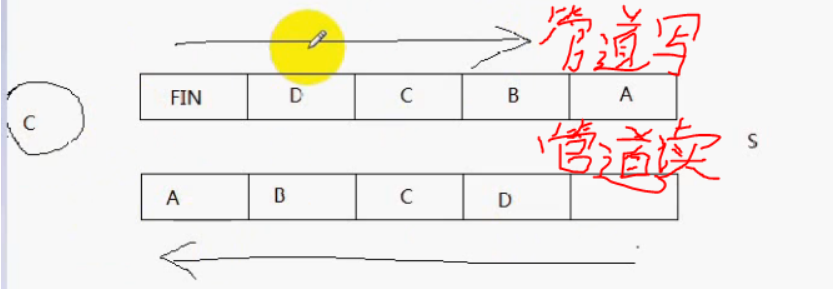
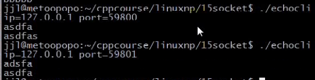
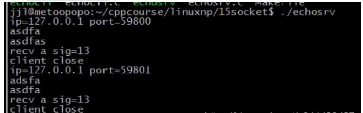
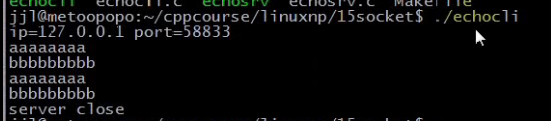
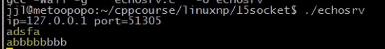

### 文章目录


[TOC]


## 1.close与shutdown

 -    **close终止了数据传送的两个方向**
 -    **shutdown可以有选择的终止某个方向的数据传送或者终止数据传送的2个方向**
 -    **shutdown how=1就可以保证对等方接收到一个EOF字符\(EOF，相当于给对方发送了一个FIN段\)，而不管其它进程是否已经打开了套接字\(与引用计数无关\)。**  
        **而close不能保证，直到套接字引用计数减为0时才发送，也就是说直到所有的进程都关闭了套接字。\(若多个进程打开了该套接字，直到最后一个进程调用close才会向对等方发送一个FIN段\)**

```cpp
man 2 shutdown

int shutdown(int sockfd, int how);

how=1，，也就是SHUT_WR =1，表示终止写的方向
SHUT_WR =1，终止写的方向
SHUT_RD=0，终止读的方向

how=2：表示两者都终止
```

 -    eg：前提：socketA调用了close，socketB没有调用close  
        （1）socketA向socketB传送数据，socketA调用close是关闭了socketA的发送和接收数据这2个方向（即：socketA不能从套接字中读数据和也不能从套接字中写数据）。  
        （2）相当于socketA向B发送了FIN段，socketB收到后，read返回为0，**但是这并不意味着socketB不能通过socket向socketA发送数据，仅仅意味着socketA到socketB的数据传送终止了，并不意味着socketB向socketA的数据传送终止了**，此时socketA会向socketB发送一个RST段（含义：连接重置），socketB再次调用write，会产生SIGPIPE信号  
        （3）eg：前段时间写过的多进程服务端的代码

```cpp
int conn;
conn = accept(sock, NULL. NULL);
pid_t pid=fork();
if (pid == -1)
	ERR_EXIT("fork");

if (pid == 0)
{
	close(sock);
	//通信
	close(conn);//这时才会向对方发送FIN段(因为这时conn引用计数减为0)
}
else if ()
{
	shutdown(conn,shut_WR);//不用理会引用计数，直接向对方发送FIN段
	close(conn);//不会向客户端发送FIN段，仅仅只是将套接字的引用计数减1
}
```

- 为啥要使用shutdown？  
  （1）**可以将TCP看成是全双工的管道**  
  （2）假设server端收到这些字节，还没有回射到client端，还处于全双工的管道中，若此时client关闭，server端收到了FIN终止段，那么此时这些数据无法回射给client端，因为client端调用了close，意味着套接字终止了数据传送的２个方向，不能接收管道中的数据了  
  对于client端而言，只想关闭管道中写入的这一半，不想关闭读入的这一半，此时使用close就无能为力了。  
  

## 2.进一步改进回射客户程序

 -    eg：服务端：NetworkProgramming-master \(1\)\\LinuxNetworkProgramming\\P15echosrv.c

```cpp
//
// Created by wangji on 19-8-7.
//

// socket编程 9

#include <iostream>
#include <stdio.h>
#include <string.h>
#include <unistd.h>
#include <sys/types.h>
#include <sys/socket.h>
#include <netinet/in.h>
#include <arpa/inet.h>


using namespace std;

struct packet
{
    int len;
    char buf[1024];
};

#define ERR_EXIT(m) \
        do  \
        {   \
            perror(m);  \
            exit(EXIT_FAILURE); \
        } while(0);

ssize_t readn(int fd, void *buf, size_t count)
{
    size_t nleft = count;   // 剩余字节数
    ssize_t nread;
    char *bufp = (char*) buf;

    while (nleft > 0)
    {
        nread = read(fd, bufp, nleft);
        if (nread < 0)
        {
            if (errno == EINTR)
            {
                continue;
            }
            return  -1;
        } else if (nread == 0)
        {
            return count - nleft;
        }

        bufp += nread;
        nleft -= nread;
    }
    return count;
}

ssize_t writen(int fd, const void *buf, size_t count)
{
    size_t nleft = count;
    ssize_t nwritten;
    char* bufp = (char*)buf;

    while (nleft > 0)
    {
        if ((nwritten = write(fd, bufp, nleft)) < 0)
        {
            if (errno == EINTR)
            {
                continue;
            }
            return -1;
        }
        else if (nwritten == 0)
        {
            continue;
        }
        bufp += nwritten;
        nleft -= nwritten;
    }
    return count;
}

ssize_t recv_peek(int sockfd, void *buf, size_t len)
{
    while (1)
    {
        int ret = recv(sockfd, buf, len, MSG_PEEK); // 查看传入消息
        if (ret == -1 && errno == EINTR)
        {
            continue;
        }
        return ret;
    }
}

ssize_t readline(int sockfd, void *buf, size_t maxline)
{
    int ret;
    int nread;
    char *bufp = (char*)buf;    // 当前指针位置
    int nleft = maxline;
    while (1)
    {
        ret = recv_peek(sockfd, buf, nleft);
        if (ret < 0)
        {
            return ret;
        }
        else if (ret == 0)
        {
            return ret;
        }
        nread = ret;
        int i;
        for (i = 0; i < nread; i++)
        {
            if (bufp[i] == '\n')
            {
                ret = readn(sockfd, bufp, i+1);
                if (ret != i+1)
                {
                    exit(EXIT_FAILURE);
                }
                return ret;
            }
        }
        if (nread > nleft)
        {
            exit(EXIT_FAILURE);
        }
        nleft -= nread;
        ret = readn(sockfd, bufp, nread);
        if (ret != nread)
        {
            exit(EXIT_FAILURE);
        }
        bufp += nread;
    }
    return -1;
}

void echo_srv(int connfd)
{
    char recvbuf[1024];
    // struct packet recvbuf;
    int n;
    while (1)
    {
        memset(recvbuf, 0, sizeof recvbuf);
        int ret = readline(connfd, recvbuf, 1024);
        if (ret == -1)
        {
            ERR_EXIT("readline");
        }
        if (ret == 0)
        {
            printf("client close\n");
            break;
        }

        fputs(recvbuf, stdout);
        writen(connfd, recvbuf, strlen(recvbuf));
    }

}

void handle_sigpipe(int sig)
{
    printf("recv a sig=%d\n", sig);
}


int main(int argc, char** argv) {


    //测试服务端收到了SIGPIPE信号
    signal(SIGPIPE, SIG_IGN);
    signal(SIGPIPE, handle_sigpipe);

    // 1. 创建套接字
    int listenfd;
    if ((listenfd = socket(AF_INET, SOCK_STREAM, IPPROTO_TCP)) < 0) {
        ERR_EXIT("socket");
    }

    // 2. 分配套接字地址
    struct sockaddr_in servaddr;
    memset(&servaddr, 0, sizeof servaddr);
    servaddr.sin_family = AF_INET;
    servaddr.sin_port = htons(6666);
    servaddr.sin_addr.s_addr = htonl(INADDR_ANY);
    // servaddr.sin_addr.s_addr = inet_addr("127.0.0.1");
    // inet_aton("127.0.0.1", &servaddr.sin_addr);

    int on = 1;
    // 确保time_wait状态下同一端口仍可使用
    if (setsockopt(listenfd, SOL_SOCKET, SO_REUSEADDR, &on, sizeof on) < 0) {
        ERR_EXIT("setsockopt");
    }

    // 3. 绑定套接字地址
    if (bind(listenfd, (struct sockaddr *) &servaddr, sizeof servaddr) < 0) {
        ERR_EXIT("bind");
    }
    // 4. 等待连接请求状态
    if (listen(listenfd, SOMAXCONN) < 0) {
        ERR_EXIT("listen");
    }
    // 5. 允许连接
    struct sockaddr_in peeraddr;
    socklen_t peerlen;


    // 6. 数据交换
    int nready;//检测到的事件个数
    int maxfd = listenfd;//默认套接口1，2，3已经打开了，所以listenfd为3
    fd_set rset;
    fd_set allset;
    FD_ZERO(&rset);
    FD_ZERO(&allset);
    FD_SET(listenfd, &allset);
    int connfd;
    int i;
    int client[FD_SETSIZE];//rset集合中最大容量为FD_SETSIZE
    int maxi;//最大空闲位置初始值为0
    // int ret;
    // int Max = 0;
    // memset(client, -1, sizeof(client));
    for (i = 0; i < FD_SETSIZE; i++)
    {   
        client[i] = -1;//等于-1表示空闲的
    }
    while (1)
    {
        rset = allset;//若没有把所有感兴趣的fd保存至allset中，那么下一次select，rset里面其实是已经改变过的fd的集合
        //rset只保留当前改变事件的IO集合，并没有监听所有的套接口
        nready = select(maxfd + 1, &rset, NULL, NULL, NULL);
        if (nready == -1)
        {
            if (errno == EINTR)//被信号中断，还可以执行
            {
                continue;
            }
            ERR_EXIT("select");
        }

        if (nready == 0)
        {
            continue;
        }

        //监听套接口发生可读事件，意味着对方connect已经完成，这边已完成连接队列的条目不为空
        //此时，调用accept方法就不再阻塞
        if (FD_ISSET(listenfd, &rset))//rset是输入输出参数：输出参数表示：哪些fd产生了事件，输入参数表示：我们关心哪些文件描述符fd
        {
            peerlen = sizeof(peeraddr);
            //peerlen是输入输出参数，要有初始值，返回的是对方地址的长度
            connfd = accept(listenfd, (struct sockaddr *)&peeraddr, &peerlen);
            if (connfd == -1)
            {
                ERR_EXIT("accept");
            }
            for (i = 0; i < FD_SETSIZE; i++)
            {
                if (client[i] < 0)
                {
                    client[i] = connfd;//将connfd保存到client中的空闲位置
                    if (i > maxi)//最大不空闲位置可能发生改变
                        maxi = i;//最大空闲位置发生了改变
                    break;
                }
            }
            if (i == FD_SETSIZE)//找不到空闲位置
            {
                fprintf(stderr, "too many clients\n");
                exit(EXIT_FAILURE);
            }
            printf("id = %s, ", inet_ntoa(peeraddr.sin_addr));
            printf("port = %d\n", ntohs(peeraddr.sin_port));
            FD_SET(connfd, &allset);//将connfd加入到allset集合，以便下次关心connfd的可读事件
            if (connfd > maxfd)//更新maxfd
                maxfd = connfd;
            // Max++;
            // maxfd = max(maxfd, connfd);
            if (--nready <= 0)//说明检测的事件已经处理完毕，没必要往下走
            {
                continue;
            }
        }
        //connfd产生事件
        for (i = 0; i <= maxi; ++i)
        {
            connfd = client[i];
            if (connfd == -1)
            {
                continue;
            }
            if (FD_ISSET(connfd, &rset))//已连接套接口有可读事件
            {
                char recvbuf[1024] = {0};
                int ret = readline(connfd, recvbuf, 1024);
                if (ret == -1)
                {
                    ERR_EXIT("readline");
                }
                if (ret == 0)
                {
                    printf("client close\n");
                    
                    FD_CLR(connfd, &allset);//从allset中清除
                    // Max--;
                    //补充(未做)：实际上，还应该改变maxi的值，如果i是maxi，则maxi应该等于第二大的值，麻烦，先算了
                    client[i] = -1;//一旦套接口关闭。位置空闲了，为-1
                    close(connfd);//关闭套接口，让客户端接收到通知
                }
                fputs(recvbuf, stdout);
                
                //测试客户端close：客户端输入一些数据后，再输入ctrl+D，由于服务端sleep 4s，服务端再次
                //发送数据给客户端，客户端会给服务端发送RST段
                //服务端会收到RST段，会收到SIGPIPE信号
                sleep(4);
                
                writen(connfd, recvbuf, strlen(recvbuf));
                if (--nready <= 0)//所有的事件处理完毕，就break
                {
                    break;
                }
            }
        }
    }
//    pid_t pid;
//    while (1) {
//        int connfd;
//        if ((connfd = accept(listenfd, (struct sockaddr *) &peeraddr, &peerlen)) < 0) {
//            ERR_EXIT("accept");
//        }
//
//        printf("id = %s, ", inet_ntoa(peeraddr.sin_addr));
//        printf("port = %d\n", ntohs(peeraddr.sin_port));
//
//        pid = fork();
//
//        if (pid == -1) {
//            ERR_EXIT("fork");
//        }
//        if (pid == 0)   // 子进程
//        {
//            close(listenfd);
//            echo_srv(connfd);
//            //printf("child exit\n");
//            exit(EXIT_SUCCESS);
//        } else {
//            //printf("parent exit\n");
//            close(connfd);
//        }
//
//
//    }
    // 7. 断开连接
    close(listenfd);


    return 0;
}
```

 -    eg：客户端：NetworkProgramming-master \(1\)\\LinuxNetworkProgramming\\P15echocli.c

```cpp
//
// Created by wangji on 19-8-6.
//

// socket编程 8 select模型

#include <iostream>
#include <stdio.h>
#include <string.h>
#include <unistd.h>
#include <sys/types.h>
#include <sys/socket.h>
#include <netinet/in.h>
#include <arpa/inet.h>
#include <signal.h>
#include <sys/wait.h>


using namespace std;

struct packet
{
    int len;
    char buf[1024];
};

#define ERR_EXIT(m) \
        do  \
        {   \
            perror(m);  \
            exit(EXIT_FAILURE); \
        } while(0);

ssize_t readn(int fd, void *buf, size_t count)
{
    size_t nleft = count;   // 剩余字节数
    ssize_t nread;
    char *bufp = (char*) buf;

    while (nleft > 0)
    {
        nread = read(fd, bufp, nleft);
        if (nread < 0)
        {
            if (errno == EINTR)
            {
                continue;
            }
            return  -1;
        } else if (nread == 0)
        {
            return count - nleft;
        }

        bufp += nread;
        nleft -= nread;
    }
    return count;
}

ssize_t writen(int fd, const void *buf, size_t count)
{
    size_t nleft = count;
    ssize_t nwritten;
    char* bufp = (char*)buf;

    while (nleft > 0)
    {
        if ((nwritten = write(fd, bufp, nleft)) < 0)
        {
            if (errno == EINTR)
            {
                continue;
            }
            return -1;
        }
        else if (nwritten == 0)
        {
            continue;
        }
        bufp += nwritten;
        nleft -= nwritten;
    }
    return count;
}


ssize_t recv_peek(int sockfd, void *buf, size_t len)
{
    while (1)
    {
        int ret = recv(sockfd, buf, len, MSG_PEEK); // 查看传入消息
        if (ret == -1 && errno == EINTR)
        {
            continue;
        }
        return ret;
    }
}

ssize_t readline(int sockfd, void *buf, size_t maxline)
{
    int ret;
    int nread;
    char *bufp = (char*)buf;    // 当前指针位置
    int nleft = maxline;
    while (1)
    {
        ret = recv_peek(sockfd, buf, nleft);
        if (ret < 0)
        {
            return ret;
        }
        else if (ret == 0)
        {
            return ret;
        }
        nread = ret;
        int i;
        for (i = 0; i < nread; i++)
        {
            if (bufp[i] == '\n')
            {
                ret = readn(sockfd, bufp, i+1);
                if (ret != i+1)
                {
                    exit(EXIT_FAILURE);
                }
                return ret;
            }
        }
        if (nread > nleft)
        {
            exit(EXIT_FAILURE);
        }
        nleft -= nread;
        ret = readn(sockfd, bufp, nread);
        if (ret != nread)
        {
            exit(EXIT_FAILURE);
        }
        bufp += nread;
    }
    return -1;
}

void ehco_cli(int sockfd)
{
//    char recvbuf[1024];
//    char sendbuf[1024];
//    // struct packet recvbuf;
//    // struct packet sendbuf;
//    memset(recvbuf, 0, sizeof recvbuf);
//    memset(sendbuf, 0, sizeof sendbuf);
//    int n = 0;
//    while (fgets(sendbuf, sizeof sendbuf, stdin) != NULL)   // 键盘输入获取
//    {
//        writen(sockfd, sendbuf, strlen(sendbuf)); // 写入服务器
//
//        int ret = readline(sockfd, recvbuf, sizeof recvbuf);    // 服务器读取
//        if (ret == -1)
//        {
//            ERR_EXIT("readline");
//        }
//        if (ret == 0)
//        {
//            printf("server close\n");
//            break;
//        }
//
//        fputs(recvbuf, stdout); // 服务器返回数据输出
//
//        // 清空
//        memset(recvbuf, 0, sizeof recvbuf);
//        memset(sendbuf, 0, sizeof sendbuf);
//    }
    fd_set rset;
    FD_ZERO(&rset);

    int nready;//检测到的事件个数
    int maxfd;
    int fd_stdin = fileno(stdin);//fileno：获取标准输入的文件描述符
    if (fd_stdin > sockfd)
    {
        maxfd = fd_stdin;
    } else {
        maxfd = sockfd;
    }

    char sendbuf[1024] = {0};
    char recvbuf[1024] = {0};
    
    int stdineof = 0;

    while (1)//检测标准输入是否有可读事件，套接口是否有可读事件
    {
        //当标准输入终止时，fgets=NULL时，fd_stdin不能加入rset集中进行监听
        if (stdineof == 0)
            FD_SET(fd_stdin, &rset);//将fd_stdin放到读的集合rset中，关心fd_stdin文件描述符的事件
        FD_SET(sockfd, &rset);//将sockfd放到读的集合rset中
        nready = select(maxfd+1, &rset, NULL, NULL, NULL);//读集合中最大文件描述+1
        //到底是哪一个套接口检测到事件？rset集合是会改变的！！返回的是哪一些io或者套接口检测到了事件
        //说明rset是输入输出参数
        if (nready == -1)
        {
            ERR_EXIT("select");
        }
        if (nready == 0)
        {
            continue;
        }
        
        //标准输入IO和网络IO
        //判断标准输入产生的可读事件，还是套接口产生的可读事件？
        if (FD_ISSET(sockfd, &rset))    // 套接口产生的可读事件
        {
            int ret = readline(sockfd, recvbuf, sizeof(recvbuf));    // 服务器读取
            if (ret == -1)
            {
                ERR_EXIT("readline");
            }
            if (ret == 0)
            {
                printf("server close\n");
                break;
            }

            fputs(recvbuf, stdout); // 服务器返回数据输出
            memset(recvbuf, 0, sizeof(recvbuf));
        }

        if (FD_ISSET(fd_stdin, &rset))//判断标准输入产生的可读事件
        {
            if (fgets(sendbuf, sizeof(sendbuf), stdin) == NULL)   //等于NULL，说明客户端已经得到一个EOF结束符
            {
                stdineof = 1;
                //测试客户端给服务端发数据，服务端sleep 4s后，客户端无法读取服务端回射的数据
                close(sockfd);
                eixt(EXIT_FAILURE);
                /*
                shutdown(sockfd, SHUT_WR);
                //仅关闭写入的一半，并不意味着不能读取数据
                //实际还能读取数据，还能读取到对方的关闭通知，即readline还能读取回射的数据
                */
            }
            else
            {
                writen(sockfd, sendbuf, strlen(sendbuf)); // 写入服务器
                memset(sendbuf, 0, sizeof(sendbuf));
            }
            

        }
    }
    // close(sockfd);
};

void handle_sigchld(int sig)
{
    // wait(NULL);
    while (waitpid(-1, NULL, WNOHANG) > 0);
}


int main(int argc, char** argv) {
    
    // signal(SIGCHLD, SIG_IGN);
    signal(SIGCHLD, handle_sigchld);
    // 1. 创建套接字
    int sockfd;
    if ((sockfd = socket(AF_INET, SOCK_STREAM, IPPROTO_TCP)) < 0) {
        ERR_EXIT("socket");
    }

    // 2. 分配套接字地址
    struct sockaddr_in servaddr;
    memset(&servaddr, 0, sizeof servaddr);
    servaddr.sin_family = AF_INET;
    servaddr.sin_port = htons(6666);
    // servaddr.sin_addr.s_addr = htonl(INADDR_ANY);
    servaddr.sin_addr.s_addr = inet_addr("127.0.0.1");
    // inet_aton("127.0.0.1", &servaddr.sin_addr);

    // 3. 请求链接
    if (connect(sockfd, (struct sockaddr *) &servaddr, sizeof servaddr) < 0) {
        ERR_EXIT("connect");
    }

    struct sockaddr_in localaddr;
    socklen_t addrlen = sizeof localaddr;
    if (getsockname(sockfd, (struct sockaddr*)&localaddr, &addrlen) < 0)
    {
        ERR_EXIT("getsockname");
    }
    printf("id = %s, ", inet_ntoa(localaddr.sin_addr));
    printf("port = %d\n", ntohs(localaddr.sin_port));

    // 4. 数据交换
    ehco_cli(sockfd);

    // 5. 断开连接
    close(sockfd);


    return 0;
}
```

- 测试1：  
  客户端执行2次：  
  第一次输入完数据，再输入客户端快速输入ctrl+D，  
  第二次再打开一个客户端，再次输入数据，服务端无法将数据回射给客户端  
    
  客户端关闭后，服务端的管道进程并没有销毁，对服务端是无害的，**但是服务端无法将数据回射给客户端了**  
  

- 测试2：在NetworkProgramming-master \(1\)\\LinuxNetworkProgramming\\P15echocli.c中的代码使用shutdown  
  （1）即使客户端关闭套接字，服务器也能将数据回射回去  
  （2）客户端使用shutdown，如果使用close，第四行和第五行的回射数据就无法收到了  
  （3）客户端输入aaaa，bbbb，ctrl+D  
    
  