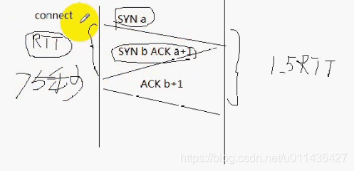
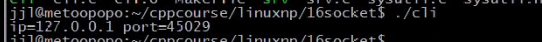
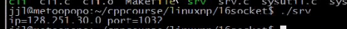
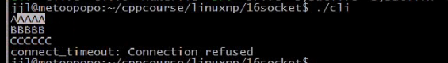

### 文章目录


[TOC]


## 1.套接字I/O超时设置方法

 -    **alarm**  
        因为该闹钟可能会被其它使用，所以一般不使用闹钟来实现超时

```cpp
SIGALRM
void handle(int sig)
{
	return 3;
}

signal(SIGALARM, handle);
alarm(5);
在read之前设置一个闹钟，若5s钟内没有返回数据（到达5s钟），则会产生一个SIGALRM信号将read打断
int ret = read(fd, buf, sizeof(buf));
if (ret == -1 && errno == EINTR)//被EINTR打断
{
	errno =ETIMEDOUT;
}
else if (ret >=0 )
{
	alarm(0);
}

```

 -    套接字选项  
        SO\_SNDTIMEO发送超时时间  
        SO\_RCVTIMEO接收超时时间  
        **不好移植，因为一些TCP选项不支持这两个选项**

```cpp
setsockopt(sock,SOL_SOCKET, SO_RCVTIMEO, 5)

int ret = read(fd, buf, sizeof(buf));
if (ret == -1 && errno == EWOULDBLOCK)//超时的错误码是EWOULDBLOCK
{
	errno =ETIMEDOUT;
}
```

## 2.用select实现超时

- 同select实现超时  
  read\_timeout函数封装  
  write\_timeout函数封装  
  accept\_timeout函数封装  
  connect\_timeout函数封装

- connect\_timeout的存在的价值？  
  （1）RTT：一次往返的时间，  
  （2）connect要停RTT这么长的时间才返回，系统默认是75s，**在广域网上可能出现网络拥塞，connect可能要停比较长的时间才能返回，系统默认75s，对于用于来说是不能容忍的**，所以需要编写connect\_timeout函数，用于连接超时的时间  
  
  - eg：NetworkProgramming-master \(1\)\\LinuxNetworkProgramming\\P16Timeout

```cpp
=================NetworkProgramming-master (1)\LinuxNetworkProgramming\P16Timeout\sysutil.c==============
#include <sysutil.h>

/*
read_timeout使用方法
int ret;
ret  = read_timeout(fd, 5);
if (ret == 0)//成功返回0，进行读操作
{
    read(fd,....);若wait_seconds=0，则阻塞在read
}
else if (ret == -1 && errno == ETIMEOUT)
{
    timeout...
}
else
{
    ERR_EXIT("read_timeout");
}
*/


/*
    * read timeout - 读超时检测函数，不含读操作
    * @fd：文件描述符
    * @wait_seconds:等待超时秒数，如果为0表示不检测超时
    * 成功（未超时）返回0，失败返回-1，超时返回-1并且errno = ETIMEDOUT 
*/
//若检测到超时，就不进行读操作，若返回成功未超时，将做读操作
//read_timeout作用：检测IO是否超时
int read_timeout(int fd, unsigned int wait_seconds)
{
    int ret = 0;
    if (wait_seconds > 0)
    {
        fd_set read_fdset;//读集合
        struct  timeval timeout;//超时时间

        FD_ZERO(&read_timeout);
        FD_SET(fd, &read_fdset);

        timeout.tv_sec = wait_seconds;
        timeout.tv_usec = 0;

        //超时时间到了，没有发生可读事件，那么返回值为0
        //在超时时间之内，发生可读事件，返回值为1
        //select调用失败返回小于0，若小于0是由信号中断的话(errno == EINTR)，则继续调用select
        do 
        {
            ret = select(fd +1, &read_fdset, NULL, NULL, &timeout);
        }while(ret < 0 && errno == EINTR);


        if (ret == 0 )
        {
            ret = -1;
            errno = ETIMEDOUT;
        }
        else if (ret == 1)//因为当前只将一个fd放入到读集合fdset中
            ret = 0;
        
        //若ret= -1,并且errno不等于EINTR，则不做任何处理，直接return
        //若wait_seconds=0，则不按照超时的方式进行处理
    }

    //wait_seconds=0，则直接返回ret=0
    return ret;
}

/*
    * read timeout - 读超时检测函数，不含写操作
    * @fd：文件描述符
    * @wait_seconds:等待超时秒数，如果为0表示不检测超时
    * 成功（未超时）返回0，失败返回-1，超时返回-1并且errno = ETIMEDOUT 
*/
//若检测到超时，就不进行写操作，若返回成功未超时，将做写操作
//write_timeout作用：检测IO是否超时
int write_timeout(int fd, unsigned int wait_seconds)
{
    int ret = 0;
    if (wait_seconds > 0)
    {
        fd_set write_fdset;//写集合
        struct  timeval timeout;//超时时间

        FD_ZERO(&write_timeout);
        FD_SET(fd, &write_fdset);

        timeout.tv_sec = wait_seconds;
        timeout.tv_usec = 0;

        do 
        {
            ret = select(fd +1, &write_timeout, NULL, NULL, &timeout);
        }while(ret < 0 && errno == EINTR);

        if (ret == 0 )
        {
            ret = -1;
            errno = ETIMEDOUT;
        }
        else if (ret == 1)//因为当前只将一个fd放入到读集合fdset中
            ret = 0;
    }

    return ret;
}

/*
 * accept_timeout 带超时的accept
 * fd：套接字,检测的IO
 * addr：输出参数，返回对方地址
 * wait_seconds：等待超时秒数，如果为0表示正常模式
 * 成功（未超时）返回已连接套接字，超时返回-1并且errno = ETIMEDOUT
*/
int accept_timeout(int fd, struct sockaddr_in *addr, unsigned int wait_seconds)
{
    int ret;
    socklen_t addrlen = sizeof(struct sockaddr_in);

    if (wait_seconds > 0)
    {
        fd_set accept_fdset;
        struct timeval timeout;
        FD_ZERO(&accept_fdset);
        FD_SET(fd, &accept_fdset);
        timeout.tv_sec = wait_seconds;
        timeout.tv_usec = 0;
        do
        {
            //三次握手已完成，已完成连接队列有一个条目，accept不阻塞，
            //就说明accept_fdset集合中产生了可读事件
            ret = select(fd+1, &accept_fdset, NULL, &timeout);
        } while (ret < 0 && errno == EINTR);

        if (ret == -1)//这里是ret=-1，errno不等于EINTR
            return -1;
        else if (ret == 0)//ret=0表示超时了
        {
            errno = ETIMEDOUT;
            return -1;
        }
    }

    //ret=1表示：表示检测到事件
    //wait_seconds=0,则直接调用accept，会阻塞
    if (addr != NULL)
        ret = accept(fd, (struct sockaddr*)addr, &addrlen);//返回已连接套接字
    else
        ret = accept(fd, NULL, NULL);

    if (ret == -1)
        ERR_EXIT("accept");    
    return ret;
}

/*
 * activate_noblock：设置I/O为非阻塞模式
 * @fd：文件描述符
*/
void activate_nonblock(int fd)
{
    int ret;
    int flags = fcntl(fd, F_GETFL);//获取fd的标记
    if (flags == -1)
        ERR_EXIT("fcntl");

    flags |= O_NONBLOCK;//添加非阻塞模式
    ret = fcntl(fd, F_SETTFL, flags);
    if (ret == -1)
        ERR_EXIT("fcntl");
}

/*
 * activate_noblock：设置I/O为阻塞模式
 * @fd：文件描述符
*/
void deactivate_nonblock(int fd)
{
    int ret;
    int flags = fcntl(fd, F_GETFL);
    if (flags == -1)
        ERR_EXIT("fcntl");

    flags &= ~O_NONBLOCK;//去掉非阻塞模式
    ret = fcntl(fd, F_SETTFL, flags);
    if (ret == -1)
        ERR_EXIT("fcntl");
}

/*
 * connect_timeout  connect
 * @fd：套接字
 * @addr：要连接的对方地址
 * @wait_seconds等待超时秒数，如果为0表示正常模式
 * 成功（未超时）返回0，失败返回-1，超时返回-1并且errno=ETIMEDOUT
*/
int connect_timeout(int fd, struct sockaddr_in *addr, unsigned int wait_seconds)
{
    int ret;
    socklen_t addrlen = sizeof(struct sockaddr_in);

    //不能直接调用connect，直接调用就会阻塞，希望以非阻塞的方式调用，所以fd
    //设置为非阻塞模式
    if (wait_seconds > 0)
        activate_nonblock(fd);

    ret = connect(fd, (struct sockaddr*)addr, addrlen);
    if (ret <0 && errno == EINPROGRESS)//非阻塞fd返回一定是EINPROGRESS，表示正在处理中
    {
        printf("AAAAA");
        fd_set connect_fdset;//已连接fd集合
        struct timeval timeout;//超时时间
        FD_ZERO(connect_fdset);
        FD_SET(fd, &connect_fdset);
        timeout.tv_sec = wait_seconds;
        timeout.tv_usec = 0;
        do
        {
            /* 一旦连接建立，套接字就可写 */
            ret = select(fd+1, NULL, &connect_fdset, NULL, &timeout);
        } while (ret <0 && errno == EINTER);
        
        if (ret == 0)//超时时间到了，还没有产生可写事件，意味着连接没成功
        {
            ret = -1;
            errno = ETIMEDOUT;
        }
        else if (ret < 0)
            return -1;
        else if (ret == 1)//检测到可写事件
        {
            printf("BBBBB");
            //ret返回1，可能有2种情况，一种是连接建立成功，一种是套接字产生错误
            //此时错误信息不会保存至errno变量中，因此，需要调用getsockopt来获取
            int err;
            socklen_t socklen = sizeof(err);
            int sockoptret = getsockopt(fd, SOL_SOCKET , SO_ERROR, &err, &socklen);//获取错误到err中
            if (sockoptret == -1)
            {
                return -1;
            }
            if (err == 0)//表示没有错误，连接建立成功
            {
                printf("DDDDD");
                ret = 0;
            }
            else
            {
                printf("CCCCC");
                errno =err;
                ret = -1;
            }
            
        }
        
    }

     if (wait_seconds >0)
     {
         deactivate_nonblock(fd);//重新设置为阻塞模式
     }
     return ret;
}


========================NetworkProgramming-master (1)\LinuxNetworkProgramming\P16Timeout\sysutil.h=========
#ifndef _SYSUTIL_H
#define _SYSUTIL_H

#include <unistd.h>
#include <sys/types.h>
#include <sys/socket.h>
#include <netinet/in.h>
#include <arpa/inet.h>
#include <signal.h>
#include <sys/wait.h>
#include <fcntl.h>
#include <sys/ioctl.h>

#include <stdlib.h>
#include <stdio.h>
#include <errno.h>
#include <string.h>

#define ERR_EXIT(m) \
        do \
        { \
            perror(m); \
            exit(EXIT_FAILURE); \
        }while(0)

//设置fd为阻塞或者非阻塞
void activate_nonblock(int fd);
void deactivate_nonblock(int fd);

//超时IO函数
int read_timeout(int fd, unsigned int wait_seconds);
int write_timeout(int fd, unsigned int wait_seconds);
int accept_timeout(int fd, struct sockaddr_in *addr, unsigned int wait_seconds);
int connect_timeout(int fd, struct sockaddr_in *addr, unsigned int wait_seconds);


#endif
=======================NetworkProgramming-master (1)\LinuxNetworkProgramming\P16Timeout\srv.c==========
#include <unistd.h>
#include <sys/types.h>
#include <sys/socket.h>
#include <netinet/in.h>
#include <arpa/inet.h>
#include <signal.h>
#include <sys/wait.h>

#include <stdlib.h>
#include <stdio.h>
#include <errno.h>
#include <string.h>

#define ERR_EXIT(m) \
        do \
        { \
            perror(m); \
            exit(EXIT_FAILURE); \
        }while(0)

int main(void)
{
    int listenfd;
    if ((listen = socket(PF_INET, SOCK_STREAM, 0)) <0)
        ERR_EXIT("socket");
    
    struct sockaddr_in servaddr;
    memset(&servaddr, 0, sizeof(servaddr));
    servaddr.sin_family = AF_INET;
    servaddr.sinport = htons(5188);
    servaddr.sin_addr.s_addr = htonl(INADDR_ANY);

    int on = 1;
    if (setsockopt(listenfd, SOL_SOCKET, SO_REUSEADDR, &on ,sizeof(on)) < 0)
        ERR_EXIT("setsockopt");
    
    if (bind(listenfd, (struct sockaddr*)&servaddr, sizeof(servaddr)) < 0)
        ERR_EXIT("bind");

    if (listen(listenfd, SOMAXCONN) <0)
        ERR_EXIT("listen");

    struct sockaddr_in peeraddr;
    socklen_t peerlen;
    int conn;

    if ((conn = accept(listenfd, (struct sockaddr*)&peeraddr, &peerlen))< 0)
        ERR_EXIT("accept");
    
    printf("ip=%s port =%d\n", inet_ntoa(peeraddr.sin_addr), ntohs(peeraddr.sin_port));

    return 0;

}

=======================NetworkProgramming-master (1)\LinuxNetworkProgramming\P16Timeout\cli.c======================
#include <sysutil.h>

int main(void)
{
    int sock;
    if ((sock = socket(PF_INET, SOCK_STREAM, IPPROTO_TCP)) < 0)
        ERR_EXIT("socket");
    
    struct sockaddr_in servaddr;
    memset(&servaddr, 0, sizeof(servaddr));
    servaddr.sin_family = AF_INET;
    servaddr.sinport = htons(5188);
    servaddr.sin_addr.s_addr = inet_addr("127.0.0.1");

    int ret = connect_timout(sock, &servaddr, 5);
    if (ret == -1 && errno == ETIMEDOUT)
    {
        printf("timeout...\n");
        return 1;
    }
    else if (ret == -1)
        ERR_EXIT("connect_timeout");

    struct sockaddr_in localaddr;
    socklen_t addrlen = sizeof(localaddr);

    struct sockaddr_in localaddr;
    socklen_t addrlen = sizeof(localaddr);
    if (getsockname(sock, (struct sockaddr*)localaddr, &addrlen) < 0)
        ERR_EXIT("getsockname");

    printf("ip=%s port =%d\n", inet_ntoa(peeraddr.sin_addr), ntohs(peeraddr.sin_port));//打印本地端口和ip

    return 0;
}
```

 -    Makefile  
        NetworkProgramming-master \(1\)\\LinuxNetworkProgramming\\P16Timeout\\Makefile

```cpp
.PHONY:clean all
CC=gcc
CFLAGS=-Wall -g
BIN=cli srv
all:$(BIN)
%.o:%.c
	$(cc) $(CFLAGS) -c $< -o $@
cli:cli.o sysutil.o
	$(cc) $(CFLAGS) $^ -o $@
srv:srv.o sysutil.o
	$(cc) $(CFLAGS) $^ -o $@
clean:
	rm -f *.o $(BIN)
```

- 测试1：  
    
  

- 测试2：  
  若只执行客户端，可以看一下connect\_timeout是如何调用的，在里面增加了相关标记代码  
  