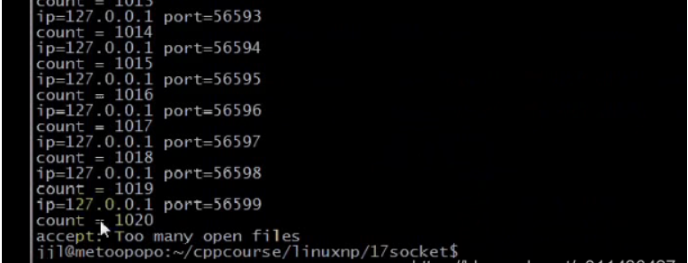

### 文章目录


[TOC]


## 1.select限制

- 用select实现的并发服务器，能达到的并发数，受到2个方面的限制  
  **（1）一个进程能打开的最大文件描述符的限制。这个可以通过调整内核参数实现。**  
  **（2）select中的fd\_set集合容量的限制\(FD\_SETSIZE\)。这需要重新编译内核。**  
  FD\_SETSIZE是在头文件中定义的，而且需要重新编译内核
  - 方法1，使用命令：  
    解决一个进程能打开的最大文件描述符的限制

```cpp
ulimit -n 2048，进程打开的文件描述符的数量
```

 -    方法2，编程解决：  
        解决一个进程能打开的最大文件描述符的限制

```cpp
#include <unistd.h>
#include <sys/types.h>
#include <sys/socket.h>
#include <netinet/in.h>
#include <arpa/inet.h>
#include <signal.h>
#include <sys/wait.h>

#include <stdlib.h>
#include <stdio.h>
#include <errno.h>
#include <string.h>

#define ERR_EXIT(m) \
        do \
        { \
             perror(m); \
             exit(EXIT_FAILURE);    \
        } while (0);

//仅仅改变当前进程最大文件描述符的限制
int main(void)
{
    //man getrlimit
    struct rlimit rl;
    if (getrlimit(RLIMIT_NOFILE, &rl) <0)
        ERR_EXIT("getrlimit"):

    printf("%d\n", (int)rl.rlim_max);

    rl.rlim_cur = 2048;
    rl.rlim_max = 2048;

    if (setrlimit(RLIMIT_NOFILE, &rl) <0)
        ERR_EXIT("setrlimit"):    

    if (getrlimit(RLIMIT_NOFILE, &rl) <0)
        ERR_EXIT("getrlimit"):

    printf("%d\n", (int)rl.rlim_max);    
    return 0;
}
```

 -    eg：select并发量的测试  
        客户端代码：NetworkProgramming-master \(1\)\\LinuxNetworkProgramming\\P17\\P17echocli.c

```cpp
//
// Created by wangji on 19-8-6.
//

// socket编程 8 select模型

#include <iostream>
#include <stdio.h>
#include <string.h>
#include <unistd.h>
#include <sys/types.h>
#include <sys/socket.h>
#include <netinet/in.h>
#include <arpa/inet.h>
#include <signal.h>
#include <sys/wait.h>


using namespace std;

struct packet
{
    int len;
    char buf[1024];
};

#define ERR_EXIT(m) \
        do  \
        {   \
            perror(m);  \
            exit(EXIT_FAILURE); \
        } while(0);

//客户端仅作连接
int main(int argc, char** argv) {
    
    int count = 0;
    while(1)
    {
        // 1. 创建套接字
        int sockfd;
        if ((sockfd = socket(AF_INET, SOCK_STREAM, IPPROTO_TCP)) < 0) 
        {
            sleep(4);//当客户端fd超过上限，先sleep4s再退出来，推迟close
            ERR_EXIT("socket");
        }

        // 2. 分配套接字地址
        struct sockaddr_in servaddr;
        memset(&servaddr, 0, sizeof servaddr);
        servaddr.sin_family = AF_INET;
        servaddr.sin_port = htons(6666);
        // servaddr.sin_addr.s_addr = htonl(INADDR_ANY);
        servaddr.sin_addr.s_addr = inet_addr("127.0.0.1");
        // inet_aton("127.0.0.1", &servaddr.sin_addr);

        // 3. 请求链接
        if (connect(sockfd, (struct sockaddr *) &servaddr, sizeof servaddr) < 0) {
            ERR_EXIT("connect");
        }

        struct sockaddr_in localaddr;
        socklen_t addrlen = sizeof localaddr;
        if (getsockname(sockfd, (struct sockaddr*)&localaddr, &addrlen) < 0)
        {
            ERR_EXIT("getsockname");
        }
        printf("id = %s, ", inet_ntoa(localaddr.sin_addr));
        printf("port = %d\n", ntohs(localaddr.sin_port));

        printf("count = %d\n", ++count);
    }
    return 0;
}
```

 -    eg：select并发量的测试  
        服务端代码：NetworkProgramming-master \(1\)\\LinuxNetworkProgramming\\P17\\P17echoserv.c

```cpp
//
// Created by wangji on 19-8-7.
//

// socket编程 9

#include <iostream>
#include <stdio.h>
#include <string.h>
#include <unistd.h>
#include <sys/types.h>
#include <sys/socket.h>
#include <netinet/in.h>
#include <arpa/inet.h>


using namespace std;

struct packet
{
    int len;
    char buf[1024];
};

#define ERR_EXIT(m) \
        do  \
        {   \
            perror(m);  \
            exit(EXIT_FAILURE); \
        } while(0);

ssize_t readn(int fd, void *buf, size_t count)
{
    size_t nleft = count;   // 剩余字节数
    ssize_t nread;
    char *bufp = (char*) buf;

    while (nleft > 0)
    {
        nread = read(fd, bufp, nleft);
        if (nread < 0)
        {
            if (errno == EINTR)
            {
                continue;
            }
            return  -1;
        } else if (nread == 0)
        {
            return count - nleft;
        }

        bufp += nread;
        nleft -= nread;
    }
    return count;
}

ssize_t writen(int fd, const void *buf, size_t count)
{
    size_t nleft = count;
    ssize_t nwritten;
    char* bufp = (char*)buf;

    while (nleft > 0)
    {
        if ((nwritten = write(fd, bufp, nleft)) < 0)
        {
            if (errno == EINTR)
            {
                continue;
            }
            return -1;
        }
        else if (nwritten == 0)
        {
            continue;
        }
        bufp += nwritten;
        nleft -= nwritten;
    }
    return count;
}

ssize_t recv_peek(int sockfd, void *buf, size_t len)
{
    while (1)
    {
        int ret = recv(sockfd, buf, len, MSG_PEEK); // 查看传入消息
        if (ret == -1 && errno == EINTR)
        {
            continue;
        }
        return ret;
    }
}

ssize_t readline(int sockfd, void *buf, size_t maxline)
{
    int ret;
    int nread;
    char *bufp = (char*)buf;    // 当前指针位置
    int nleft = maxline;
    while (1)
    {
        ret = recv_peek(sockfd, buf, nleft);
        if (ret < 0)
        {
            return ret;
        }
        else if (ret == 0)
        {
            return ret;
        }
        nread = ret;
        int i;
        for (i = 0; i < nread; i++)
        {
            if (bufp[i] == '\n')
            {
                ret = readn(sockfd, bufp, i+1);
                if (ret != i+1)
                {
                    exit(EXIT_FAILURE);
                }
                return ret;
            }
        }
        if (nread > nleft)
        {
            exit(EXIT_FAILURE);
        }
        nleft -= nread;
        ret = readn(sockfd, bufp, nread);
        if (ret != nread)
        {
            exit(EXIT_FAILURE);
        }
        bufp += nread;
    }
    return -1;
}

void echo_srv(int connfd)
{
    char recvbuf[1024];
    // struct packet recvbuf;
    int n;
    while (1)
    {
        memset(recvbuf, 0, sizeof recvbuf);
        int ret = readline(connfd, recvbuf, 1024);
        if (ret == -1)
        {
            ERR_EXIT("readline");
        }
        if (ret == 0)
        {
            printf("client close\n");
            break;
        }

        fputs(recvbuf, stdout);
        writen(connfd, recvbuf, strlen(recvbuf));
    }

}

void handle_sigpipe(int sig)
{
    printf("recv a sig=%d\n", sig);
}


int main(int argc, char** argv) {

    int count = 0;
    //测试服务端收到了SIGPIPE信号
    signal(SIGPIPE, SIG_IGN);
    signal(SIGPIPE, handle_sigpipe);

    // 1. 创建套接字
    int listenfd;
    if ((listenfd = socket(AF_INET, SOCK_STREAM, IPPROTO_TCP)) < 0) {
        ERR_EXIT("socket");
    }

    // 2. 分配套接字地址
    struct sockaddr_in servaddr;
    memset(&servaddr, 0, sizeof servaddr);
    servaddr.sin_family = AF_INET;
    servaddr.sin_port = htons(6666);
    servaddr.sin_addr.s_addr = htonl(INADDR_ANY);

    int on = 1;
    // 确保time_wait状态下同一端口仍可使用
    if (setsockopt(listenfd, SOL_SOCKET, SO_REUSEADDR, &on, sizeof on) < 0) {
        ERR_EXIT("setsockopt");
    }

    // 3. 绑定套接字地址
    if (bind(listenfd, (struct sockaddr *) &servaddr, sizeof servaddr) < 0) {
        ERR_EXIT("bind");
    }
    // 4. 等待连接请求状态
    if (listen(listenfd, SOMAXCONN) < 0) {
        ERR_EXIT("listen");
    }
    // 5. 允许连接
    struct sockaddr_in peeraddr;
    socklen_t peerlen;


    // 6. 数据交换
    int nready;//检测到的事件个数
    int maxfd = listenfd;//默认套接口1，2，3已经打开了，所以listenfd为3
    fd_set rset;
    fd_set allset;
    FD_ZERO(&rset);
    FD_ZERO(&allset);
    FD_SET(listenfd, &allset);
    int connfd;
    int i;
    int client[FD_SETSIZE];//rset集合中最大容量为FD_SETSIZE
    int maxi;//最大空闲位置初始值为0
    for (i = 0; i < FD_SETSIZE; i++)
    {   
        client[i] = -1;//等于-1表示空闲的
    }
    while (1)
    {
        rset = allset;//若没有把所有感兴趣的fd保存至allset中，那么下一次select，rset里面其实是已经改变过的fd的集合
        //rset只保留当前改变事件的IO集合，并没有监听所有的套接口
        nready = select(maxfd + 1, &rset, NULL, NULL, NULL);
        if (nready == -1)
        {
            if (errno == EINTR)//被信号中断，还可以执行
            {
                continue;
            }
            ERR_EXIT("select");
        }

        if (nready == 0)
        {
            continue;
        }

        //监听套接口发生可读事件，意味着对方connect已经完成，这边已完成连接队列的条目不为空
        //此时，调用accept方法就不再阻塞
        if (FD_ISSET(listenfd, &rset))//rset是输入输出参数：输出参数表示：哪些fd产生了事件，输入参数表示：我们关心哪些文件描述符fd
        {
            peerlen = sizeof(peeraddr);
            //peerlen是输入输出参数，要有初始值，返回的是对方地址的长度
            connfd = accept(listenfd, (struct sockaddr *)&peeraddr, &peerlen);
            if (connfd == -1)
            {
                ERR_EXIT("accept");
            }
            for (i = 0; i < FD_SETSIZE; i++)
            {
                if (client[i] < 0)
                {
                    client[i] = connfd;//将connfd保存到client中的空闲位置
                    if (i > maxi)//最大不空闲位置可能发生改变
                        maxi = i;//最大空闲位置发生了改变
                    break;
                }
            }
            if (i == FD_SETSIZE)//找不到空闲位置
            {
                fprintf(stderr, "too many clients\n");
                exit(EXIT_FAILURE);
            }
            printf("id = %s, ", inet_ntoa(peeraddr.sin_addr));
            printf("port = %d\n", ntohs(peeraddr.sin_port));

            printf("count = %d\n", c++count);
            FD_SET(connfd, &allset);//将connfd加入到allset集合，以便下次关心connfd的可读事件
            if (connfd > maxfd)//更新maxfd
                maxfd = connfd;
            if (--nready <= 0)//说明检测的事件已经处理完毕，没必要往下走
            {
                continue;
            }
        }
        //connfd产生事件
        for (i = 0; i <= maxi; ++i)
        {
            connfd = client[i];
            if (connfd == -1)
            {
                continue;
            }
            if (FD_ISSET(connfd, &rset))//已连接套接口有可读事件
            {
                char recvbuf[1024] = {0};
                int ret = readline(connfd, recvbuf, 1024);
                if (ret == -1)
                {
                    ERR_EXIT("readline");
                }
                if (ret == 0)
                {
                    printf("client close\n");
                    
                    FD_CLR(connfd, &allset);//从allset中清除
                    // Max--;
                    //补充(未做)：实际上，还应该改变maxi的值，如果i是maxi，则maxi应该等于第二大的值，麻烦，先算了
                    client[i] = -1;//一旦套接口关闭。位置空闲了，为-1
                    close(connfd);//关闭套接口，让客户端接收到通知
                }
                fputs(recvbuf, stdout);
                
                
                writen(connfd, recvbuf, strlen(recvbuf));
                if (--nready <= 0)//所有的事件处理完毕，就break
                {
                    break;
                }
            }
        }
    }


    return 0;
}
```

- 测试结果：客户端没有sleep  
  服务端  
    
  客户端  
  

- 测试结果：客户端加了sleep  
  服务端：  
    
  客户端：  
  

- 解释如下  
  （1）客户端  
  0 1 2已经被标准输入，标准输出，标准错误输出所占用  
  1021个连接  
  创建第1022个套接字的时候失败了，若客户端没有调用sleep\(4\)，会给服务端发送FIN段，  
  若客户端客户端调用了sleep\(4\)，就不会发送FIN段给对方了  
  （2）服务端  
  收到这1021个连接，会在已完成连接队列中维护1021个条目，若客户端没有sleep\(4\)，可能还有300个fd没有处理，此时创建第1022个套接字的时候失败了，失败了就意味着退出进程，导致客户端发送了FIN段给服务端，而此时服务端还没有完全接受连接，所以有可能先收到了客户端的FIN段，**所以会出现client close和accept混在一起了**

- 没有sleep的服务端解释：  
  close已经收到了，但是已完成连接队列还没有完全接收完，一旦套接字关闭，就能腾出来足够的文件描述符来接受连接了，所以这里的1021并不代表有1021个并发，因为有一些客户端已经关闭了，所以客户端有个sleep\(4\)。

- 有sleep的客户端解释：  
  **为啥客户端是1020个并发？**  
  除了0，1，2外，还有监听套接字3，所以并发数量为1024-4=1020.  
  当fd为1021时，创建套接字就会失败，因为超出了进程创建的fd的限制，所以显示Too many open files

## 2.poll：与select差不多

 -    poll

```cpp
#include <poll.h>
int poll(struct pollfd *fds, nfds_t nfds, int timeout);

fds：关心的套接口以及事件，通常指向一个数组；
nfds：加入到该数组中的io的个数；
timeout：超时时间；
```

 -    struct pollfd结构体

```cpp
struct pollfd {
	 int   fd;         /* file descriptor */
	 short events;     /* requested events */要请求的事件
	 short revents;    /* returned events */返回的事件
};
```

 -    eg客户端：代码如上：NetworkProgramming-master \(1\)\\LinuxNetworkProgramming\\P17\\P17echocli.c
 -    eg服务端：NetworkProgramming-master \(1\)\\LinuxNetworkProgramming\\P17\\P17pollsrv.c

```cpp
//
// Created by jxq on 19-8-7.
//

// socket编程 12 poll模型

#include <iostream>
#include <stdio.h>
#include <cstring>
#include <unistd.h>
#include <sys/types.h>
#include <sys/socket.h>
#include <netinet/in.h>
#include <arpa/inet.h>
#include <poll.h>


using namespace std;

struct packet
{
    int len;
    char buf[1024];
};

#define ERR_EXIT(m) \
        do  \
        {   \
            perror(m);  \
            exit(EXIT_FAILURE); \
        } while(0);

ssize_t readn(int fd, void *buf, size_t count)
{
    size_t nleft = count;   // 剩余字节数
    ssize_t nread;
    char *bufp = (char*) buf;

    while (nleft > 0)
    {
        nread = read(fd, bufp, nleft);
        if (nread < 0)
        {
            if (errno == EINTR)
            {
                continue;
            }
            return  -1;
        } else if (nread == 0)
        {
            return count - nleft;
        }

        bufp += nread;
        nleft -= nread;
    }
    return count;
}

ssize_t writen(int fd, const void *buf, size_t count)
{
    size_t nleft = count;
    ssize_t nwritten;
    char* bufp = (char*)buf;

    while (nleft > 0)
    {
        if ((nwritten = write(fd, bufp, nleft)) < 0)
        {
            if (errno == EINTR)
            {
                continue;
            }
            return -1;
        }
        else if (nwritten == 0)
        {
            continue;
        }
        bufp += nwritten;
        nleft -= nwritten;
    }
    return count;
}

ssize_t recv_peek(int sockfd, void *buf, size_t len)
{
    while (1)
    {
        int ret = recv(sockfd, buf, len, MSG_PEEK); // 查看传入消息
        if (ret == -1 && errno == EINTR)
        {
            continue;
        }
        return ret;
    }
}

ssize_t readline(int sockfd, void *buf, size_t maxline)
{
    int ret;
    int nread;
    char *bufp = (char*)buf;    // 当前指针位置
    int nleft = maxline;
    while (1)
    {
        ret = recv_peek(sockfd, buf, nleft);
        if (ret < 0)
        {
            return ret;
        }
        else if (ret == 0)
        {
            return ret;
        }
        nread = ret;
        int i;
        for (i = 0; i < nread; i++)
        {
            if (bufp[i] == '\n')
            {
                ret = readn(sockfd, bufp, i+1);
                if (ret != i+1)
                {
                    exit(EXIT_FAILURE);
                }
                return ret;
            }
        }
        if (nread > nleft)
        {
            exit(EXIT_FAILURE);
        }
        nleft -= nread;
        ret = readn(sockfd, bufp, nread);
        if (ret != nread)
        {
            exit(EXIT_FAILURE);
        }
        bufp += nread;
    }
    return -1;
}

void echo_srv(int connfd)
{
    char recvbuf[1024];
    // struct packet recvbuf;
    int n;
    while (1)
    {
        memset(recvbuf, 0, sizeof recvbuf);
        int ret = readline(connfd, recvbuf, 1024);
        if (ret == -1)
        {
            ERR_EXIT("readline");
        }
        if (ret == 0)
        {
            printf("client close\n");
            break;
        }

        fputs(recvbuf, stdout);
        writen(connfd, recvbuf, strlen(recvbuf));
    }

}

int main(int argc, char** argv) {
    // 1. 创建套接字
    int listenfd;
    if ((listenfd = socket(AF_INET, SOCK_STREAM, IPPROTO_TCP)) < 0) {
        ERR_EXIT("socket");
    }

    // 2. 分配套接字地址
    struct sockaddr_in servaddr;
    memset(&servaddr, 0, sizeof servaddr);
    servaddr.sin_family = AF_INET;
    servaddr.sin_port = htons(6666);
    servaddr.sin_addr.s_addr = htonl(INADDR_ANY);
    // servaddr.sin_addr.s_addr = inet_addr("127.0.0.1");
    // inet_aton("127.0.0.1", &servaddr.sin_addr);

    int on = 1;
    // 确保time_wait状态下同一端口仍可使用
    if (setsockopt(listenfd, SOL_SOCKET, SO_REUSEADDR, &on, sizeof on) < 0) {
        ERR_EXIT("setsockopt");
    }

    // 3. 绑定套接字地址
    if (bind(listenfd, (struct sockaddr *) &servaddr, sizeof servaddr) < 0) {
        ERR_EXIT("bind");
    }
    // 4. 等待连接请求状态
    if (listen(listenfd, SOMAXCONN) < 0) {
        ERR_EXIT("listen");
    }
    // 5. 允许连接
    struct sockaddr_in peeraddr;
    socklen_t peerlen;


    // 6. 数据交换
    int nready;
    int maxfd = listenfd;
    int maxi = 0;//最大不空闲的位置为0
    int connfd;
    int i;
    struct pollfd client[2048];//struct pollfd结构体保存客户端的信息
    int ret;
    int Max = 0;

    for (i = 0; i < 2048; ++i)
    {
        client[i].fd = -1;//-1表示客户端空闲
    }
    
    client[0].fd = listenfd;
    client[0].events = POLLIN;//POLLIN：表示监听套接字listenfd的可读事件感兴趣
    while (1)
    {
        nready = poll(client, maxi+1, -1);//-1表示永远等待，等到有事件才返回
        //nready = select(maxfd + 1, &rset, NULL, NULL, NULL);
        if (nready == -1)//为-1表示出错
        {
            if (errno == EINTR)
            {
                continue;
            }
            ERR_EXIT("select");
        }

        if (nready == 0)//为0表示超时了
        {
            continue;
        }

        //if (FD_ISSET(listenfd, &rset))
        if (client[0].revents & POLLIN)//监听套接口是client[0]
        {
            peerlen = sizeof(peeraddr);
            connfd = accept(listenfd, (struct sockaddr *)&peeraddr, &peerlen);
            if (connfd == -1)
            {
                ERR_EXIT("accept");
            }
            for (i = 0; i < 2048; i++)
            {
                if (client[i].fd < 0)
                {
                    client[i].fd = connfd;
                    if （i > maxi）
                        maxi = i;
                    break;
                }
            }
            if (i == 2048)
            {
                fprintf(stderr, "too many clients\n");
                exit(EXIT_FAILURE);
            }
            printf("id = %s, ", inet_ntoa(peeraddr.sin_addr));
            printf("port = %d\n", ntohs(peeraddr.sin_port));
            client[i].events = POLLIN;//得到新的fd，就得将其添加进去
            if (--nready <= 0)
            {
                continue;
            }
        }

        //已连接套接口从1到maxi进行遍历
        for (i = 1; i < = maxi; ++i)
        {
            connfd = client[i].fd;
            if (connfd == -1)
            {
                continue;
            }
            //if (FD_ISSET(connfd, &rset))
            if (client[i].revents & POLLIN)//表示发生了可读事件
            {
                char recvbuf[1024] = {0};
                ret = readline(connfd, recvbuf, 1024);
                if (ret == -1)
                {
                    ERR_EXIT("readline");
                }
                if (ret == 0)
                {
                    printf("client close\n");
                    client[i].fd = -1;
                    //FD_CLR(connfd, &allset);
                    maxi--;
                }
                fputs(recvbuf, stdout);
                //sleep(4);
                writen(connfd, recvbuf, strlen(recvbuf));
                if (--nready <= 0)
                {
                    break;
                }
            };
        }
    }

    // 7. 断开连接
    close(listenfd);


    return 0;
}
```

- 测试：ulimit \-n 2048  
  服务端：去掉0，1，2，监听fd，为2048-4=2044  
    
  客户端：去掉0，1，2，为2048-3=2045，即打开2045个fd  
  

- struct pollfd结构体中的events  
  （1）POLLIN与select的可读事件相对应  
  （2）POLLPRI与select的紧急事件相对应  
  （3）POLLOUT与select的可写事件相对应


 -    Makefile

```cpp
.PHONY:clean all
CC=gcc
CFLAGS=-Wall -g
BIN=echosrv echocli nofile_limit contest pollsrv
all:$(BIN)
%.o:%.c
	$(CC) $(CFLAGS) -c $< -o $@
clean:
	rm -f *.o $(BIN)


```