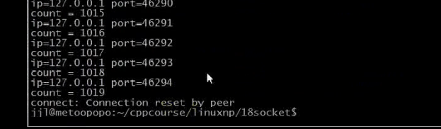
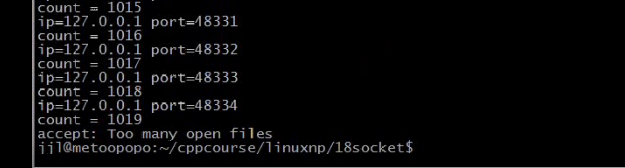

### 文章目录


[TOC]

## 1.select vs poll

 -    select限制  
        （1）一个进程能打开的最大文件描述符的个数是有限的  
        （2）FD\_SETSIZE\(fd\_set\)
 -    poll限制，poll只有select的第一个限制  
        （1）一个进程能打开的最大文件描述符的个数是有限的
 -    最大文件描述符的个数除了使用ulimit -n number来设置，还和什么相关？  
        **系统所有打开的最大文件描述符的个数也是有限的，跟内存大小有关**

```cpp
cat /proc/sys/fs/file-max
```

  
因为当前内存是512M，所以系统可以打开的最大文件描述符的个数为5万。若是1G，则是10万左右，10G就是百万。

- select和poll的效率不高共同点：  
  **内核要遍历所有文件描述符，直到找到发生事件的文件描述符**

## 2.epoll使用

```cpp
#include <sys/epoll.h>

int epoll_create(int size);创建一个epoll实例，size不是最大并发数，size仅仅代表内部所创建的hash表的大小
int epoll_create1(int flags);最新的，而且fd的数量已经由红黑树来控制
int epoll_ctl(int epfd, int op, int fd, struct epoll_event *event);将一个fd添加到epoll来管理
int epoll_wait(int epfd, struct epoll_event *events, int maxevents, int timeout);等待事件
```

 -    eg：**epoll这块测试代码用c++编写**  
        服务端代码：NetworkProgramming-master \(1\)\\LinuxNetworkProgramming\\P18epollsrv.cpp

```cpp
//
// Created by jxq on 19-8-7.
//

// socket编程 13 epoll 模型

#include <iostream>
#include <stdio.h>
#include <cstring>
#include <unistd.h>
#include <sys/types.h>
#include <sys/socket.h>
#include <netinet/in.h>
#include <arpa/inet.h>
#include <sys/epoll.h>
#include <poll.h>
#include <vector>
#include <sys/stat.h>
#include <fcntl.h>
#include <algorithm>


using namespace std;

typedef vector<struct epoll_event> EventList;//vector：动态数组

struct packet
{
    int len;
    char buf[1024];
};

#define ERR_EXIT(m) \
        do  \
        {   \
            perror(m);  \
            exit(EXIT_FAILURE); \
        } while(0);

ssize_t readn(int fd, void *buf, size_t count)
{
    size_t nleft = count;   // 剩余字节数
    ssize_t nread;
    char *bufp = (char*) buf;

    while (nleft > 0)
    {
        nread = read(fd, bufp, nleft);
        if (nread < 0)
        {
            if (errno == EINTR)
            {
                continue;
            }
            return  -1;
        } else if (nread == 0)
        {
            return count - nleft;
        }

        bufp += nread;
        nleft -= nread;
    }
    return count;
}

ssize_t writen(int fd, const void *buf, size_t count)
{
    size_t nleft = count;
    ssize_t nwritten;
    char* bufp = (char*)buf;

    while (nleft > 0)
    {
        if ((nwritten = write(fd, bufp, nleft)) < 0)
        {
            if (errno == EINTR)
            {
                continue;
            }
            return -1;
        }
        else if (nwritten == 0)
        {
            continue;
        }
        bufp += nwritten;
        nleft -= nwritten;
    }
    return count;
}

ssize_t recv_peek(int sockfd, void *buf, size_t len)
{
    while (1)
    {
        int ret = recv(sockfd, buf, len, MSG_PEEK); // 查看传入消息
        if (ret == -1 && errno == EINTR)
        {
            continue;
        }
        return ret;
    }
}

ssize_t readline(int sockfd, void *buf, size_t maxline)
{
    int ret;
    int nread;
    char *bufp = (char*)buf;    // 当前指针位置
    int nleft = maxline;
    while (1)
    {
        ret = recv_peek(sockfd, buf, nleft);
        if (ret < 0)
        {
            return ret;
        }
        else if (ret == 0)
        {
            return ret;
        }
        nread = ret;
        int i;
        for (i = 0; i < nread; i++)
        {
            if (bufp[i] == '\n')
            {
                ret = readn(sockfd, bufp, i+1);
                if (ret != i+1)
                {
                    exit(EXIT_FAILURE);
                }
                return ret;
            }
        }
        if (nread > nleft)
        {
            exit(EXIT_FAILURE);
        }
        nleft -= nread;
        ret = readn(sockfd, bufp, nread);
        if (ret != nread)
        {
            exit(EXIT_FAILURE);
        }
        bufp += nread;
    }
    return -1;
}

void echo_srv(int connfd)
{
    char recvbuf[1024];
    // struct packet recvbuf;
    int n;
    while (1)
    {
        memset(recvbuf, 0, sizeof recvbuf);
        int ret = readline(connfd, recvbuf, 1024);
        if (ret == -1)
        {
            ERR_EXIT("readline");
        }
        if (ret == 0)
        {
            printf("client close\n");
            break;
        }

        fputs(recvbuf, stdout);
        writen(connfd, recvbuf, strlen(recvbuf));
    }

}

void activate_nonblock(int fd)
{
    int ret;
    int flags = fcntl(fd, F_GETFL);
    if(flags == -1)
        ERR_EXIT("fcntl");
    flags |= O_NONBLOCK;
    ret = fcntl(fd, F_SETFL, flags);
    if(ret == -1)
        ERR_EXIT("fcntl");
}

int main(int argc, char** argv) {
    // 1. 创建套接字
    int listenfd;
    if ((listenfd = socket(AF_INET, SOCK_STREAM, IPPROTO_TCP)) < 0) {
        ERR_EXIT("socket");
    }

    // 2. 分配套接字地址
    struct sockaddr_in servaddr;
    memset(&servaddr, 0, sizeof servaddr);
    servaddr.sin_family = AF_INET;
    servaddr.sin_port = htons(6666);
    servaddr.sin_addr.s_addr = htonl(INADDR_ANY);
    // servaddr.sin_addr.s_addr = inet_addr("127.0.0.1");
    // inet_aton("127.0.0.1", &servaddr.sin_addr);

    int on = 1;
    // 确保time_wait状态下同一端口仍可使用
    if (setsockopt(listenfd, SOL_SOCKET, SO_REUSEADDR, &on, sizeof on) < 0) {
        ERR_EXIT("setsockopt");
    }

    // 3. 绑定套接字地址
    if (bind(listenfd, (struct sockaddr *) &servaddr, sizeof servaddr) < 0) {
        ERR_EXIT("bind");
    }
    // 4. 等待连接请求状态
    if (listen(listenfd, SOMAXCONN) < 0) {
        ERR_EXIT("listen");
    }
    // 5. 允许连接
    struct sockaddr_in peeraddr;
    socklen_t peerlen;


    // 6. 数据交换
    int nready;
    int connfd;
    int i;
    vector<int> clients;//保存客户端的已连接套接字
    int epollfd;
    //EPOLL_CLOEXEC含义：该进程被替换的时候，文件描述会被关闭
    epollfd = epoll_create1(EPOLL_CLOEXEC); // 创建一个epoll的实例

    struct epoll_event event;
    //typedef union epoll_data{...};
    //struct epoll_enent{_uint32_t enents; epoll_data data};
    //感兴趣的fd是监听listenfd
    event.data.fd = listenfd;//data是一个联合体，共用体，共用体的大小是8个字节
    event.events = EPOLLIN | EPOLLET;//listenfd感兴趣的事件：EPOLLIN，是否事件到来，EPOLLET表示边沿方式触发
    epoll_ctl(epollfd, EPOLL_CTL_ADD, listenfd, &event);//（epoll实例句柄，操作方式，将fd添加至epoll来管理，该fd感兴趣的事件）

    EventList events(16);//events数组的初始值为16

    while (1)
    {
        //epoll_wait检测哪一些IO产生了事件，（epoll实例句柄，哪些事件产生了感兴趣的事件，能够返回的最大事件个数，超时时间）
        // 等侍注册在epfd上的socket fd的事件的发生，如果发生则将发生的sokct fd和事件类型放入到events数组中
        //events.begin()是一个迭代器，可以看成一个指针，*events.begin()：取数组第一个元素，类型就是struct epoll_event
        //&*events.begin()：动态数组的首地址
        //不直接使用vents.begin()，是因为他类型是一个迭代器，类型不匹配，编译不通过，取&*就等价于struct epoll_event*
        nready = epoll_wait(epollfd, &*events.begin(), static_cast<int>(events.size()), -1);    // -1：一直等待，直到有事件产生

        if (nready == -1)
        {
            if (errno == EINTR)
            {
                continue;
            }
            ERR_EXIT("epoll_wait");
        }

        if (nready == 0)
        {
            continue;
        }

        //nready：等待到的事件个数
        if ((size_t)nready == events.size())//说明容器容量不够大，需要调整容器容量的大小
        {
            events.resize(events.size()*2);
        }

        //返回的事件，保存在&*events.begin()中
        for (i = 0; i < nready; ++i)//返回了nready个事件
        {
            //epoll效率比select和poll高的核心：返回的事件保存在events中，通过events可以找到fd，也就是说这些fd产生了事件
            //就不需要遍历哪些socket在某个集合中产生了可读事件，因为events指示的fd已经产生了事件
            if (events[i].data.fd == listenfd)//listenfd产生了可读事件
            {
                peerlen = sizeof(peeraddr);
                connfd = accept(listenfd, (struct sockaddr*)&peeraddr, &peerlen);
                if (connfd == -1)
                {
                    ERR_EXIT("accept");
                }
                printf("id = %s, ", inet_ntoa(peeraddr.sin_addr));
                printf("port = %d\n", ntohs(peeraddr.sin_port));
                clients.push_back(connfd);
                activate_nonblock(connfd);

                event.data.fd = connfd;
                event.events = EPOLLIN | EPOLLET;
                epoll_ctl(epollfd, EPOLL_CTL_ADD, connfd, &event);

                //下一次epoll_wait就有可能产生监听fd和连接fd产生可读事件

            }//只需要判断events产生了哪些事件 ，可读，可写？
            //不需要遍历哪个fd产生了事件，因为events[i].data.fd中的fd就是产生事件的套接字
            else if (events[i].events & EPOLLIN)//已连接fd产生了可读事件
            {
                connfd = events[i].data.fd;//取出已连接fd
                if (connfd < 0)
                {
                    continue;
                }
                char recvbuf[1024];
                int ret = readline(connfd, recvbuf, sizeof(recvbuf));
                if (ret == -1)
                {
                    ERR_EXIT("readline");
                }
                if (ret == 0)//表示对方关闭
                {
                    printf("client close\n");
                    close(connfd);

                    event = events[i];//对方关闭，要将该events[i]从epollfd中删除
                    epoll_ctl(epollfd, EPOLL_CTL_DEL, connfd, &event);
                    //删除已连接fd
                    clients.erase(std:remove(clients.begin(), clients.end(), connfd),clients.end());
                    // clients.erase(
                    //         remove_if(clients.begin(), clients.end(), [connfd](int n){return n == connfd;}),
                    //         clients.end());
                }
                fputs(recvbuf, stdout);
                writen(connfd, recvbuf, strlen(recvbuf));
            }
        }

    }
    // 7. 断开连接
    close(listenfd);
    return 0;
}
```

- 客户端代码：NetworkProgramming-master \(1\)\\LinuxNetworkProgramming\\P17\\P17echocli.c

- 测试：  
  客户端  
    
  服务端  
  **总共1024个fd，为什么只有1019个fd？**  
  0 1 2 3\(监听fd\)，4\(epollfd的句柄\)，所以最多连接1019个fd  
  

  - Makefile

```cpp
.PHONY:clean all
CC=gcc
CFLAGS=-Wall -g
BIN=echosrv echocli nofile_limit contest pollsrv epollsrv
all:$(BIN)
%.o:%.c
	$(CC) $(CFLAGS) -c $< -o $@
%.o:%.cpp
	g++ $(CFLAGS) -c $< -o $@
epollsrv:epollsrv.o
	g++ $(CFLAGS) -c $^ -o $@
clean:
	rm -f *.o $(BIN)


```

## 3.epoll与select、poll的区别

- （1）相比于select与poll、epoll最大的好处在于他不会随着监听fd数目的增长而降低效率
- （2）内核中的select与poll的实现是采用轮询来处理的，轮询的fd数目越多，自然耗时越多
- **（3）epoll的实现是基于回调的，如果fd有期望的事件发生就通过回调函数将其加入epoll就绪队列中，也就是说它只关心活跃的fd，与fd数目无关**  
  epoll\_wait返回的事件就已经指出了哪一个fd发生了可读或者可写的事件，所以不用在应用层遍历fd
- **（4）内核/用户空间内存拷贝问题，如何让内核把fd消息通知给用户空间呢？**  
  **在这个问题上，select/poll采用了内存拷贝方法，而epoll采用了共享内存的方式。**
- （5）epoll不仅会告诉应用程序有I/O事件到来，还会告诉应用程序相关的信息，这些信息是应用程序填充的\(填充指的是epoll\_ctrl填充的\)，因此根据这些信息，应用程序就能直接定位到事件，而不必遍历整个fd集合  
  epoll少了2次的遍历
- 第（3）和第（4），epoll比poll和select效率高的原因

## 4.epoll模式：EPOLLLT，EPOLLET

- EPOLLLT  
  （1）level trigger电平触发，水平触发  
  （2）完全靠kernel epoll驱动，应用程序只需要处理从epoll\_wait返回的fds **（就绪队列的描述符）**，这些fds，我们认为它们处于就绪状态

- EPOLLET  
  （1）edege trigger边缘触发，效率更高  
  （2）此模式下，系统仅仅通知应用程序哪些fds变成了就绪状态，一旦fd变成就绪状态 **（只通知一次）**，epoll将不再关注这个fd的任何状态信息，（从epoll队列移除）直到应用程序通过读写操作触发EAGAIN状态，epoll认为这个fd又变为了空闲状态，那么epoll又重新关注这个fd的状态变化（重新加入epoll队列）  
  （3）随着epoll\_wait的返回，队列中的fds是在减少的，所以在大并发的系统中，EPOLLET更有优势。  
  但是对程序员的要求也更高。  
  （4）EPOLLET只关注fd从空闲到就绪态的状态送触发的事件，返回相应的事件  
  若数据没有处理完，就调用epoll\_wait的话，就会出问题，假如对方发送过来2K数据，读取的时候只读取了1K的数据，**然后调用epoll\_wait重新监听状态，此时就没有办法监听状态了，会一直阻塞，因为他是边缘触发：从空闲到就绪状态的触发，此时内核中虽然还有数据，他也不再触发可读事件，而LT模式只要缓冲区的事件没有读取完，就会触发，所以LT触发的次数更多，那么他的效率就会下降（下降的效率也不是特别多）**  
  剩下的1K怎么读取呢？  
  这就需要应用层维护一个就绪队列，而水平触发方式的方式是由系统内部维护的  
  ET模式需要维护一个就绪队列，如果不维护，那么处理很容易出差错，若没有读取完全的话，直接调用epoll\_wait函数就会一直阻塞了，就不再触发了。  
  或者读完了，触发一个EAGAIN，表示全部读完了，前提是**将fd设置为非阻塞模式**，epoll认为这个fd变成了空闲状态了，此时可以重新关心fd的变化\(即重新加入epoll队列\)，如果有新事件到来的时候，他将不再阻塞