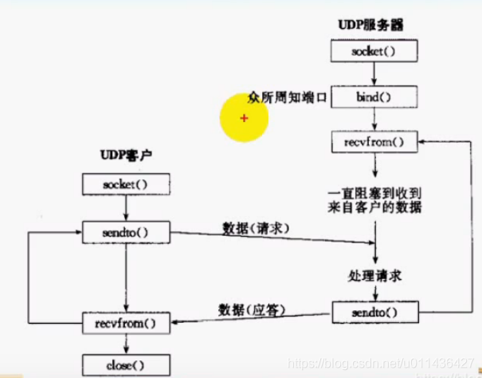
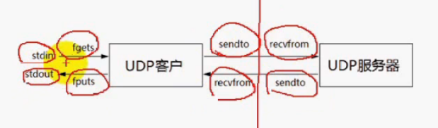
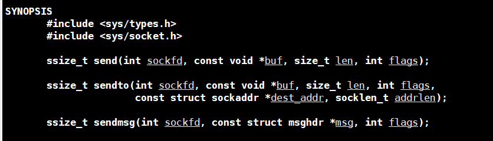
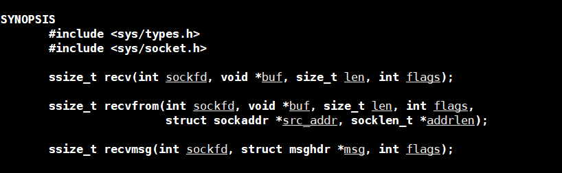
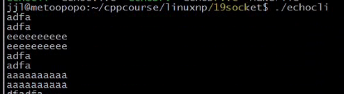
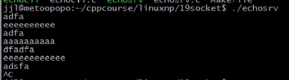
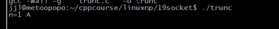
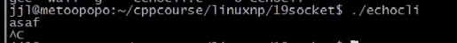

### 文章目录


[TOC]


## 1.UDP特点

- **无连接  
  不需要经过三次握手**
- **基于消息的数据传输服务  
  TCP是基于流的传输服务，消息之间没有边界，UDP数据包之间有边界**
- **不可靠  
  数据包丢失，重复，乱序，以及缺乏流控**
- **一般情况下UDP更加高效**

## 2.UDP客户/服务基本模型



## 3.UDP回射客户/服务器

 -    红色竖线：表示客户端和服务端的边界  
        





 -    eg：服务端：NetworkProgramming-master \(1\)\\LinuxNetworkProgramming\\P19udpechosrc.c

```cpp
#include <unistd.h>
#include <stdlib.h>
#include <stdio.h>
#include <errno.h>

#include <sys/types.h>
#include <sys/socket.h>
#include <netinet/in.h>//sockaddr_in
#include <string.h>

#define ERR_EXIT(m) \
        do  \
        {   \
            perror(m);  \
            exit(EXIT_FAILURE); \
        } while(0);


void echo_srv(int sock)
{
    char recvbuf[1024] = {0};
    struct sockaddr_in peeraddr;
    socklen_t peerlen;
    int n;
    while (1)
    {
        peerlen = sizeof(peeraddr);
        memset(recvbuf, 0, sizeof(recvbuf));
        //指定对方的地址信息:peeraddr,peerlen
        n = recvfrom(sock, recvbuf, sizeof(recvbuf), 0, (struct sockaddr*)&peeraddr, &peerlen);
        if (n == -1)
        {
            if (errno == EINTR)//被信号中断的话，继续接收
                continue;
            ERR_EXIT("recvfrom");
        }
        else if (n > 0)
        { 
            fputs(recvbuf, stdout);
            sendto(sock, recvbuf, n, 0, (struct sockaddr*)&peeraddr, peerlen);
        }
    }
    close(sock);
}

int main(void)
{
    int sock;
    //PF_INET:IPv4的地址家族
    //SOCK_DGRAM：IPv4家族中的udp套接口，所以第三个参数可为0
    if ((sock = socket(PF_INET, SOCK_DGRAM, 0))< 0);
        ERR_EXIT("socket");
    
    //三个参数：地址族，端口，本机ip地址
    struct sockaddr_in servaddr;
    memset(&servaddr, 0, servaddr);
    servaddr.sin_family = AF_INET;
    servaddr.sin_port = htons(5188);
    servaddr.sin_addr.s_addr = htons(INADDR_ANY);

    if (bind(sock, (struct sockaddr*)&servaddr, sizeof(servaddr)) <0)
        ERR_EXIT("bind");

    echo_srv(sock);
    return 0;
}
```

 -    eg：客户端：NetworkProgramming-master \(1\)\\LinuxNetworkProgramming\\P19udpechocli.c

```cpp
#include <unistd.h>
#include <stdlib.h>
#include <stdio.h>
#include <errno.h>

#include <arpa/inet.h>
#include <sys/types.h>
#include <sys/socket.h>
#include <netinet/in.h>//sockaddr_in
#include <string.h>

#define ERR_EXIT(m) \
        do  \
        {   \
            perror(m);  \
            exit(EXIT_FAILURE); \
        } while(0);


void echo_cli(int sock)
{
    //三个参数：地址族，端口，本机ip地址
    struct sockaddr_in servaddr;
    memset(&servaddr, 0, servaddr);
    servaddr.sin_family = AF_INET;
    servaddr.sin_port = htons(5188);
    servaddr.sin_addr.s_addr = inet_addr("127.0.0.1");//INADDR_ANY:表示本机任意地址
    
    //解决异步错误，connect保证该套接字不饿能发送数据给其它地址，与TCP3次握手不同
    connect(sock, (struct sockaddr*)&servaddr, sizeof(servaddr));

    int ret;//测试异步错误
    char sendbuf[1024] = {0};
    char recvbuf[1024] = {0};

    /*
    对于已连接套接字而言：
    获取本地地址可以用getsockname
    获取远程地址可以用getpeername
    当前的套接字是未连接的，仅仅可以获取本地的地址，该套接字是第一次sendto的时候绑定的
    */
    while (fgets(sendbuf, sizeof(sendbud), sdtin) !=NULL)
    {
        //若只开启udp客户端，不开启udp服务端
        //会产生ICMP异步错误：sento只是将应用层的缓冲区拷贝套套接口对应的缓冲区，是不报错的，该错误会延迟到recvfrom才收到通知
        //而recvfrom也不不能通知，因为TCP/IP规定：这种异步错误是不能返还给未连接的套接字的，所以recvfrom会一直阻塞
        // sendto(sock, sendbuf, strlen(sendbuf), 0, (struct sockaddr*)&servaddr, sizeof(servaddr));

        //解决异步错误，因为这里的sock的对等方的地址已经由connect指定了
        sendto(sock, sendbuf, strlen(sendbuf), 0, NULL, 0);
        //等价于send(sock, sendbuf, strlen(sendbuf))
        ret = recvfrom(sock, recvbuf, sizeof(recvbuf), 0, NULL, NULL);
        if(ret == -1)
        {
            if (errno == EINTR)
                continue;
            ERR_EXIT("recvfrom");
        }

        fputs(recvbuf, stdout);
        memset(sendbuf, 0, sizeof(sendbuf));
        memset(recvbuf, 0, sizeof(recvbuf));
    }
    close(sock);

}

int main(void)
{
    int sock;
    //PF_INET:IPv4的地址家族
    //SOCK_DGRAM：IPv4家族中的udp套接口，所以第三个参数可为0
    if ((sock = socket(PF_INET, SOCK_DGRAM, 0))< 0);
        ERR_EXIT("socket");
    
    echo_cli(sock);

    return 0;
}
```

- 测试结果：  
    
  

## 4.UDP注意点

 -    UDP报文可能会丢失、重复  
        （1）丢失：需要客户端和服务端得有超时机制  
        （2）重复：需要维护数据报的序号
 -    UDP报文可能会乱序（需要维护数据报的序号）
 -    UDP缺乏流量控制
 -    UDP协议数据报文截断  
        **（1）若缓冲区满了，会将缓冲区的数据覆盖掉，也可以在应用层模拟TCP的滑动窗口协议来实现流控  
        （2）若接收到的数据报大于接收缓冲区，报文就会截断，下一次接收就不能接收数据了，那些数据会被丢弃**  
        （3）eg：NetworkProgramming-master \(1\)\\LinuxNetworkProgramming\\P19trunc.c

```cpp
#include <unistd.h>
#include <stdlib.h>
#include <stdio.h>
#include <errno.h>

#include <sys/types.h>
#include <sys/socket.h>
#include <netinet/in.h>//sockaddr_in
#include <string.h>

#define ERR_EXIT(m) \
        do  \
        {   \
            perror(m);  \
            exit(EXIT_FAILURE); \
        } while(0);


void echo_srv(int sock)
{
    char recvbuf[1024] = {0};
    struct sockaddr_in peeraddr;
    socklen_t peerlen;
    int n;
    while (1)
    {
        peerlen = sizeof(peeraddr);
        memset(recvbuf, 0, sizeof(recvbuf));
        //指定对方的地址信息:peeraddr,peerlen
        n = recvfrom(sock, recvbuf, sizeof(recvbuf), 0, (struct sockaddr*)&peeraddr, &peerlen);
        if (n == -1)
        {
            if (errno == EINTR)//被信号中断的话，继续接收
                continue;
            ERR_EXIT("recvfrom");
        }
        else if (n > 0)
        {
            fputs(recvbuf, stdout);
            sendto(sock, recvbuf, n, 0, (struct sockaddr*)&peeraddr, peerlen);
        }
    }
    close(sock);
}

int main(void)
{
    int sock;
    //PF_INET:IPv4的地址家族
    //SOCK_DGRAM：IPv4家族中的udp套接口，所以第三个参数可为0
    if ((sock = socket(PF_INET, SOCK_DGRAM, 0))< 0);
        ERR_EXIT("socket");
    
    //三个参数：地址族，端口，本机ip地址
    struct sockaddr_in servaddr;
    memset(&servaddr, 0, servaddr);
    servaddr.sin_family = AF_INET;
    servaddr.sin_port = htons(5188);
    servaddr.sin_addr.s_addr = htons(INADDR_ANY);

    if (bind(sock, (struct sockaddr*)&servaddr, sizeof(servaddr)) <0)
        ERR_EXIT("bind");
    
    //服务端也是客户端
    //若sendto中的4写成0的话，不会发送任何字节数据，但是实际上若不算数据链路层，
    //发送的就是一个TCP的头部（20字节）和一个IP头部（20字节），共40字节，对方受到返回0，不代表连接的关闭
    //因为udp是无连接的
    sendto(sock, "ABCD", 4, 0, (struct sockaddr*)&servaddr, sizeof(servaddr));
    int n;
    char recvbuf[1];
    int i;
    for (i = 0; i < 4, i++)
    {
        //接收的长度sizeof(recvbuf)一定要大于发送方所发送的数据报的长度ABCD，才不会出现截断现象
        //这里是出现截断了
        n = recvfrom(sock, recvbuf, sizeof(recvbuf), 0, NULL, NULL);
        if (n == -1)
        {
            if (errno == EINTR)
                continue;
            ERR_EXIT("recvfrom");
        }
        else if (n >0)
            printf("n=%d %c\n",n, recvbuf[0]);
    }
    
    return 0;
}
```

（4）测试  


- recvfrom返回0，不代表连接关闭，因为udp是无连接的

- ICMP异步错误  
  （1）**如何解决ICMP异步错误？**  
  **UDP也使用connet**  
  （2）测试代码：NetworkProgramming-master \(1\)\\LinuxNetworkProgramming\\P19udpechocli.c  
  

- UDP connect  
  （1）代码：NetworkProgramming-master \(1\)\\LinuxNetworkProgramming\\P19udpechocli.c  
  （2）测试：操作：只运行客户端，  
  异步错误返还给已连接的套接字  
  

- UDP外出接口的确定  
  （1）假定客户端有多个ip  
  客户端 服务端  
  192.168.1.100 192.168.1.33  
  192.168.2.100 192.168.2.33  
  **（2）若客户端sendto\(sock, 192.168.1.33\)，则客户端udp的sock会自动选择与192.168.1.100进行绑定，则外出接口地址就会选择192.168.1.100，若没有connect，则发送给谁由sendto决定；**  
  （3）若客户端connect\(sock, 192.168.1.33\)，则客户端udp的sock会自动选择与192.168.1.100进行绑定，则外出接口地址就会选择192.168.1.100，**这里仅仅绑定外出接口地址，而端口的绑定是第一次调用sendto时绑定的**
  - Makefile  
    下面的可执行文件的编译结果，是由编译器自动推导得到的

```cpp
.PHONY:clean all
CC=gcc
CFLAGS=-Wall -g
BIN=echosrv echocli trunc
all:$(BIN)
%.o:%.c
	$(CC) $(CFLAGS) -c $< -o $@
clean:
	rm -f *.o $(BIN)
```