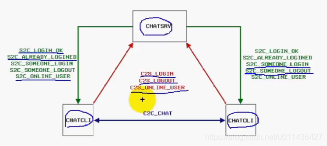
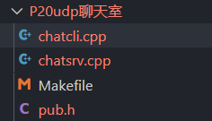
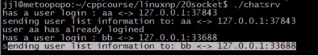
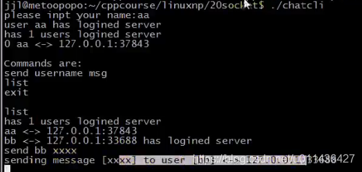

### 文章目录


[TOC]


## 1.UDP聊天室的实现

 -    消息的定义如下

```cpp
C2S_LOGIN：客户端向服务端发送的登录消息
S2C_LOGIN_OK：服务端到客户端的相应
S2C_ALREADY_LOGINED：用户已经登录乐了，响应登陆失败
S2C_SOMEONE_LOGIN：若有一个用户登录服务器，服务器会给其它用户发送有用户登录的消息
C2S_ONLINE_USER：任何时刻客户端都可以向服务端发送一个在线用户请求列表的请求
S2C_ONLINE_USER：服务器端将在线用户列表返还给客户端
C2S_LOGOUT：客户端向服务端发送退出聊天室的请求
S2C_SOMEONE_LOGOUT：若有一个用户退出，服务器会给其它用户发送有用户退出的消息
```



- 其它说明  
  实现公聊的2种方式：这里没有实现  
  （1）客户端发消息给服务器端，让服务器端转发给其它的所有客户端  
  （2）客户端维护了服务器端的在线用户列表，这些列表在客户端也保存了一份，在进行公聊时，可以向其它用户发送公聊消息

## 2.具体实现

 -    文件具体如下  
        
 -    NetworkProgramming-master \(1\)\\LinuxNetworkProgramming\\P20udp聊天室\\pub.h

```cpp
#idndef _PUB_H_
#define _PUB_H_

#include <list>
#include <algorithm>
using namespace std;

//C2S
#define C2S_LOGIN 0x01
#define C2S_LOGOUT 0x02
#define C2S_ONLINE_USER 0x03

#define MSG_LEN 512
//S2C
#define S2C_LOGIN_OK 0x01
#define S2C_ALREADY_LOGINED 0x02
#define S2C_SOMEONE_LOGIN 0x03
#define S2C_SOMEONE_LOGOUT 0x04
#define S2C_ONLINE_USER 0x05

//C2C
#define C2C_CHAT 0x06

//传递的消息结构
typedef struct message
{
    int cmd;//表示上面的消息
    char body[MSG_LEN];//消息的内容，存放用户名
}MESSAGE;

//用户信息的结构体
typedef struct user_info
{
    char username[16];//用户名
    unsigned int ip;//ip，用网络字节序的4个字节来表示
    unsigned short port;//端口，用2个字节的网络字节序来表示
}USER_INFO;

//客户端与客户端传输的消息
typedef struct chat_msg
{
    char username[16];//用户名
    char msg[100];//发送的消息
}CHAT_MSG;

//用C++好处：不用自己去实现链表
typedef list<USER_INFO> USER_LIST;//定义了一个列表list，链表类型是：USER_LIST

#endif /*_PUB_H_*/
```

 -    NetworkProgramming-master \(1\)\\LinuxNetworkProgramming\\P20udp聊天室\\chatsrv.cpp

```cpp
#include <sys/types.h>
#include <sys/socket.h>
#include <netinet/in.h>
#include <arpa/inet.h>
#include <signal.h>
#include <sys/wait.h>

#include <stdlib.h>
#include <stdio.h>
#include <errno.h>
#include <string.h>

#include "pub.h"


#define ERR_EXIT(m) \
        do \
        { \
             perror(m); \
             exit(EXIT_FAILURE);    \
        } while (0);

//聊天室成员列表
USER_LIST client_list;

void do_login(MESSAGE& msg, int sock, struct sockaddr_in *cliaddr);
void do_logout(MESSAGE& msg, int cosk, struct sockaddr_in *cliaddr);
void do_sendlist(int sock, struct sockaddr_in *cliaddr);

void do_login(MESSAGE& msg, int sock, struct sockaddr_in *cliaddr)
{
    USER_INFO user;
    strcpy(user.username, msg.body);//取出用户名
    user.ip = cliaddr->sin_addr.s_addr;//网络字节序的32bit整数
    user.port = cliaddr->sin_port;//网络字节序的16bit整数

    //查找用户
    USER_LIST::iterator it;//迭代器
    for (it=client_list.begin(); it !=client_list.end(); ++it)
    {
        if (strcmp(it->username, msg.body) == 0)
        {
            break;
        }
    }

    //没找到用户
    if (it == client_list.end())
    {
        //没找到该用户，说明该用户已经登录了
        printf("has a user login: %s <-> %s:%d\n", msg.body, inet_ntoa(cliaddr->sin_addr.s_addr), ntohs(cliaddr->sin_port));
        client_list.push_back(user);

        //登录成功应答
        MESSAGE reply_msg;
        memset(&reply_msg, 0, sizeof(reply_msg));
        reply_msg.cmd = htonl(S2C_LOGIN_OK);
        sendto(sock, &reply_msg, sizeof(msg), 0, (struct sockaddr*)cliaddr, sizeof(cliaddr));

        int count = htonl((int)client_list.size());
        //发送在线人数
        sendto(sock, &count, sizeof(msg), 0, (struct sockaddr*)cliaddr, sizeof(cliaddr));
        printf("sending user list information to: %s <->%s:%d\n", msg.body, it->username, it->port);

        //发送在线列表,给当前登录的客户端
        for (it = client_list.begin(); it!=client_list.end(); ++it)
        {
            //it是迭代器类型，it是一个指针，保存的是USER_INFO的指针，*it就是USER_INFO
            sendto(sock, &*it, sizeof(USER_INFO), (struct sockaddr*)cliaddr, sizeof(cliaddr));
        }

        //向其它用户通知有新用户登录
        for (it = client_list.begin(); it != client_list.end(); ++it)
        {
            //如果当前的用户是自己的话，不通知自己
            if (strcmp(it->username, msg.body) == 0)
                continue;

            struct sockaddr_in peeraddr;
            memset(&peeraddr, 0, sizeof(peeraddr));
            peeraddr.sin_family = AF_INET;
            peeraddr.sin_port = it->port;
            peeraddr.sin_addr.s_addr = it->ip;

            msg.cmd = htonl(S2C_SOMEONE_LOGIN);
            memcpy(msg.body, &user, sizeof(user));//user表示当前用户的登录信息

            //peeraddr来自迭代器it的遍历
            if (sendto(sock, &msg, sizeof(msg), 0, (struct sockaddr *)&peeraddr, sizeof(peeraddr)) == -1)
                ERR_EXIT("sendto");
        }
    }
    else//没有遍历到结尾，就找到用户
    {
        printf("user %s has already logined\n", msg.body);

        MESSAGE reply_msg;
        memset(&reply_msg, 0, sizeof(reply_msg));
        reply_msg.cmd = htonl(S2C_ALREADY_LOGINED);
        sendto(sock, &reply_msg, sizeof(reply_msg), 0, (struct sockaddr *)cliaddr, sizeof(cliaddr));
    }
    
}

void do_logout(MESSAGE& msg, int cosk, struct sockaddr_in *cliaddr)
{
    printf("has a user logout : %s <-> %s:%d\n", msg.body, inet_ntoa(cliaddr->sin_addr.s_addr), ntohs(cliaddr->sin_port));

    USER_LIST::iterator it;
    for (it = client_list.begin(); it != client_list.end(); ++it)
    {
        if (strcmp(it->username, msg.body) == 0)
            break;
    }
    if (it != client_list.end())
        client_list.erase(it);
    
    //向其它用户通知有用户登出
    for (it = client_list.begin(); it != client_list.end(); ++it)
    {
        if (strcmp(it->username, msg.body) == 0)
            continue;
        
        struct sockaddr_in peeraddr;
        memset(&peeraddr, 0, sizeof(peeraddr));
        peeraddr.sin_family = AF_INET;
        peeraddr.sin_port = it->port;
        peeraddr.sin_addr.s_addr = it->ip;

        msg.cmd = htonl(S2C_SOMEONE_LOGOUT);
        if (sendto(sock, &msg, sizeof(msg), 0, (struct sockaddr *)&peeraddr, sizeof(peeraddr)) == -1)
            ERR_EXIT("sendto"); 
    }
}

void do_sendlist(int sock, struct sockaddr_in *cliaddr)
{
    MESSAGE msg;
    msg.cmd = htonl(S2C_ONLINE_USER);
    sendto(sock, (const char *)&msg, sizeof(msg), 0, (struct sockaddr *)cliaddr, sizeof(cliaddr));

    int count = htonl((int)client_list.size());
    
    //发送在线用户数
    sendto(sock, (const char *)&count, sizeof(int), 0, (struct sockaddr *)cliaddr, sizeof(cliaddr));
    //发送在线用户列表
    for (USER_LIST::iterator, it=client_list.begin(); it !=client_list.end(); ++it)
    {
        sendto(sock, &*it, sizeof(USER_INFO), 0, (struct sockaddr *)cliaddr, sizeof(cliaddr));
    }
}


void chat_srv(int sock)
{
    struct sockaddr_in cliaddr;
    socklen_t clilen;
    int m;
    MEEAGE msg;
    while (1)
    {
        memset(&msg, 0, sizeof(msg));
        clilen = sizeof(cliaddr);
        n = recvfrom(sock, &msg, sizeof(msg), 0, (struct sockaddr *)&cliaddr, &clilen);
        if (n < 0)
        {
            if (errno == EINTR)
                continue;
            ERR_EXIT("recvfrom");
        }

        int cmd = ntohl(msg.cmd);//解析消息，将命令转换为主机字节序
        switch (cmd)
        {
            case C2S_LOGIN:
                do_login(msg, sock, &cliaddr);
                break;
            case C2S_LOGOUT:
                do_logout(msg, sock, &cliaddr);
                break;
            case C2S_ONLINE_USER:
                do_sendlist(sock, &cliaddr);
                break;
            default:
                break;
        }

    }
}

int main(void)
{
    int sock;
    if ((sock = socket(PF_INET, SOCK_DGRAM, 0)) < 0 )
        ERR_EXIT("socket");
    
    struct sockaddr_in servaddr;
    memset(&servaddr, 0, sizeof(servaddr));
    servaddr.sin_Family = AF_INET;
    servaddr.sin_port = htons(5188);
    servaddr.sin_addr.s_addr = htonl(INADDR_ANY);

    if (bind(sock, (struct sockaddr*)&servaddr, sizeof(servaddr)) < 0)
        ERR_EXIT("bind");
    
    chat_srv(sock);
    return 0;
}
```

 -    NetworkProgramming-master \(1\)\\LinuxNetworkProgramming\\P20udp聊天室\\chatcli.cpp

```cpp
#include <stdlib.h>
#include <stdio.h>
#include <errno.h>
#include <string.h>
#include "pub.h"

#define ERR_EXIT(m) \
        do \
        { \
             perror(m); \
             exit(EXIT_FAILURE);    \
        } while (0);

//当前用户名
char username[16];

//聊天室成员列表
USER_LIST client_list;

void do_someone_login(MESSAGE& msg);
void do_someone_logout(MESSAGE& msg);
void do_getlist(int sock);
void do_chat(const MESSAGE& msg);

void parse_cmd(char* cmdline, int sock, struct sockaddr_in *servaddr);
bool sendmsgto(int sock, char* name, char* msg);

void parse_cmd(char* cmdline, int sock, struct sockaddr_in *servaddr)
{
    char cmd[10] = {0};
    char *p;
    p = strchr(cmdline, ' ');//寻找空格，将指针定位到空格的位置
    if (p != NULL)
        *p = '\0';
    strcpy(cmd, cmdline);

    //如果是exit命令
    if (strcmp(cmd, "exit") == 0)
    {
        MESSAGE msg；
        memset(&msg, 0, sizeof(msg));
        msg.cmd = htonl(C2S_LOGOUT);
        strcpy(msg.body, username);

        if (sendto(sock, &msg, sizeof(msg), 0, (struct sockaddr *)servaddr, sizeof(servaddr)) == -1)
            ERR_EXIT("sendto");
        
        printf("user %s has logout server\n", username);
        exit(EXIT_SUCESS);
    }
    else if (strcmp(cmd, "send") == 0)//如果是send命令
    {
        char peername[16]={0};
        char msg[MSG_LEN]={0};

        /*
        send user msg
              p   p2
        */
       while(*p++ == ' ');
       char *p2;
       p2 = strchr(p, ' ');
       if (p2 == NULL)
       {
           printf("bad command\n");
           printf("\nCommands are:\n");
           printf("send username msg\n");
           printf("list\n");
           printf("exit\n");
           return;
       }
       *p2 == '\0';
       strcpy(peername, p);
       while (*p2++ == ' ');
       strcpy(msg, p2);
       sendmsgto(sock, peername, msg);
    }
    else if (strcmp(cmd, "list") == 0)
    {
        MESSAGE msg;
        memset(&msg, 0, sizeof(msg));
        msg.cmd = htonl(C2S_ONLINE_USER);

        if (sendto(sock, &msg, sizeof(msg), 0, (struct sockaddr *)servaddr, sizeof(servaddr)) == -1)
            ERR_EXIT("sendto");

    }
    else//如果是其他命令
    {
        printf("bad command\n");
           printf("\nCommands are:\n");
           printf("send username msg\n");
           printf("list\n");
           printf("exit\n");
    }
    
}

bool sendmsgto(int sock, char* name, char* msg)
{
    if (strcmp(name, username) == 0)
    {
        printf("can't send message to self\n");
        return false;
    }
    USER_LIST::iterator it;
    for (it = client_list.begin(); it !=client_list.end();++it)
    {
        if (strcmp(it->username, name) == 0)
            break;
    }
    if (it == client_list.end())
    {
        printf("user %s has not logined server\n", name);
        return false;
    }

    MESSAGE m;
    memset(&m, 0, sizeof(m));
    m.cmd = htonl(C2C_CHAT);

    CHAT_MSG cm;
    strcpy(cm.username, username)；
    strcpy(cm.msg, msg);

    memcpy(m.body, &cm, sizeof(cm));

    //得到对方的ip和端口
    strcut sockaddr_in peeraddr;
    memset(&peeraddr, 0, sizeof(peeraddr));
    peeraddr.sin_family = AF_INET;
    peeraddr.sin_addr.s_addr = it->ip;
    peeraddr.sin_port = it->port;

    printf("sending message [%s] to user [%s] <-> %s:%d\n", msg, name, inet_ntoa(it->ip),ntohs(it->port));
    sendto(sock, (const char*)&n, sizeof(m), 0, (struct sockaddr *)&peeraddr, sizeof(peeraddr));

    return true;
}

void do_getlist(int sock)
{
    int count;
    recvfrom(sock, &count, sizeof(int), 0, NULL, NULL);
    printf("has %d users logined server\n", ntohl(count));
    client_list.clear();//首先将当前的在线用户列表清空

    int n = ntohl(count);
    for (int i=0; i<n; i++)
    {
        USER_INFO user;
        recvfrom(sock, &user, sizeof(USER_INFO), 0, NULL, NULL);
        client_list.push_back(user);
        in_addr tmp;
        tmp.s_addr = user.ip;

        printf("%s <-> %s:%d\n", user.username, inet_ntoa(tmp), ntohs(user.port));
    }
}

void do_someone_login(MESSAGE& msg)
{
    USER_INFO *user = (USER_INFO*)msg.body;
    in_addr tmp;
    tmp.s_addr = user->ip;
    printf("%s <-> %s:%d has logined server\n", user->username, inet_ntoa(tmp),ntohs(user->port));
    client_list.push_back(*user);
}

void do_someone_logout(MESSAGE& msg)
{
    USER_LIST::iterator it;
    //需要遍历在线用户列表
    for (it=client_list.begin(); it !=client_list.end(); ++it)
    {
        if (strcmp(it->username, msg.body) == 0)
            break;
    }
    if (it != client_list.end())
        client_list.erase(it);
    printf("user %s has logout server\n", msg.body);
}

void do_chat(const MESSAGE& msg)
{
    CHAT_MSG *cm = (CHAT_MSG *)msg.body;
    printf("recv a msg [%s] from [%s]\n", cm->msg, cm->username);
}

void chat_cli(int sock)
{
    //初始化服务端地址
    struct sockaddr_in servaddr;
    memset(&servaddr, 0, sizeof(servaddr));
    servaddr.sin_family = AF_INET;
    servaddr.sin_port = htons(5188);
    servaddr.sin_addr.s_addr = inet_addr("127.0.0.1");
    
    struct sockaddr_in peeraddr;
    socklen_t peerlen;

    MESSAGE msg;
    while (1)
    {
        memset(username, 0, sizeof(username));
        printf("please input your name:");
        fflush(stdout);
        scanf("%s", username);

        //生成一个消息
        memset(&msg, 0, sizeof(msg));
        msg.cmd = htonl(C2S_LOGIN);//消息msg的命令是C2S_LOGIN
        strcpy(msg.body, username);

        sendto(sock, &msg, sizeof(msg), 0, (struct sockaddr *)&servaddr, sizeof(servaddr));

        memset(&meg, 0, sizeof(msg));
        recvfrom(sock, &msg, sizeof(msg), 0, NULL, NULL);
        int cmd = ntohl(msg.cmd);
        if (cmd == S2C_ALREADY_LOGINED)
            printf("user %s already logined server, please user another username", username);
        else if (cmd == S2C_LOGIN_OK)
        {
            printf("user %s has logined server", username);
            break;
        }
    }
    //已经登录成功后，需要执行的代码
    int count;
    recvfrom(sock, &count, sizeof(int), 0, NULL, NULL);

    int n = ntohl(count);
    printf("has %d users logined server\n", n);

    for (int i = 0; i < n; i++)
    {
        USER_INFO user;
        recvfrom(sock, &user, sizeof(USER_INFO), 0 ,NULL, NULL);
        client_list.push_back(user);//客户端也维护了成员列表client_list
        in_addr tmp;
        tmp.s_addr = user.ip;

        printf("%d %s <->%s:%d\n", i, user.username, inet_ntoa(tmp), ntohs(user.port));//用户名，ip地址，端口号
    }

    //一个用户登录成功后，就输出下面的信息,表示当前可用的命令
    printf("\nCommands are :\n");
    printf("send username msg\n");
    printf("list\n");
    printf("exit\n");
    printf("\n");

    fd_set rset;
    FD_ZERO(&rset);
    int nready;
    while (1)
    {
        //IO多路复用，一个是对sock，还有一个是对标准输入IO进行操作，所以用select统一来管理
        //否则，若程序阻塞在标准输入，若此时有网络消息到来，则办法及时处理该消息
        FD_SET(STDIN_FILENO, &rset);
        FD_SET(sock, &rset);
        nready = select(sock+1, &rset, NULL, NULL, NULL);//监听读集合rset中的fd是否产生可读事件
        if (nready == -1)
            ERR_EXIT("select");
        if (nready == 0)
            continue;
        
        //若产生了可读事件
        if (FD_ISSET(sock, &rset))
        {
            peerlen = sizeof(peeraddr);
            memset(&msg, 0 ,sizeof(msg));
            recvfrom(sock, &msg, sizeof(msg), 0, (struct sockaddr *)&peeraddr, &peeraddr);
            int cmd = ntohl(msg.cmd);
            switch (cmd)
            {
                case S2C_SOMEONE_LOGIN:
                    do_someone_login(msg);
                    break;
                case S2C_SOME_LOGOUT:
                    do_someone_logout(msg);
                    break;
                case S2C_ONLINE_USER://在线用户列表的情况
                    do_getlist(sock);
                    break;
                case C2C_CHAT://客户端向客户端发送聊天信息的情况
                    do_chat(msg);
                    break;
                default:
                    break;

            }
        }
        //如果是标准输入产生了可读事件
        if (FD_ISSET(STDIN_FILENO, &rset))
        {
            char cmdline[100] = {0};
            if (fgets(cmdline, sizeof(cmdline), stdin) == NULL)
                break;
            if (cmdline[0] == '\n')
                continue;
            cmdline[strlen(cmdline) - 1] = '\0';
            parse_cmd(cmdline, sock, &servaddr);
        }

    }

    memset(&msg, 0 ,sizeof(msg));
    msg.cmd = htonl(C2S_LOGOUT);
    strcpy(msg.body, username);

    sendto(sock, (const char*)&msg, sizeof(msg), 0, (struct sockaddr *)&servaddr, sizeof(servaddr));
    close(sock);
}


int main(void)
{
    int sock;
    //创建数据包socket
    if ( (sock = socket(PF_INET, SOCK_DGRAM, 0)) < 0 )
        ERR_EXIT("sock");

    chat_cli(sock);

    return 0;
}
```

 -    Makefile

```cpp
.PHONY:clean all
CC=g++
CFLAGS=-Wall -g
BIN=chatcli chatsrv
all:$(BIN)
%.o:%.cpp
	$(cc) $(CFLAGS) -c $< -o $@
chatcli:chatcli.o
	$(cc) $(CFLAGS) $^ -o $@
chatsrv:chatsrv.o
	$(cc) $(CFLAGS) $^ -o $@
clean:
	rm -f *.o $(BIN)
```

- 测试：  
  创建了2个用户aa和bb  
    
    
  