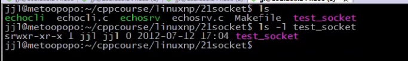
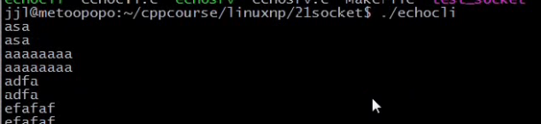
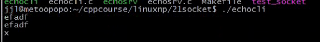
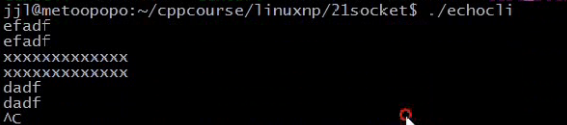

### 文章目录


[TOC]


## 1.UNIX域协议特点

- UNIX域套接字与TCP套接字相比较，在同一台主机的传输速度**前者是后者的两倍**
- UNIX域套接字可以在同一台主机上，各进程之间传递描述符
- UNIX域套接字与传统套接字的区别是：用路径名来表示协议族的描述

## 2.UNIX域地址结构

 -    man unix

```cpp
struct sockaddr_un 
{
    sa_family_t sun_family;               /* AF_UNIX */地址家族，AF_LOCAL
    char        sun_path[108];            /* pathname */地址路径
};
```

## 3.UNIX域字节流回射客户/服务

 -    eg：代码：服务端：NetworkProgramming-master \(1\)\\LinuxNetworkProgramming\\P21echosrv.c

```cpp
#include <unistd.h>
#include <sys/types.h>
// #include <netinet/in.h>//这是网际协议的头文件

//man unix得到
#include <sys/un.h>

#include <stdlib.h>
#include <stdio.h>
#include <errno.h>
#include <string.h>


#define ERR_EXIT(m) \
    do \
    { \
        perror(m); \
        exit(EXIT_FAILURE); \
    } while (0);
    
void echo_srv(int conn)
{
    char recvbuf[1024];
    int n;
    while (1)
    {
        memset(recvbuf, 0, sizeof(recvbuf));
        n = read(conn, recvbuf, sizeof(recvbuf));
        if (n == -1)
        {
            if (n == EINTR)
                continue;
            ERR_EXIT("read");
        }
        else if (n == 0)
        {
            printf("client close");
            break;
        }
        fputs(recvbuf, stdout);
        write(conn, recvbuf, strlen(recvbuf));
    }
    close(conn);
}

int main(void)
{
    int listenfd;
    if ((listenfd = socket(PF_UNIX, SOCK_STREAM, 0)) < 0)
        ERR_EXIT("socket");
    
    unlink("test_socket");//解决服务端再次创建时，出现：bind： Address already in use
    //UNIX域协议套接字
    //0表示内核自动选择UNIX域协议套接字协议
    struct sockaddr_un servaddr;
    memset(&servaddr, 0, sizeof(servaddr));
    servadr.sun_family = AF_UNIX;
    strcpy(servadr.sun_path, "test_socket");//一般放在"/tmp/test_socket"

    //初始化地址结构，与tcp不一样，不需要设置地址重复利用
    //绑定监听
    //在bind时，会在当前目录下产生test_socket文件
    if ((bind(listenfd, (struct sockaddr*)&servaddr, sizeof(servaddr))) < 0)
        ERR_EXIT("bind");
    //SOMAXCONN：监听队列最大值
    if (listen(listenfd, SOMAXCONN) < 0)
        ERR_EXIT("listen");

    //接收客户端连接
    int conn;
    pid_t pid;
    //accept(listenfd,对等方地址，对等方地址长度)
    while (1)
    {
        conn = accept(listenfd, NULL, NULL);
        if (conn == -1)
        {
            if (conn == EINTR)
                continue;
            ERR_EXIT("accept");
        }
        pid = fork();
        if (pid == -1)
            ERR_EXIT("fork");
        
        if (pid == 0)
        {
            close(listenfd);//子进程不许呀处理监听fd
            echo_srv(conn);
            exit(EXIT_SUCCESS);
        }
        close(conn);//父进程不需要处理连接fd

    }


    return 0;
}
```

 -    eg：代码：客户端：NetworkProgramming-master \(1\)\\LinuxNetworkProgramming\\P21echocli.c

```cpp
#include <unistd.h>
#include <sys/types.h>
// #include <netinet/in.h>//这是网际协议的头文件

//man unix得到
#include <sys/un.h>

#include <stdlib.h>
#include <stdio.h>
#include <errno.h>
#include <string.h>

#define ERR_EXIT(m) \
    do \
    { \
        perror(m); \
        exit(EXIT_FAILURE); \
    } while (0);
    
void echo_cli(int sock)
{
    char sendbuf[1024] = {0};
    char recvbuf[1024] = {0};
    while (fgets(sendbuf, sizeof(sendbuf), stdin) !=NULL)
    {
        write(sock, sendbuf, strlen(sendbuf));
        read(sock, recvbuf, sizeof(recvbuf));
        fputs(recvbuf, stdout);//打印接收数据
        memset(sendbuf, 0, sizeof(sendbuf));
        memset(recvbuf, 0, sizeof(recvbuf));
    }
    close(sock);
}

int main(void)
{
    int sock;
    if ((sock = socket(PF_UNIX, SOCK_STREAM, 0)) <0)
        ERR_EXIT("socket");
    struct sockaddr_un servaddr;
    memset(&servaddr, 0, sizeof(servaddr));
    servaddr.sun_family=AF_UNIX;
    strcpy(servaddr.sun_path, "test_socket");

    if (connect(sock, (struct sockaddr*)&servaddr, sizeof(servaddr)) <0)
        ERR_EXIT("connect");

    echo_cli(sock);

    return 0;
    
}
```

- 测试：

  
启动两个客户端，一个服务端  
客户端1  
  
客户端2  
  
服务端  


 -    Makefile

```cpp
.PHONY:clean all
CC=gcc
CFLAGS=-Wall -g
BIN=echosrv echocli
all:$(BIN)
%.o:%.c
	$(CC) $(CFLAGS) -c $< -o $@
clean:
	rm -f *.o $(BIN)
```

## 4.UNIX域套接字编程注意点

- bind成功，将会创建一个文件，权限是0777\&umask  
  一般放在/tmp目录下
- sun\_path最好用一个绝对路径
- UNIX域协议支持流式套接口（流式套接口要注意粘包问题，需要封装个readline方法）与报文套接口
- UNIX域流式套接字connect发现监听队列满时，会立刻返回一个ECONNREFUSED，这和TCP不同，如果监听队列满，会忽略到来的SYN，这导致对方\(客户端\)重传SYN