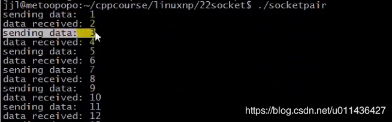
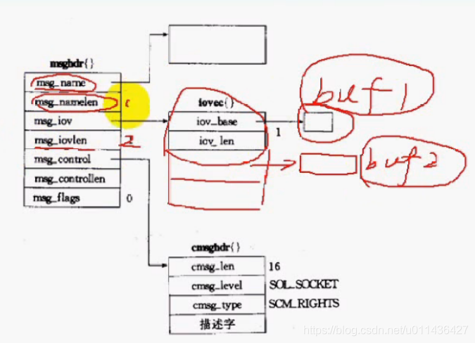
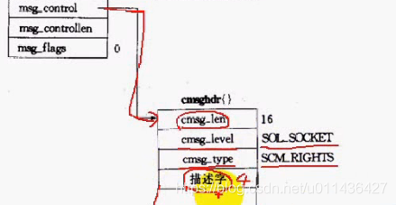
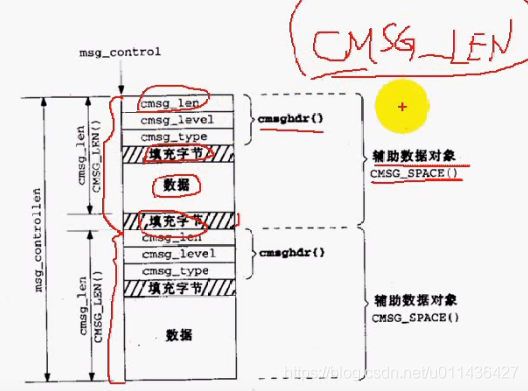
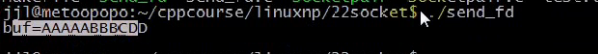

### 文章目录


[TOC]


## 1.socketpair

 -    pipe匿名管道：半双工的，只能用于父子进程（通过共享文件描述符的方式来通信，因为子进程继承了父进程的fd），或者亲缘关系的进程间通信  
        会返回2个文件描述符
 -    与pipe区别1：他是全双工的，其它一样  
        与pipe区别2：会返回2个文件描述符，sv\[0\]和sv\[1\]都是既可以读也可以写，而pipe管道，是0作为读端，1作为写端  
        相同点：只能用于父子进程，或者亲缘关系的进程间通信
 -    socketpair

```cpp
功能：创建一个全双工的流管道
原型：
int socketpair(int domain,int type, int protocol, int sv[2])

参数：
domain:协议家族
type：套接字类型
protocol：协议类型
sv：返回套接字对
```

\-eg：代码：NetworkProgramming-master \(1\)\\LinuxNetworkProgramming\\P22sockpair.c

```cpp
//
// Created by jxq on 19-8-10.
//

// socket编程 17

#include <iostream>
#include <sys/types.h>
#include <sys/socket.h>
#include <stdio.h>
#include <sys/un.h>
#include <unistd.h>
#include <stdlib.h>


#define ERR_EXIT(m) \
        do \
        { \
            perror(m); \
            exit(EXIT_FAILURE); \
        } while(0);


int main(int argc, char** argv)
{
    int fd[2];
    int r = socketpair(AF_UNIX, SOCK_STREAM, 0, fd);

    if (r < 0)
    {
        ERR_EXIT("socketpair");
    }

    pid_t pid；
    pid = fork();
    if (pid == -1)
        ERR_EXIT("fork");

    if (pid > 0)
    {
        //父进程使用fd[0],既可以接收，也可以发送
        int val = 0;
        close(fd[1]);
        while (1)
        {
            ++val;//父进程++
            printf("sending data: %d\n", val);
            write(fd[0], &val, sizeof val);//父子进程通信，不需要转换成网络字节序
            read(fd[0], &val, sizeof val);
            printf("recver data: %d\n", val);
            sleep(1);
        }
    }
    else if (pid == 0)
    {
        close(fd[0]);
        int val;
        while (1)
        {
            read(fd[1], &val, sizeof val);
            val++;//子进程++操作
            write(fd[1], &val, sizeof val);
        }
    }

    return 0;
}
```

- 测试：  
  

## 2.sendmsg/recvmsg

 -    sendmsg：传递描述字
 -    recvmsg：接收描述字
 -    sendmsg和recvmsg与send和recv差不多的，但是sendmsg和recvmsg更强大，但是这俩的fd必须是套接口的fd，不能是普通文件fd

```cpp
ssize_t sendmsg(int sockfd, const struct msghdr *msg, int flags);
ssize_t recvmsg(int sockfd, struct msghdr *msg, int flags);

struct msghdr {
	//msg_name和msg_namelen决定对方的地址信息，不关心可以填写0
    void         *msg_name;       /* optional address */
    socklen_t     msg_namelen;    /* size of address */

	//msg_iov是指向真正要发送的数据，类似send的缓冲区
	//msg_iov是一个指针，说明缓冲区有多个
	//msg_iovlen发送的缓冲区的个数
    struct iovec *msg_iov;        /* scatter/gather array */
    size_t        msg_iovlen;     /* # elements in msg_iov */

    void         *msg_control;    /* ancillary data, see below */辅助数据的指针
    size_t        msg_controllen; /* ancillary data buffer len */辅助数据的长度
    int           msg_flags;      /* flags on received message */辅助数据的接收选项
};

```

 -    man writev可以看到struct iovec 结构体

```cpp
struct iovec {
    void  *iov_base;    /* Starting address */缓冲区
    size_t iov_len;     /* Number of bytes to transfer */缓冲区的长度
};
```

 -    msghdr结构体示意图  
        buf1和buf2是两块缓冲区（因为指针所指向的缓冲区可以不止一个，可以是一个数组），所以此时msg\_iovlen为2  
        msg\_iov指向结构体iovec，iovec结构体真正指定缓冲区buf1和buf1，这才是要发送的数据  
        
 -    sendmsg要传递fd的话，还要发送一些控制信息（辅助数据）  
        这些辅助数据由msg\_control指定的数据结构控制；  
        man recvmsg；

```cpp
 struct cmsghdr {
      socklen_t     cmsg_len;     /* data byte count, including hdr */整块数据的长度
      int           cmsg_level;   /* originating protocol */传递什么样子的fd
      int           cmsg_type;    /* protocol-specific type */传递什么样子的fd
  /* followed by
      unsigned char cmsg_data[]; */若是一组fd，则填充到这里
  };
```



- 辅助数据的内存对齐  
  将cmsghdr\(\)看成是一块辅助数据对象的头部，于其数据之间需要填充字节，保证字节对齐；  
  两块块辅助数据对象之间也会填充字节，保证字节对齐；  
  辅助数据可能有多块，块与块之间有数据填充  
  

man CMSG\_FIRSTHDR

```cpp
通过msgh指针获取第一条消息的头部信息
struct cmsghdr *CMSG_FIRSTHDR(struct msghdr *msgh);

通过msgh指针获取下一条消息的头部信息
struct cmsghdr *CMSG_NXTHDR(struct msghdr *msgh, struct cmsghdr *cmsg);


size_t CMSG_ALIGN(size_t length);对齐

size_t CMSG_SPACE(size_t length);辅助数据对象的占用空间，length是辅助数据对象的数据的长度
辅助数据对象的cmsg_len+cmsg_level+cmg_type+填充字节+数据，包含辅助数据之间的填充字节

size_t CMSG_LEN(size_t length);辅助数据对象的cmsg_len+cmsg_level+cmg_type+填充字节+数据，不包含辅助数据之间的填充字节
unsigned char *CMSG_DATA(struct cmsghdr *cmsg);

```

 -    代码：NetworkProgramming-master \(1\)\\LinuxNetworkProgramming\\P22sockpair02.cpp

```cpp
//
// Created by jxq on 19-8-10.
//

//
// Created by jxq on 19-8-10.
//

// socket编程 17

#include <iostream>
#include <sys/types.h>
#include <sys/socket.h>
#include <stdio.h>
#include <sys/un.h>
#include <unistd.h>
#include <stdlib.h>
#include <sys/stat.h>
#include <fcntl.h>

using namespace std;

#define ERR_EXIT(m) \
        do \
        { \
            perror(m); \
            exit(EXIT_FAILURE); \
        } while(0);


void send_fd(int sock_fd, int send_fd)
{
    int ret;
    struct msghdr msg;
    struct cmsghdr *p_cmsg;//p_cmsg一定要指向某块缓冲区
    struct iovec vec;
    char cmsgbuf[CMSG_SPACE(sizeof(send_fd))];  // 获取辅助数据对象的空间
    int *p_fds;
    char sendchar = 0;


    //第一步指定缓冲区：msg_iov是指向真正要发送的数据，类似send的缓冲区
    msg.msg_name = NULL;
    msg.msg_namelen = 0;
    msg.msg_iov = &vec;//指定缓冲区，msg_iov指向vec结构体
    msg.msg_iovlen = 1; // 主要目的不是传递数据，是为了发送辅助数据，故只传1个字符
    msg.msg_flags = 0;

    //填充vec结构体
    vec.iov_base = &sendchar;
    vec.iov_len = sizeof(sendchar);


    //第二步：填充辅助数据开始
    //msg_control指向辅助数据
    msg.msg_control = cmsgbuf;
    msg.msg_controllen = sizeof(cmsgbuf);

    p_cmsg = CMSG_FIRSTHDR(&msg);   // CMSG_FIRSTHDR宏可以得到首个 cmsghdr 结构体的头部指针
    p_cmsg->cmsg_level = SOL_SOCKET;//表示要传递fd
    p_cmsg->cmsg_type = SCM_RIGHTS;//表示要传递fd
    p_cmsg->cmsg_len = CMSG_LEN(sizeof(send_fd));

    // 传入结构体指针 p_cmsg ，宏CMSG_DATA 可以得到准备存放send_fd 的位置指针，将send_fd 放进去
    p_fds = (int *)CMSG_DATA(p_cmsg);//通过CMSG_DATA函数得到数据数据的首地址
    *p_fds = send_fd; // 将send_fd放到4个字节的*p_fds空间中 
    //填充辅助数据结束


    ret = sendmsg(sock_fd, &msg, 0);

    if (ret != 1)
        ERR_EXIT("sendmsg");
}

int recv_fd(const int sock_fd)
{
    int ret;
    struct msghdr msg;
    char recvchar;
    struct iovec vec;
    int recv_fd;

    char cmsgbuf[CMSG_SPACE(sizeof(recv_fd))];
    struct cmsghdr *p_cmsg;
    int *p_fd;

    vec.iov_base = &recvchar;
    vec.iov_len = sizeof(recvchar);

    msg.msg_name = NULL;
    msg.msg_namelen = 0;
    msg.msg_iov = &vec;
    msg.msg_iovlen = 1;
    msg.msg_control = cmsgbuf;
    msg.msg_controllen = sizeof(cmsgbuf);
    msg.msg_flags = 0;

    p_fd = (int *)CMSG_DATA(CMSG_FIRSTHDR(&msg));
    *p_fd = -1;

    ret = recvmsg(sock_fd, &msg, 0);
    if (ret != 1)
        ERR_EXIT("recvmsg");

    //取出辅助数据
    p_cmsg = CMSG_FIRSTHDR(&msg);   // 首个cmsghdr地址
    if (p_cmsg == NULL)
        ERR_EXIT("no passed fd");

    //真正的数据部分取出来
    p_fd = (int *)CMSG_DATA(p_cmsg);    // 文件描述符
    recv_fd = *p_fd;
    if (recv_fd == -1)
        ERR_EXIT("no passed fd");

    return recv_fd;
}

int main(int argc, char** argv)
{
    int socketfd[2];
    int r = socketpair(AF_UNIX, SOCK_STREAM, 0, socketfd);

    if (r < 0)
    {
        ERR_EXIT("socketpair");
    }

    pid_t pid = fork();
    
    //如果是子进程打开的fd，父进程只能通过fd的传递方法来实现共享子进程的fd
    //fd的传递只能通过UNIX域协议socket，tcp和udp是不能传递fd的
    if (pid == -1)
    {
        ERR_EXIT("fork");
    }
    if (pid > 0)
    {
        int val = 0;
        close(socketfd[1]);
        int fd = recv_fd(socketfd[0]);
        char buf[1024] = {0};
        read(fd, buf, sizeof buf);
        printf("buf =  %s\n", buf);
    }
    else if (pid == 0)
    {
        close(socketfd[0]);
        int fd;
        fd = open("test.txt", O_RDONLY);
        if (fd == -1)
        {
            ERR_EXIT("open");
        }
        send_fd(socketfd[1], fd);//将子进程的fd传递给父进程
    }
    return 0;
}
```

- 测试：  
  

  - Makefile

```cpp
.PHONY:clean all
CC=gcc
CFLAGS=-Wall -g
BIN=socketpair sendfd
all:$(BIN)
%.o:%.c
	$(CC) $(CFLAGS) -c $< -o $@
clean:
	rm -f *.o $(BIN)
```

## 3.UNIX域套接字传递描述符字