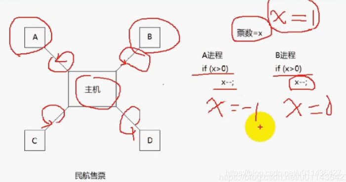
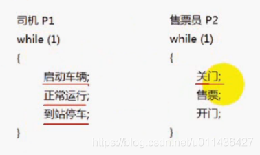
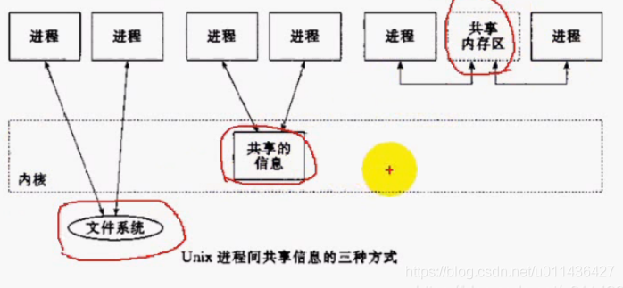

### 文章目录

[TOC]

## 1.进程同步与进程互斥

- 顺序程序特征  
  顺序性：后一条指令要在第一条指令的基础上才能执行  
  封闭性：运行环境的封闭性，通用寄存器，系统堆栈，进程上下文，不会受其它程序的影响，他是封闭的  
  确定性：不管在慢机器还是在快机器，给定程序输入，程序有输出  
  可再现性：什么时候都可以再现结果
- 并发程序特征  
  共享性：共享某些资源  
  并发性  
  随机性
- 进程互斥  
  **（1）排他性地使用资源称之为互斥资源、临界资源**  
  （2）由于各进程要求共享资源，而且有些资源需要互斥使用，因此各个进程间竞争使用这些资源，进程的这种关系为进程的互斥  
  （3）系统中某些资源一次只允许一个进程使用，称这样的资源为临界资源或者互斥资源  
  （4）在进程中涉及到互斥资源的程序段叫临界区
- 互斥eg：  
  互斥：两个进程对共享资源的有序的访问，可用信号量实现  
  进程与进程之间是CPU时间片轮转的  
  当时间片轮转到了B进程，B进程x-1等于0，接着时间片又轮转给了A进程，先前x>0已经做完了，接着做x–，则此时x=-1，相当于一张票卖了2次，这是不允许的  
  
- 进程同步  
  进程同步指的是多个进程需要相互配合共同完成一项任务
- 同步eg  
  同步：两个进程的协作，可用信号量实现  
  司机要等到售票员关门后，才可以启动车辆；  
  售票员要等到司机到站停车后，才可以开门；  
  

## 2.进程间通信目的

- 数据传输  
  一个进程需要将它的数据发送给另一个进程
- 资源共享  
  多个进程之间共享同样的资源
- 通知事件  
  一个进程需要向另一个或一组进程发送消息，通知它（它们）发生了某种事件（如进程终止时要通知父进程）
- 进程控制  
  有些进程希望完全控制另一个进程的执行（eg：Debug进程），此时控制进程系统能够拦截另一个进程的所有陷入和异常，并能够及时知道它的状态改变；  
  进程控制也可以通过信号SIGTRAP的方式来实现

## 3.进程间通信发展

- 管道，管道只能用于父子进程之间的通信，有名管道可以用于不相关的进程间通信
- System V进程间通信
- POSIX进程间通信

## 4.进程间通信分类

- 文件
- 文件锁
- 管道（pipe）和有名管道FIFO
- 信号signal
- 消息队列：进程间数据传输，system V，posix
- 共享内存：进程间共享数据，system V，posix
- 信号量：system V，posix
- 互斥量：system v实现互斥量要用信号量来实现，posix
- 条件变量：posix
- 读写锁：posix
- 套接字socket
- System V IPC和POSIX IPC  
  （1）System V IPC  
  System V消息队列  
  System V共享内存  
  System V信号量  
  （2）POSIX IPC  
  消息队列  
  共享内存  
  信号量  
  互斥量  
  条件变量  
  读写锁

## 5.进程间共享信息的三种方式

- 进程间共享信息的三种方式  
  

## 6.IPC对象的持续性

- 随进程持续  
  一直存在直到打开的最后一个进程结束，eg：pipe和FIFO；  
  因为进程间共享信息有3种方式，所以IPC对象的持续性也有3种  
  pipe匿名管道和pipe有名管道FIFO
- 随内核持续  
  一直存在直到内核自举或显式删除，eg：System V消息队列，System V共享内存，System V信号量；  
  进程结束的时候，这些IPC对象不会删除，当显式删除或者机器重启时，这些对象会被删除。
- 随着文件系统持续  
  一直存在直到显示删除，即使内核自举还存在，eg：POSIX消息队列、共享内存、信号量如果是使用映射文件来实现；  
  即使访问这些IPC对象的进程都结束了或者计算机重启，这些对象还会保留着；只有显示删除，这些对象才会被删除；  
  若不使用映射文件的方式，则它就是随内核持续的。