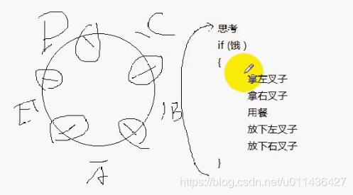
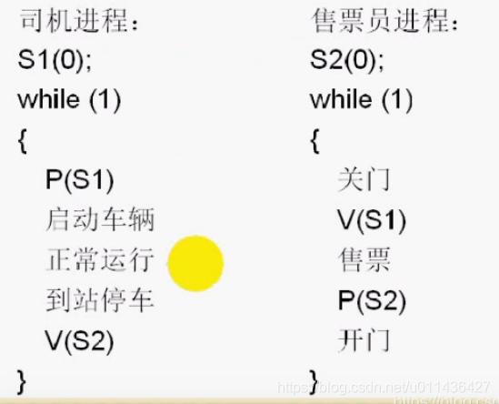
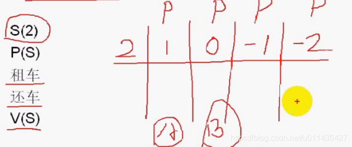

### 文章目录


[TOC]


## 1.死锁

- 死锁是指多个进程之间相互等待对方的资源，而在得到对方资源之前又不释放自己的资源，这样，造成循环等待的一种现象。如果所有进程都在等待一个不可能发生的事，则进程就死锁了。

- 进程与进程间的关系  
  （1）互斥：类似人之间的矛盾关系 2个小孩争抢同一个玩具  
  多个进程排他性的使用他们所共享的资源，这些进程间就构成互斥关系  
  （2）同步：类似人之间的协作关系 公共汽车安全行驶问题 司机 售票员

- 死锁产生的必要条件  
  （1）互斥条件  
  进程对资源进行排他性使用，即在一段时间内某资源仅为一个进程所占用  
  （2）请求和保持条件  
  当进程因请求资源而阻塞时，对已获得的资源保持不放  
  （3）不可剥夺条件  
  进程已获得的资源在未使用完之前，不能被剥夺，只能在使用完时由自己释放  
  （4）环路等待条件  
  各个进程组成封闭的环形链，每个进程都等待下一个进程所占用的资源  
  说明：  
  如果一个进程同一时刻，允许多个进程占用的话，就不会构成死锁  
  因为进程要排他性地使用资源，所以防止死锁产生，重点是防止上面的（2）（3）（4）条件

- 防止死锁办法  
  （1）资源一次性分配：破坏请求和保持条件  
  （2）可剥夺资源：破坏不可剥夺条件  
  所需要的资源都得到满足的时候，才能够占有，而不能占有一半的资源；  
  （3）资源有序分配法：破坏循环等待条件  
  当一个进程请求资源时，可以破坏其它进程所占有的资源

- 死锁避免  
  （1）预防死锁的几种策略，会严重地损害系统性能。因此，在避免死锁时，要施加较弱的限制，从而获得较满意的系统性能  
  （2）由于在避免死锁的策略中，允许进程动态地申请资源。  
  因而，系统在进行资源分配之前预先计算资源分配的安全性。若此次分配不会导致系统进入不安全状态，则将资源分配给进程，否则，进程等待。其中最具有代表性的避免死锁算法是银行家算法。

- 银行家算法  
  为保证资金的安全，银行家规定：  
  （1）当一个顾客对资金的最大需求量不超过银行家现有的资金时，就可以接纳该顾客  
  （2）顾客可以分期贷款，但贷款的总数不能超过最大需求量  
  （3）当银行家现有的资金不能满足顾客尚需的贷款数额时，对顾客的贷款可推迟值赋，但总能使顾客在有限的时间里得到贷款  
  （4）当顾客得到所需的全部资金后，一定能在有限的时间里归还所有的资金  
  进程资源的分配可以模拟银行家算法  
  （1）一个进程申请的资源不超过系统的资源时，就可以允许该进程申请资源，否则就延迟申请  
  （2）进程申请的资源系统不能满足，进程可以分配申请，但是申请的资源不能超过系统的容量  
  （3）进程申请资源时，若系统暂时不能满足进程，系统会让进程等待，系统让进程在有限的时间里得到资源  
  （4）进程得到所有的资源，能够在有限的时间内归还所有的资源

- 哲学家就餐问题  
  （1）5个哲学家围在一个圆桌上就餐，每个人都必须拿起2把叉子才能用餐  
  （2）哲学家就餐问题解法  
  解法1：服务生解法；这个方法将服务生作为一个管理者，它会判断资源是否处于安全的状态，若是安全状态，则会允许哲学家拿起叉子，否则不允许，继续等待.这是死锁避免算法，类似用银行家算法来解决问题  
  解法2：最多4个哲学家；这个方法不好，实际改变了条件；  
  解法3：仅当一个哲学家两边筷子都可以用时，才允许他拿筷子；这是破坏请求和保持条件  
  解法4：给所有哲学家编号，奇数号的哲学家必须首先拿左边的筷子，偶数号的哲学家则反之；这是破坏环路和等待条件  
  

## 2.信号量与PV原语

 -    信号量和PV原语解决进程同步和互斥问题
 -    信号量和P、V原语是由Dijkstra迪杰斯特拉提出的
 -    信号量  
        互斥：P、V在同一个进程中  
        同步：P、V在不同进程中
 -    信号量值含义，S：计数值，等于-1表示：有1个进程处于等待的状态  
        S>0：S表示可用资源的个数  
        S=0：表示无可用资源，无等待进程  
        S\<0，|S|表示等待队列中进程的个数
 -    信号量

```cpp
struct semaphore
{
	int value;
	pointer_PCB queue;进程控制块指针：表示当前有哪些进程处于等待的状态
};
```

 -    P原语  
        进程申请资源  
        下面的代码是原子性的操作，不能被打断，在硬件上，而可以通过关闭中断的方式来实现

```cpp
P(s)
{
	s.value=s.value--;
	if (s.value < 0)
	{
		该进程状态置为等待状态
		将该进程的PCB插入相应的等待队列s.queue末尾
	}
}
```

 -    V原语  
        进程归还资源

```cpp
V(s)
{
	s.value=s.value++;
	if (s.value <=0)
	{
		唤醒相应等待队列s.queue中等待的一个进程
		改变其状态为就绪态
		并将其插入就绪队列
	}
}

```

## 3.用PV原语解决司机与售票员问题

- 若信号量PV操作分布在不同进程中是解决同步问题的  
  P\(S1\)将司机进程处于等待状态，当售票员进程关上门之后会给司机一个信号，即执行V\(S1\)操作，使得S1信号量的值增加了，唤醒了司机进程，司机进程就能进入启动车辆的状态；  
  由于司机到站停车后才能开门，且S2信号量的值为0，因而它也进入到了等待状态，直到司机进程到站停车后执行V\(S2\)操作，唤醒等待的售票员进程，所以，售票员进程能开门  
  

## 4用PV原语解决民航售票问题

 -    互斥问题  
        （1）S\(1\) 信号量的初始计数值为1，对S进行P操作进入临界区，此时S-1等于0，若有其他进程进入临界区，则会处于等待的状态，因为当前信号量的计数值为0，直到该进程执行V操作，释放对临界资源的控制权，才能够唤醒另外一个进程  
        （2）

```cpp
if (x>0)
x–;
上面是临界区，x称之为临界资源
/***********************/

票数=x
S(1)

P(S)
if (x>0)
	x--;
V(S)
```

## 5.用PV原语解决汽车租赁问题

- **信号量计数值表示当前资源的个数**
- 有一汽车租赁公司有两部敞篷车可以出租，假定同时来了四个顾客都要租赁敞篷车，那么肯定会有两个人租不到  
    
  因为有2辆敞篷车，所以信号量计数值为2，注意这里的资源必须是同类的资源  
  当一个顾客比较快办理完手续，首先进行一次P操作，计数值为1，接着。。。以此类推  
  有一天B归还车了，他要唤醒其中的一个进程，会将当前的计数值-2改为-1，表示当前还有一个人处于等待的状态。。。以此类推