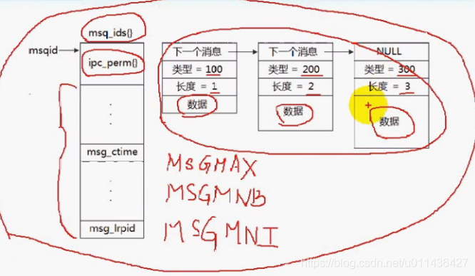
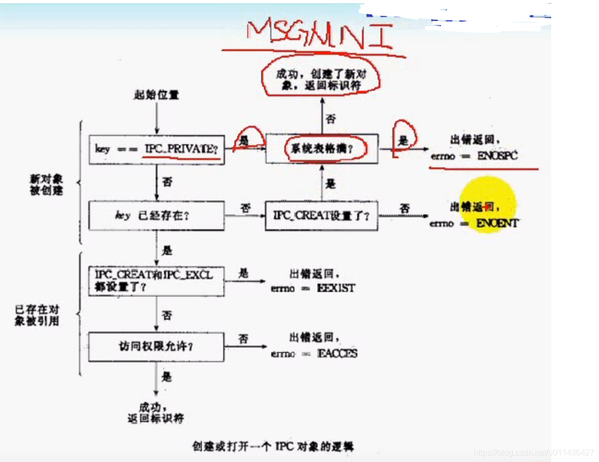
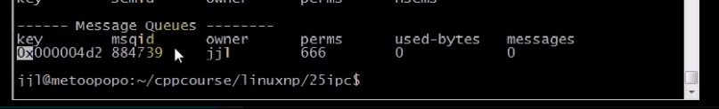
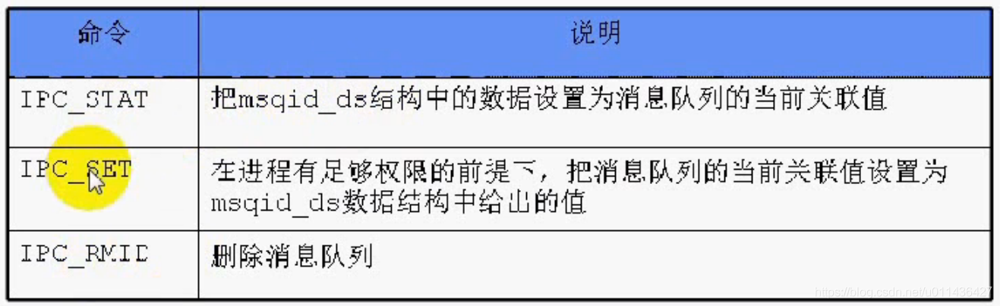

### 文章目录


[TOC]


## 1.消息队列

- 消息队列提供了**一个进程向另外一个进程**发送一块数据的方法

- 每个数据块都被认为是有一个类型，接收者进程接收的数据块可以有不同的类型值

- 消息队列也有管道一样的不足，就是**每个消息的最大长度**是有上限的\(**MSGMAX** \)；  
  **每个消息队列的总的字节数**是有上限的\(**MSGMNB**\)；  
  **系统上消息队列的总数**也有一个上限\(**MSGMNI**\)；

- **与管道区别：**  
  管道也可以进行进程间通信，但是管道的数据是**基于字节流的**，**数据与数据之间没有边界**；  
  消息队列：数据之间有边界，数据不一定是先进先出，**基于数据块**
  - 查询OS的消息队列的参数

```python
cat /proc/sys/kernel/msgmax
cat /proc/sys/kernel/msgmnb
cat /proc/sys/kernel/msgmni
```

## 2.IPC对象数据结构

 -    当访问这些IPC对象的消息对象被删除，内核也不会被删除该IPC对象，除非显示删除  
        **如果是消息队列：则是:	msgget；**    
        **如果是信号量：则是：semget；**  
        **如果是共享内存，则是：shmget；**
 -    内核为每个IPC对象维护一个数据结构

```cpp
struct ipc_perm 
{
	key_t __key; /* Key supplied to msgget(2) */

	//用户id和组id
	uid_t uid; /* Effective UID of owner */
	gid_t gid; /* Effective GID of owner */
	uid_t cuid; /* Effective UID of creator */
	gid_t cgid; /* Effective GID of creator */
	unsigned short mode; /* Permissions */用户权限；
	unsigned short __seq; /* Sequence number */序号；
};
```

## 3.消息队列结构

```cpp
struct msqid_ds 
{
	//IPC对象都有的数据结构
	struct ipc_perm msg_perm; /* Ownership and permissions */
	
	//消息队列特有
	time_t msg_stime; /* Time of last msgsnd(2) */
	time_t msg_rtime; /* Time of last msgrcv(2) */
	time_t msg_ctime; /* Time of last change */
	unsigned long __msg_cbytes; /* Current number of bytes in queue (nonstandard) */消息队列当前字节数
	msgqnum_t msg_qnum; /* Current number of messages in queue */消息队列当前消息的总数
	msglen_t msg_qbytes; /* Maximum number of bytes allowed in queue */等价于MSGMNB
	pid_t msg_lspid; /* PID of last msgsnd(2) *///最后一个发送数据的进程号
	pid_t msg_lrpid; /* PID of last msgrcv(2) *///最后一个接收数据的进程号
};
```

## 4.消息队列在内核中的表示

- 按照链表形式组织  
  

## 5.消息队列函数

 -    消息队列的函数如下：

```cpp
#include <sys/types.h>
#include <sys/ipc.h>
#include <sys/msg.h>

int msgget(key_t key, int msgflg);//创建or打开一个消息队列
int msgctl(int msqid, int cmd, struct msqid_ds *buf);//控制消息队列，eg：改变消息队列的权限
int msgsnd(int msqid, const void *msgp, size_t msgsz, int msgflg);//向消息队列中发送消息
ssize_t msgrcv(int msqid, void *msgp, size_t msgsz, long msgtyp, int msgflg);//从消息队列中接收消息
```

 -    msgget函数

```cpp
功能：用来创建和访问一个消息队列
原型：
int msgget(key_t key, int msgflg);//创建or打开一个消息队列

参数：
key：某个消息队列的名字
msgflg：由9个权限标志构成，它们的用法和创建文件时使用的mode模式标志是一样的

返回值：
成功返回一个非负整数，即：该消息队列的标识码；失败返回-1；
```



 -    如何删除消息队列？

```cpp
（1）删除消息队列：
key=0的消息队列删除：
ipcrm -q  msqid

（2）key不等于0的消息队列的删除：
ipcrm -q  msqid
或者
ipcrm -Q  msqid

（3）查看所有IPC对象：
ipcs
```

 -    eg：NetworkProgramming-master \(1\)\\NetworkProgramming-master\\P25msgget01.c

```cpp
//
// Created by wangji on 19-8-12.
//

// p25 system v消息队列(一)

#include <unistd.h>
#include <sys/types.h>
#include <sys/ipc.h>
#include <sys/msg.h>

#include <stdlib.h>
#include <stdio.h>
#include <errno.h>

#define ERR_EXIT(m) \
        do \
        { \
             perror(m); \
             exit(EXIT_FAILURE);    \
        } while (0);

int main(void)
{
    int msgid;
 

    // 当只有IPC_CREAT选项打开时,若已存在，则都返回该消息队列的ID，若不存在则创建消息队列，打开原有的消息队列
    //666：拥有者，主用户，其他用户具有读写权限
    msgid = msgget(1234, 0666 | IPC_CREAT);
    
    // 当IPC_CREAT | IPC_EXCL时, 如果没有该块消息队列，则创建，并返回消息队列ID。若已有该消息队列，则返回-1，输出：msgget:File exists
    //msgid = msgget(1234, 0666 | IPC_CREAT | IPC_EXCL);

    //IPC_PRIVATE所创建的消息队列，不能被其它进程所共享，可以用于本进程，以及父子进程
    //IPC_PRIVATE：执行一次本文件，就会创建一个消息队列，这些消息的队列key值为0，但是msqid不同
     //msgid = msgget(IPC_PRIVATE, 0666 | IPC_CREAT | IPC_EXCL);
    /*msgid = msgget(IPC_PRIVATE, 0666);
    msgid = msgget(1234, 0666 | IPC_CREAT);*/
    //msgid = msgget(1234, 0);    // flags = 0 表示按原来权限打开

    if (msgid == -1)
    {
        ERR_EXIT("msgget");
    }

    printf("msgget successful\n");
    printf("msgid = %d\n", msgid);

    msgctl(msgid, IPC_RMID,NULL);//会删除key=1234的消息队列

    return 0;
}

====================================Makefile文件===================================================================
## 注意BIN=的可执行文件，必须是XXXX.c 的XXXX名字！！！
###$(CC)和rm前面是tab，其余用空格隔开
.PHONY:clean all
CC=cc
CFLAGS=-Wall -g
BIN=msg_get msg_rmid
all:$(BIN)
%.o:%.c
	$(CC) $(CFLAGS) -c $< -o $@
clean:
	rm -f *.o $(BIN)


```

执行结果如下：**0x000004d2表示1234**，十六进制数对应十进制数  


 -    msgctl函数

```python
功能：消息队列的控制函数

原型：
int msgctl(int msqid, int cmd, struct msqid_ds *buf);

参数：
msqid：由msgget函数返回的消息队列标识码
cmd：是将要采取的动作，有三个可取值，看下面的图片
buf表示cmd所要传递的参数

返回值：成功返回0，失败返回-1
```

 -    cmd将要采取的动作，有三个可取值  
        
 -    IPC\_STAT的eg：NetworkProgramming-master \(1\)\\NetworkProgramming-master\\P25msgget02.c

```cpp
//
// Created by jxq on 19-8-12.
//

// p25 system v消息队列(一)

#include <unistd.h>
#include <sys/types.h>
#include <sys/ipc.h>
#include <sys/msg.h>

#include <stdlib.h>
#include <stdio.h>
#include <errno.h>

#define ERR_EXIT(m) \
        do \
        { \
             perror(m); \
             exit(EXIT_FAILURE);    \
        } while (0);

int main(void)
{
    int msgid;
    msgid = msgget(1234, 0);
    if (msgid == -1)
    {
        ERR_EXIT("msgget");
    }

    printf("msgget succ\n");
    printf("msgid = %d\n", msgid);

    struct msqid_ds buf;
    msgctl(msgid, IPC_STAT, &buf);
    printf("mode = %o\n", buf.msg_perm.mode);//消息队列的权限
    printf("bytes = %ld\n", buf.__msg_cbytes);//当前消息队列的字节数
    printf("number=%d\n", (int)buf.msg_qnum);//消息队列的消息个数
    printf("msgmnb=%d\n", (int)buf.msg_qbytes);//消息队列容纳的字节总数

    return 0;
}
```

 -    IPC\_SET的eg：NetworkProgramming-master \(1\)\\NetworkProgramming-master\\P25msgget03.cpp

```cpp
//
// Created by jxq on 19-8-12.
//

// p25 system v消息队列(一)

#include <unistd.h>
#include <sys/types.h>
#include <sys/ipc.h>
#include <sys/msg.h>

#include <stdlib.h>
#include <stdio.h>
#include <errno.h>

#define ERR_EXIT(m) \
        do \
        { \
             perror(m); \
             exit(EXIT_FAILURE);    \
        } while (0);

int main(int argc, char** argv)
{
    int msgid;
    msgid = msgget(1234, 0);
    if (msgid == -1)
    {
        ERR_EXIT("msgget");
    }

    printf("msgget succ\n");
    printf("msgid = %d\n", msgid);

    //首先获取消息队列的权限到buf中
    struct msqid_ds buf;
    msgctl(msgid, IPC_STAT, &buf);

    //sscanf将字符串，以%o的形式保存在buf.msg_perm.mode中
    //scanf将标准输入，以%o的形式保存在buf.msg_perm.mode中
    sscanf("600", "%o", (unsigned int*)&buf.msg_perm.mode);

    //然后在用IPC_SET设置
    msgctl(msgid, IPC_SET, &buf);

    return 0;
}
```

