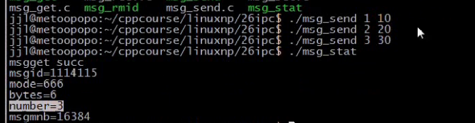
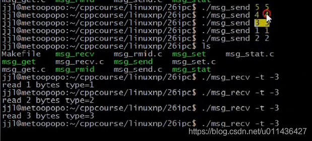

### 文章目录


[TOC]


## 1.msgsnd函数

```cpp
功能：把一条消息添加到消息队列中

原型：int msgsnd(int msqid, const void *msgp, size_t msgsz, int msgflg);

参数：
msgid：由msgget函数返回的消息队列标识码
msgp：是一个指针，指针指向准备发送的消息；至少2个参数：消息类型以及实际数据存放的场所；
msgsz：是msgp指向的消息长度，这个长度不含保存消息类型的那个long int长整型
msgflg：控制着当前消息队列满或达到系统上限时将要发生的事情

返回值：成功返回0；失败返回-1
```

 -    **msgflg=IPC\_NOWAIT表示队列满不等待，返回EAGAIN错误；０：表示以阻塞的方式发送**
 -    **消息结构在2方面受到制约。**  
        （1）首先，他必须小于系统规定的上限值MSGMAX  
        （2）其次，他必须以一个long int长整型开始，接收者函数利用这个长整型确定消息的类型  
        消息结构参考如下：

```cpp
struct msgbuf 
{
    long mtype;       /* message type, must be > 0 */／／消息类型
    char mtext[1];    /* message data */／／存放消息的场所
};
```

 -    eg：NetworkProgramming-master \(1\)\\NetworkProgramming-master\\P26msg\_send.c

```cpp
//
// Created by wangji on 19-8-12.
//

// p25 system v消息队列(二)

#include <unistd.h>
#include <sys/types.h>
#include <sys/ipc.h>
#include <sys/msg.h>

#include <stdlib.h>
#include <stdio.h>
#include <errno.h>

#define ERR_EXIT(m) \
        do \
        { \
             perror(m); \
             exit(EXIT_FAILURE);    \
        } while (0);

struct msgbuf 
{
    long mtype;       /* message type, must be > 0 */
    char mtext[1];    /* message data */
};


int main(int argc, char** argv)
{
    if (argc != 3)
    {
        fprintf(stderr, "Usage: %s <bytes> <type>\n", argv[1]);
        exit(EXIT_FAILURE);
    }

    int len = atoi(argv[1]);//消息长度
    int type = atoi(argv[2]);//消息类型
    int msgid;
    msgid = msgget(1234, 0);
    if (msgid == -1)
    {
        ERR_EXIT("msgget");
    }

    //准备一个消息，分配内存
    struct msgbuf *ptr;

    //消息内存大小=消息类型long mtype+发送的消息的长度len
    ptr = (struct msgbuf*) malloc(sizeof(long) + len);
    ptr->mtype = type;
    if (msgsnd(msgid, ptr, len, 0) < 0)//0表示消息队列满的时候，以阻塞的方式发送
    {
        ERR_EXIT("msgsnd");
    }
    
    /*
    if (msgsnd(msgid, ptr, len, IPC_NOWAIT) < 0)//IPC_NOWAIT表示非阻塞，当发送的消息超过msgmnb时
    {
        ERR_EXIT("msgsnd");
    }
    //会返回EAGAIN 错误：Resource temporarily unavailable
    //发送的消息不会阻塞了
    */


    return 0;
}
```

## 2.msgrcv函数

```cpp
功能：是从一个消息队列接收消息

原型;ssize_t msgrcv(int msqid, void *msgp, size_t msgsz, long msgtype,
                      int msgflg);

参数：
msgid：由msgget函数返回的消息队列标识码
msgp:是一个指针，指针指向准备接收的消息
msgsz：由msgp指向的消息长度，这个长度不含保存消息类型的那个long int长整型
msgtype：它可以实现接收优先级的简单形式
msgflg：控制着队列中没有相应类型的消息可供接收时，将要发生的事情
msgflag：
若消息队列中没有消息，msgflag=IPC_NOWAIT，那么会返回EAGAIN
若消息队列中没有消息，msgflag=0，那么消息队列中的消息会阻塞

返回值
成功返回实际放到接收缓冲区里去的字符个数；
失败，返回-1
```

 -    **对于msgtype和msgflag的解释**

```cpp
msgtype=0返回队列第一条消息
msgtype>0返回队列第一条类型等于msgtype的消息
msgtype<0返回队列第一条类型小于等于msgtype绝对值的消息(从小到大接受)
msgflag=IPC_NOWAIT，队列没有可读消息不等待，返回ENOMSG错误
msgflag=IPC_NOERROR，消息大小超过msgsz时被截断
msgtype>0且msgflg=MSC_EXCEPT，接收类型不等于msgtype的第1条消息
```

 -    eg：NetworkProgramming-master \(1\)\\NetworkProgramming-master\\P26msg\_recv.c

```cpp
//
// Created by wangji on 19-8-12.
//

// p25 system v消息队列(二)

#include <unistd.h>
#include <sys/types.h>
#include <sys/ipc.h>
#include <sys/msg.h>

#include <stdlib.h>
#include <stdio.h>
#include <errno.h>

#define ERR_EXIT(m) \
        do \
        { \
             perror(m); \
             exit(EXIT_FAILURE);    \
        } while (0);

//一条消息的最大值不能超过8192
#define MSGMAX 8192

struct msgbuf 
{
    long mtype;       /* message type, must be > 0 */
    char mtext[1];    /* message data */
};


int main(int argc, char** argv)
{
    int flag = 0;
    int type = 0;
    int opt;

    while (1)
    {
        //man 3 getopt查询该函数用法
        //因为执行的时候:./P26msg_recv -n -t 1(等价于./P26msg_recv -n -t1)，可以用getopt函数来解析参数
        //-n表示消息以非阻塞方式接收(n)，,-t 1表示消息类型为1(t:)，可以用："nt:"来表示，:表示-t 参数后面的1
        opt = getopt(argc, argv, "nt:");
        if (opt == '?')//表示解析到不认识的参数
        {
            exit(EXIT_FAILURE);
        }
        if (opt == -1)//opt=-1，表示所有的参数都解析完毕
        {
            break;
        }

        //switch解析参数
        switch (opt)
        {
            case 'n':
                // printf("AAA\n");
                flag |= IPC_NOWAIT;
    
                break;
            case 't':
                // printf("BBB\n");
                type = atoi(optarg);//t后面的参数1保存在optarg
                //printf("n=%d\n",type);//type=0表示按顺序接收            
                break;
        }
    }


    int msgid;
    msgid = msgget(1234, 0);
    if (msgid == -1)
    {
        ERR_EXIT("msgget");
    }

    struct msgbuf *ptr;
    ptr = (struct msgbuf*) malloc(sizeof(long) + MSGMAX);//实际消息的最大值
    //ptr->mtype = type;
    //msgrcv( msqid, &buf1, recvlength ,3,0 ) ;
    int n;//接收到的字节数
    if ((n = msgrcv(msgid, ptr, MSGMAX, type, flag)) < 0)
    {
        ERR_EXIT("msgsnd");
    }
    printf("type=%d, bytes=%d\n", ptr->mtype, (int)n) ;
    return 0;
}

```

- 测试结果：

10号消息1个字节  
  
\-t 5表示5号消息。以阻塞方式进行接收的相关测试如下：因为发送的消息类型没有5，所以会这样  
  
\-n表示以非阻塞方式进行接收的相关测试如下：  
  
msgtype\<0的相关测试如下：  
消息队列的数据不一定是先进先出，**而是基于数据块**  
1号消息1个字节，先出来  
