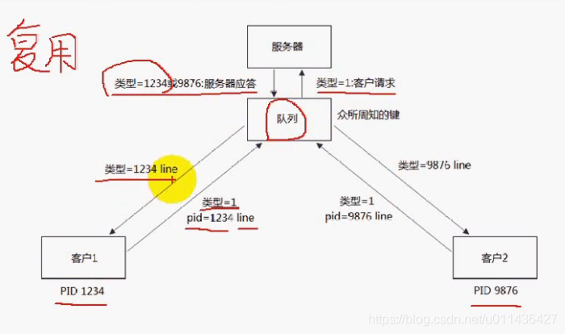
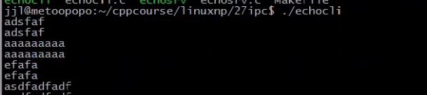
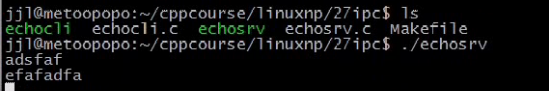
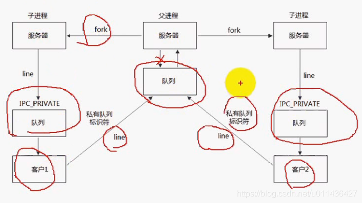

### 文章目录


[TOC]


## 1.单个消息队列实现回射服务器

- 队列复用功能：客户端——>服务器端，服务器端——>客户端端

- 客户1：只接收类型为1234的消息，客户2只接收类型为9876的消息  
  

- **单个队列的死锁现象：** 当多个客户端往发送请求，将队列堵满了，服务器不能够应答，客户端在等待服务器回射数据回来，此时会产生死锁。

  - eg服务端程序：NetworkProgramming-master \(1\)\\NetworkProgramming-master\\P27msgsrv.c

```cpp
//
// Created by wangji on 19-8-12.
//

// p25 system v消息队列(三)回射服务器端

#include <unistd.h>
#include <sys/types.h>
#include <sys/ipc.h>
#include <sys/msg.h>

#include <stdlib.h>
#include <stdio.h>
#include <errno.h>
#include <string.h>//memset函数的头文件

#define ERR_EXIT(m) \
        do \
        { \
             perror(m); \
             exit(EXIT_FAILURE);    \
        } while (0);


#define MSGMAX 8192

struct msgbuf 
{
    long mtype;       /* message type, must be > 0 */
    char mtext[MSGMAX];    /* message data */
};

void echo_srv(int msgid)
{
    struct msgbuf msg;
    int n;
    int type;
    memset(&msg, 0, sizeof(msgbuf));
    while (1)
    {
        if ((n = msgrcv(msgid, &msg, MSGMAX, 1, 0)) < 0)//不停的接收类型=1的消息，0表示以阻塞的方式接收
        {
            ERR_EXIT("msgsnd");
        }

        //解析的来自客户端的pid+回射行line
        type = *((int*)msg.mtext);//取出前4个字节
        msg.mtype = type;

        //前4个字节是pid
        fputs(msg.mtext+4, stdout);

        if (msgsnd(msgid, &msg, n, 0) < 0)
        {
            ERR_EXIT("msgsnd");
        }
        //memset(&msg, 0, sizeof(msgbuf));
    }

}

int main(int argc, char** argv)
{
    int msgid;
    msgid = msgget(1234, IPC_CREAT|0666);
    if (msgid == -1)
    {
        ERR_EXIT("msgget");
    }

    echo_srv(msgid);

    return 0;
}
```

 -    eg客户端程序：NetworkProgramming-master \(1\)\\NetworkProgramming-master\\P27msgcli.c

```cpp
//
// Created by wangji on 19-8-12.
//

// p25 system v消息队列(三)回射客户端

#include <unistd.h>
#include <sys/types.h>
#include <sys/ipc.h>
#include <sys/msg.h>

#include <stdlib.h>
#include <stdio.h>
#include <errno.h>
#include <string.h>

#define ERR_EXIT(m) \
        do \
        { \
             perror(m); \
             exit(EXIT_FAILURE);    \
        } while (0);

#define MSGMAX 8192


struct msgbuf 
{
    long mtype;       /* message type, must be > 0 */
    char mtext[MSGMAX];    /* message data */
};


int echocli(int msgid)
{
    struct msgbuf msg;
    memset(&msg, 0, sizeof(msgbuf));
    int pid = getpid();
    msg.mtype = 1;//客户端给服务器段发送的消息类型总是=1
    *((int*)msg.mtext) = pid;//msg.mtext前4个字节是pid
    int n;
    //msg.mtext + 4,表示前4个字节是pid
    while (fgets(msg.mtext + 4, MSGMAX, stdin) != NULL)//不停的从键盘中获取1行数据
    {
        //msgsnd(msgid, &msg,4 + strlen(4+msg.mtext), 0)也对，客户端发送的是：pid+回射行line
        if (msgsnd(msgid, &msg, sizeof(long) + strlen(msg.mtext), 0) < 0)
        {
            ERR_EXIT("msgsnd");
        }
        
        //前4个字节不需要清空，用以保存pid
        memset(msg.mtext+4, 0, sizeof(msg.mtext + 4));

        if ((n = msgrcv(msgid, &msg, MSGMAX, pid, 0)) < 0)//接收类型是pid的消息
        {
            ERR_EXIT("msgsnd");
        }
        fputs(msg.mtext + 4, stdout);
        memset(msg.mtext + 4, 0, sizeof(msg.mtext + 4));
    }


}

int main(int argc, char** argv)
{
    int msgid;
    msgid = msgget(1234, 0);
    if (msgid == -1)
    {
        ERR_EXIT("msgget");
    }

    echocli(msgid);


    return 0;
}

```

- 测试结果如下：  
    
  

## 2.多个队列解决单个队列的死锁问题

- **多个队列解决死锁现象**  
  （1）当一个客户端创建时，同时创建一个私有的队列；  
  （2）当客户端往服务器端发送消息时，会将私有队列的标识符传递给服务器端，以便服务器端能够向私有队列填充数据；  
  （3）服务器端收到消息后，会fork一个子进程来将消息回射到客户端，子进程将消息填充到私有队列中；

