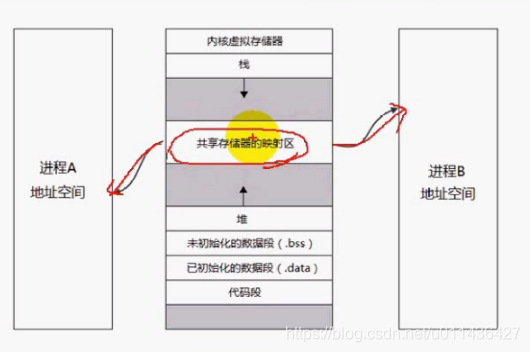
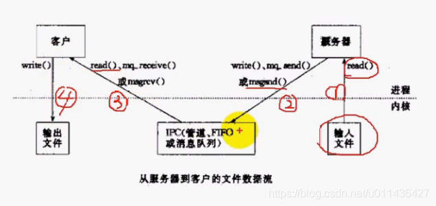
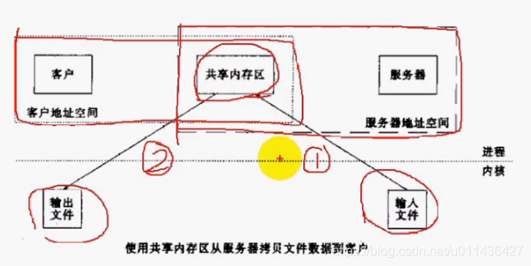
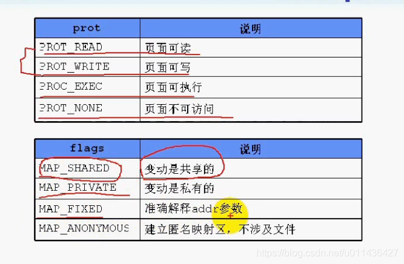
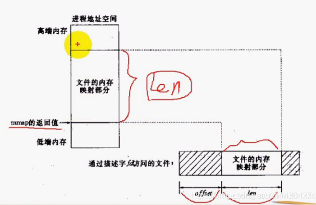
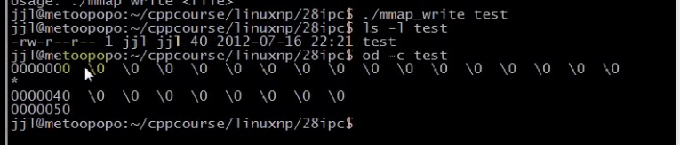
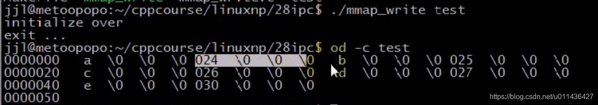
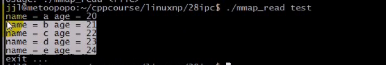
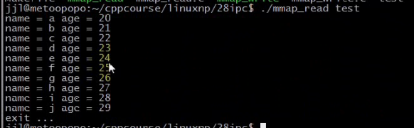
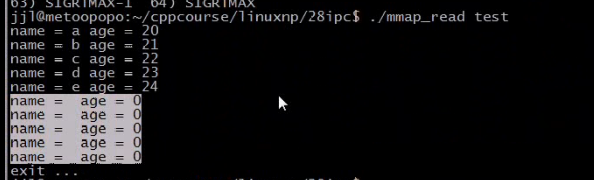

### 文章目录

- - [1.共享内存](#1_1)
  - [2.用管道消息队列和共享内存传递数据的对比](#2_10)
  - [3.mmap函数](#3mmap_23)
  - [4.munmap函数](#4munmap_232)
  - [5.msync不常用](#5msync_249)
  - [6.mmap注意点](#6mmap_273)

## 1.共享内存

- **共享内存区是最快的IPC形式。**  
  （1）共享内存传递数据是最快的  
  （2）一旦这样的内存映射到共享它的进程的地址空间，**这些进程间数据传递不再涉及到内核，** 换句话说是进程不再通过执行进入内核的系统调用来传递彼此的数据  
  （3）进程间通信，通过内存操作函数来传递数据
- 共享内存的示意图如下  
  **共享存储器的映射区可以映射到不同进程的进程地址空间**  
  

## 2.用管道消息队列和共享内存传递数据的对比

- 如果用管道或者消息队列传递数据  
  4次系统调用，4次拷贝  
  

- 用共享内存传递数据  
  共享内存是内存中的一块特殊区域，2次系统调用  
  

## 3.mmap函数

 -    mmap：将文件或者IO映射到一块内存区域

```cpp
功能：将文件或者设备空间映射到共享内存区

原型： void *mmap(void *addr, size_t length, int prot, int flags,
                  int fd, off_t offset);
参数：
addr：要映射的起始地址，通常指定为NULL，让内核自动选择；表示映射到哪个地址
length：映射到进程地址空间的字节数
prot：映射区保护方式
flags：标志
fd：文件描述符
offset：从文件头开始的偏移量

返回值：成功返回映射到的内存区的起始地址；
失败返回-1
```

 -    prot和flags的具体说明  
        prot：对内存的操作，就是对文件的操作；  
        flags：说明如下，

```cpp
MAP_SHARED:
对共享内存写操作会影响其它进程，对共享内存的写操作，会写到文件中；

MAP_PRIVATE:
对共享内存写操作不会影响其它进程，对共享内存的写操作，不会写到文件中；

MAP_FIXED:
addr可能不是内存页面(指的是内存页面，内存是以页面为单位的，将文件映射到内存中)的整数倍，
MAP_FIXED会将其对齐到业面的整数倍，通常不用关心；

MAP_ANONYMOUS:
仅供父子进程使用；
```



- 内存映射文件示意图  
  **内存分配是以页面为单位的，若Len小于一个页面的大小，也是分配一个页面**  
  
  - eg: **将文件映射到共享内存，然后读取共享内存中的数据**

```cpp
==================NetworkProgramming-master (1)\NetworkProgramming-master\P28mmap_send.c===============
//
// Created by wangji on 19-8-12.
//

// p28 共享内存介绍（一）

#include <unistd.h>
#include <sys/types.h>
#include <sys/ipc.h>
#include <sys/msg.h>

#include <stdlib.h>
#include <stdio.h>
#include <errno.h>
#include <string.h>
#include <fcntl.h>
#include <sys/mman.h>

#define ERR_EXIT(m) \
        do \
        { \
             perror(m); \
             exit(EXIT_FAILURE);    \
        } while (0);


typedef struct stu
{
    char name[4];
    int age;
} STU;

int main(int argc, char** argv)
{
    if (argc != 2)
    {
        fprintf(stderr, "Usage: %s <file>\n", argv[0]);
        exit(EXIT_FAILURE);
    }

    int fd;
    // O_CREAT 以创建方式打开
    // O_RDWR  以读写方式打开
    // O_TRUNC  以清空方式打开
    //权限为666
    //man 2 open可以查看open使用哪些头文件
    fd = open(argv[1], O_CREAT | O_RDWR | O_TRUNC, 0666);
    if (fd == -1)
    {
        ERR_EXIT("open");
    }

    // SEEK_SET 参数 offset 即为新的读写位置
    //STU结构体是8个字节，定位到39个字节的位置，SEEK_SET从头开始定位
    lseek(fd, sizeof(STU) * 5 - 1, SEEK_SET);
    write(fd, "", 1);
    //上述总共是写入40个字节的文件

//测试结果（1）只有上面

    //对文件的操作就像是对内存的访问
    STU *p;
    p = (STU*)mmap(NULL, sizeof(STU) * 5, PROT_READ | PROT_WRITE, MAP_SHARED, fd, 0);
    if (p == NULL)
    {
        ERR_EXIT("mmap");
    }

    //对映射的内存区进行写入操作
    char ch = 'a';
    for (int i = 0; i < 6; ++i)
    {
        memcpy((p+i)->name, &ch, 1);//对内存的操作就是对文件的操作，因为文件已经映射到这块内存区了
        (p+i)->age = 20 + i;

        ++ch;
    }

    printf("initialize over\n");

    //删除映射
    munmap(p, sizeof(STU)*6);//（地址，字节）
    printf("exit...\n");

    return 0;
}

==================NetworkProgramming-master (1)\NetworkProgramming-master\P28mmap_recv.c===============
//
// Created by wangji on 19-8-12.
//

// p28 共享内存介绍（一）

#include <unistd.h>
#include <sys/types.h>
#include <sys/ipc.h>
#include <sys/msg.h>

#include <stdlib.h>
#include <stdio.h>
#include <errno.h>
#include <string.h>
#include <fcntl.h>
#include <sys/mman.h>

#define ERR_EXIT(m) \
        do \
        { \
             perror(m); \
             exit(EXIT_FAILURE);    \
        } while (0);

typedef struct stu
{
    char name[4];
    int age;
} STU;

int main(int argc, char** argv)
{
    int fd;
    fd = open(argv[1], O_RDWR);
    if (fd == -1)
    {
        ERR_EXIT("open");
    }


    STU *p;
    p = (STU*)mmap(NULL, sizeof(STU) * 6, PROT_READ | PROT_WRITE, MAP_SHARED, fd, 0);
    if (p == NULL)
    {
        ERR_EXIT("mmap");
    }
    char ch = 'a';
    int i;
    for (int i = 0; i < 6; ++i)
    {
        printf("student's name = %s, age = %d\n", (p+i)->name, (p+i)->age);//对内存进行读取操作，相当于读取文件
//        memcpy((p+i)->name, &ch, 1);
//        (p+i)->age = 20 + i;
//        ++ch;
    }

    munmap(p, sizeof(STU)*6);
    printf("exit...\n");

    return 0;
}
```

- 测试结果（1）  
  通过ls -l test可知，文件长度为40个字节  
  40对应8进制数为32，依次类推就是32\(0000040\)，33，34。。40  
  
- 测试结果（2），./mmap\_write对应P28mmap\_send.c，./mmap\_read对应P28mmap\_recv.c，  
  024是八进制，对应十进制是：20  
    
  

## 4.munmap函数

```cpp
功能：取消mmap函数建立的映射

原型：
int munmap(void *addr, size_t length);

参数：
addr：映射的内存起始地址
len：映射到进程地址空间的字节数

返回值：
成功返回0；失败返回-1
```

## 5.msync不常用

```cpp
功能：对映射的共享内存执行同步操作

原型：
int msync(void *addr, size_t length, int flags);

参数：
addr：内存起始地址
len：长度
flags：选项

返回值：
成功返回0；
失败返回-1
```

- flags参数  
  （1）MS\_ASYNC：仅仅告诉内核：将高速缓冲区的内容写回到磁盘，立即返回，不阻塞；  
  （2）MS\_SYNC：高速缓冲区的内容写回到磁盘，等待内核执行完毕才返回；  
  （3）MS\_INVALIDATE：下次还要读操作，就要对文件进行读操作；

## 6.mmap注意点

 -    映射不能改变文件的大小
 -    **可用于进程间通信的有效地址空间不完全受限于被映射文件的大小**  
        eg：  
        （1）映射的共享内存区大于文件的内容；  
        可以通信的内存区域是以内存页面为单位的，映射的40字节，80字节，内存页面肯定是大于这么多的，很可能分配4k的地址空间，在4k地址空间访问就不会出错，若超过4k地址空间，**可能会出现SIGBUS信号**，若访问的地址空间超过好几个页面，**很可能出现SIGSEGV段错误**；  
          
        （2）因为先前的./mmap\_write test进程已经结束了，那块映射的区域读端进程看不到了，此时只能从文件中进行映射，只能看到5个学生信息  
        

```cpp
代码修改：
============NetworkProgramming-master (1)\NetworkProgramming-master\P28mmap_send.c===========
p = (STU*)mmap(NULL, sizeof(STU) * 10, PROT_READ | PROT_WRITE, MAP_SHARED, fd, 0);//内存映射区实际上是超过80字节的
    if (p == NULL)
for (int i = 0; i < 10; ++i)

sleep(10)
munmap(p, sizeof(STU)*10);//（地址，字节）

============NetworkProgramming-master (1)\NetworkProgramming-master\P28mmap_recv.c=============
for (int i = 0; i < 10; ++i)
munmap(p, sizeof(STU)*10);//（地址，字节）

执行过程：
对于（1）而言，在./mmap_write test的sleep之前，执行：./mmap_read test会出现（1）的结果
对于（2）而言，在./mmap_write test的sleep之后，执行：./mmap_read test会出现（2）的结果
```

- 文件一旦被映射后，所有对映射区域的访问实际上是对内存区域的访问。  
  映射区域写回文件时，所写内容不能超过文件的大小。