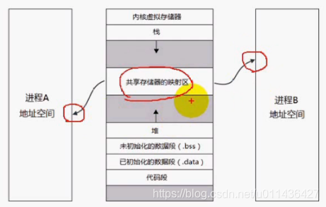
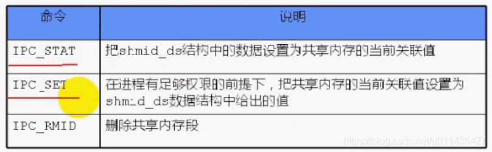
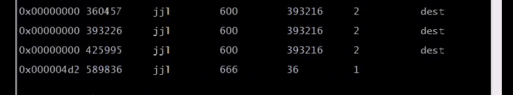
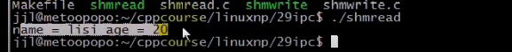
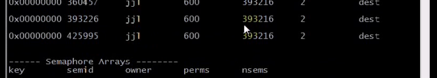

### 文章目录

- - [1.共享内存数据结构](#1_2)
  - [2.共享内存函数](#2_25)
  - [3.共享内存eg](#3eg_125)

## 1.共享内存数据结构

 -    共享内存示意图：**共享内存可以映射到不同进程的地址空间**  
        
 -    共享内存的数据结构如下：  
        **当最后一个进程访问共享内存结束了，内核也不会自动删除共享内存段，除非显式删除共享内存或者内核自己删除共享内存**

```cpp
 struct shmid_ds 
 {
 	 //IPC对象都有
     struct ipc_perm shm_perm;    /* Ownership and permissions */

	 //共享内存所特有
     size_t          shm_segsz;   /* Size of segment (bytes) */共享内存段的大小
     time_t          shm_atime;   /* Last attach time */最后一次映射共享内存的时间
     time_t          shm_dtime;   /* Last detach time */最后一次解除映射的时间
     time_t          shm_ctime;   /* Last change time */最后一次共享内存状态改变的时间
     pid_t           shm_cpid;    /* PID of creator */共享内存创建者的号码
     pid_t           shm_lpid;    /* PID of last shmat(2)/shmdt(2) */最后一次连接/脱离共享内存的号码
     shmatt_t        shm_nattch;  /* No. of current attaches */当前共享内存被连接的次数
     ...
 };
```

## 2.共享内存函数

 -    

```cpp
#include <sys/ipc.h>
#include <sys/shm.h>

创建or打开一个共享内存
int shmget(key_t key, size_t size, int shmflg);

将共享内存段映射到进程的某个地址空间中
void *shmat(int shmid, const void *shmaddr,int shmflg);

将共享内存从进程中脱离
int shmdt(const void *shmaddr);

对共享内存段控制，比如删除共享内存段
int shmctl(int shmid, int cmd, struct shmid_ds *buf);

```

 -    shmget函数

```cpp
功能：用来创建共享内存

原型：
int shmget(key_t key, size_t size, int shmflg);

参数：
key:这个共享内存段的名字
size：共享内存的大小
shmflg：由9个权限标志构成，他们的用法和创建文件时使用的mode模式标志是一样的

返回值：
成功返回一个非负数，即该共享内存段的标识码；
失败返回-1
```

 -    shmat函数

```cpp
功能：将共享内存段连接到进程地址空间

原型：
void *shmat(int shmid, const void *shmaddr,int shmflg);

参数：
shmid：共享内存标识
shmaddr：指定连接的地址
shmflg：它的2个可能取值是：SHM_RND 或 SHM_RDONLY

返回值：
成功返回一个指针，指向共享内存第一个节；
失败返回-1；
```

- shmaddr  
  （1）shmaddr为NULL，OS内核自动选择一个地址  
  （2）shmaddr不为NULL，且shmflg无SHM\_RND标记，则以shmaddr为连接地址  
  （3）shmaddr不为NULL，且shmflg设置了SHM\_RND标记，则连接的地址会自动**向下**调整为SHMLBA的整数倍（公式：shmaddr-（shmaddr\%SHMLBA））  
  **SHMLBA=4K，注意是向下对齐，eg：若shmaddr=4097字节，则：4097-4097\%4096=4097-1=4096字节**  
  （4）shmflg=SHM\_RNONLY，表示连接操作用来只读共享内存，shmflg=0，表示可读可写

  - shmdt函数

```cpp
功能：将共享内存段与当前进程脱离

原型：
int shmdt(const void *shmaddr);

参数：
shmaddr：由shmat所返回的指针

返回值：
成功返回0；失败返回-1；

注意：将共享内存段与当前进程脱离不等于删除共享内存段
```

 -    shmctl函数

```cpp
功能：用来创建和访问一个共享内存

原型：
int shmctl(int shmid, int cmd, struct shmid_ds *buf);

参数：
shmid：由shmget返回的共享内存标识码
cmd：将要采取的动作(有3个)
buf：指向一个保存着共享内存的模式状态和访问权限的数据结构

返回值：
成功返回0；
失败返回-1
```

- cmd  
  

## 3.共享内存eg

 -    eg:NetworkProgramming-master \(1\)\\NetworkProgramming-master\\P29shmwrite.c

```cpp
//
// Created by wanji on 19-8-13.
//

// p29 system v共享内存

#include <sys/ipc.h>
#include <sys/shm.h>
#include <iostream>
#include <string>
#include <errno.h>
#include <string.h>

using namespace std;

#define ERR_EXIT(m) \
        do \
        {   \
            perror(m);  \
            exit(EXIT_FAILURE); \
        } while (0);

//共享内存的大小是36个字节，可以从ipcs看出
struct student
{
    char name[32];
    int age;
}STU;

int main(int argc, char** argv)
{
    int shmid;  // 共享内存标识符

    // 创建共享内存
    shmid = shmget((key_t)1234, sizeof(STU), 0666 | IPC_CREAT);
    if (shmid == -1)
    {
        ERR_EXIT("shmget");
    }

    // 第一次创建完共享内存时，它还不能被任何进程访问，shmat()函数的作用就是用来启动对该共享内存的访问，并把共享内存连接到当前进程的地址空间
    // 将共享内存链接到当前进程的地址空间
    STU *p;
    p = shmat(shmid, NULL, 0);//对共享内存的访问相当于对指针的访问
    if (p == (void *)-1)
    {
        ERR_EXIT("shmat");
    }

    // 对指针的访问可以按照普通的访问即可，就相当于对共享内存操作
    //student *shared = (struct student*) shm;
    strcpy(p->name, "hello");
    p->age = 20;

    while (1)
    {
        if (memcmp(p->name, "quit", 4) == 0)//内存比较
        {
            break;
        }
    }
    
    // 把共享内存从当前进程中分离，解除映射
    if (shmdt(p) == -1)
    {
        ERR_EXIT("shmdt");
    }


    //删除共享内存
    shmctl(shmid, IPC_RMID, NULL);
    return 0;
}

```

 -    eg:NetworkProgramming-master \(1\)\\NetworkProgramming-master\\P29shmread.c

```cpp
//
// Created by wangji on 19-8-13.
//

// p29 system v共享内存

#include <sys/ipc.h>
#include <sys/shm.h>
#include <iostream>
#include <string>
#include <errno.h>
#include <string.h>

using namespace std;

#define ERR_EXIT(m) \
        do \
        {   \
            perror(m);  \
            exit(EXIT_FAILURE); \
        } while (0);

struct student
{
    char name[32];
    int age;
}STU;

int main(int argc, char** argv)
{
    int shmid;  // 共享内存标识符

    // 打开共享内存
    shmid = shmget((key_t)1234, 0, 0);//shmget((key_t)1234, sizeof(STU), 0)这样写也行
    if (shmid == -1)
    {
        ERR_EXIT("shmget");
    }

    STU *p;
    p = shmat(shmid, NULL, 0);//将共享内存映射到进程的地址空间
    if (p == (void *)-1)
    {
        ERR_EXIT("shmat");
    }

    //将共享内存的内容print出来
    //student *shared = (struct student*) shm;
    printf("student name: %s, age: %d\n", p->name, p->age);

    memcpy(p->name, "quit", 4);

    if (shmdt(p) == -1)
    {
        ERR_EXIT("shmdt");
    }

    return 0;
}

```

- 测试：执行：./shmwrite  
  1表示：当前的连接数为1，大小是36个字节；  
  执行ipcs；  
    
  执行：./shmread  
    
  执行ipcs再次查看共享内存  
  