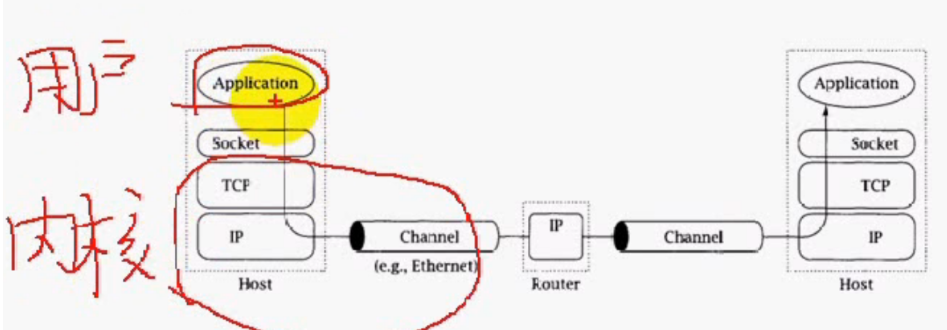
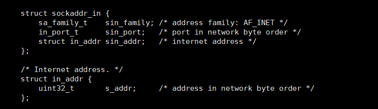
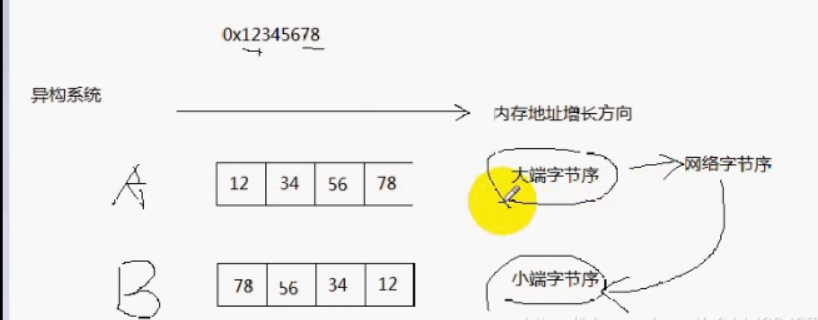
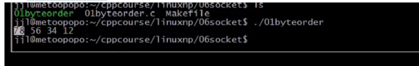
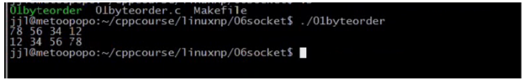
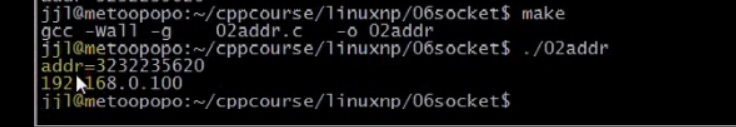
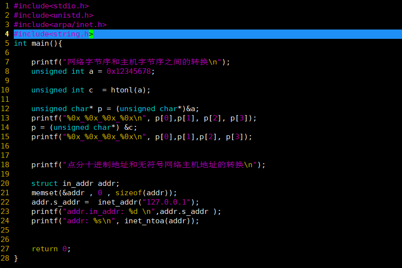
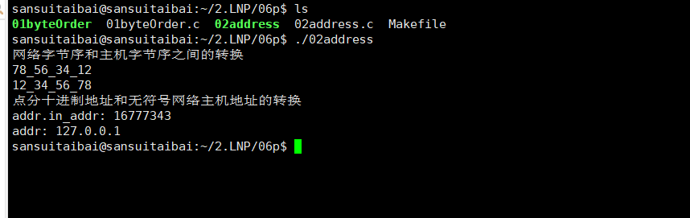

**（P6）socket编程一：什么是socket ，IPv4套接字地址结构 ，网络字节序 ，字节序转换函数 ，地址转换函数 ，套接字类型**

### 文章目录


[TOC]


## 1.什么是socket

- socket可以看成是用户进程与内核网络协议栈的编程接口
- socket不仅可以用于本机的进程间通信，还可以用于网络上不同主机的进程间通信  
  （1）管道只能在同一台主机之间进行通信  
  （2）**socket还可以在异构系统之间进行通信**，比如A主机是手机\(arm\)，C主机是PC机\(x86\)，即：他们的硬件架构可以不同，软件可以不同，操作系统也可以不同
- 如下图所示  
  （1）应用层Application  
  传输层：TCP，UDP  
  网络层：IP，**路由器工作在网络层**  
  数据链路层：Channel，eg以太网链路  
  **（2）解封装过程的解释：**  
  以太网接收到数据帧要向上层传递，会依据**数据帧中的类型字段进行传递** ，如果是arp，则传递给链路层的arp协议去处理，如果是ip，则传递给网络层的ip协议去处理。  
  ip协议头部也有类型，若类型是tcp，则传递给tcp去处理，并且去掉ip头部，接着再传输给应用层，**根据端口号传递给对应的应用程序，最后去掉tcp的头部。**  
  

## 2.IPv4套接字地址结构

 -    IPv4套接口地址结构通常也称之为**网际套接字地址结构**，他以**sockaddr\_in命名**，定义在头文件\<netinet/in.h>  
        （1）Linux手册：man 7 ip

```cpp
struct sockaddr_in
{
	uint8_t sin_len;
	sa_family_t sin_family;		//地址族
	in_port_t	sin_port;		//端口号，无符号16bit，最大端口为65535
	struct in_addr sin_addr;	//地址，无符号32bit
	char sin_zero[8];
};

sin_len:整个sockaddr_in结构体的长度，在4.3BSD-Reno版本之前的第一个成员是sin_family
sin_family：指定该地址家族，在这里必须设为AF_INET
sin_port：端口
sin_addr：IPv4的地址
sin_zero：暂不使用，一般将其设置为0
```



 -    通用地址结构  
        （1）通用地址结构用来指定与套接字关联的地址  
        （2）适合任何协议的socket套接口  
        （3）**char sa\_data\[14\];：根据地址家族不同而不同，其字节数等于struct sockaddr\_in的sin\_port\(2字节\)+struct sockaddr\_in的sin\_addr\(4字节\)+struct sockaddr\_in的sin\_zero\[8\]\(8字节\)=14，说明struct sockaddr与struct sockaddr\_in是兼容的**  
        （4）<font color='red'>**TCP/IP编程的时候更多的填充struct sockaddr\_in，然后将其强转为struct sockaddr**</font>

```cpp
struct sockaddr{
	uint8_t sin_len;
	sa_family_t	sin_family;
	char sa_data[14];
};

sin_len:整个sockaddr结构体的长度
sin_family：指定该地址家族
sa_date：由sin_family决定他的形式
```

## 3.网络字节序

- 字节序  
  （1）大端字节序Big Endian  
  **最高有效位（MSB：Most Significant Bit）存储于最低内存地址处，最低有效位（LSB：Lowest Significant Bit）存储于最高内存地址处**  
  （2）小端字节序（Little Endian）  
  **最高有效位（MSB：Most Significant Bit）存储于最高内存地址处，最低有效位（LSB：Lowest Significant Bit）存储于最低内存地址处**

- 主机字节序  
  **不同的主机有不同的字节序，如x86为小端字节序，arm字节序是可配置的**

- 网络字节序  
  **网络字节序规定为大端字节序**

- eg  
  主机A将大端字节序转化为网络字节序，直接传输就可以了。  
  接着，网络字节序会转换成B主机的小端字节序，此时网络字节序是大端的，需要将其颠倒过来，转换成小端字节序。  
  
  - eg：NetworkProgramming-master \(1\)\\NetworkProgramming-master\\P6byteorder.c

```cpp
#include <stdio.h>

int main()
{
    unsigned int x=0x12345678;
    unsigned char *p= (unsigned char *)&x;
    //字节序的转换
    // 小端：低位放低位
    // 大端：低位放高位，高位放低位
    // P[3]是高地址
    printf("%0x_%0x_%0x_%0x_",p[0],p[1],p[2],p[3]);
    return 0;
}
```

- 测试：**说明是小端字节序**  
  

## 4.字节序转换函数

```cpp
uint32_t htonl(uint32_t hostlong);

uint16_t htons(uint16_t hostshort);

uint32_t ntohl(uint32_t netlong);

uint16_t ntohs(uint16_t netshort);

说明：
在上述的函数中，h代表host；
n代表network；
s代表short；
l代表long
```


```cpp
#include <stdio.h>

int main()
{
    unsigned int x=0x12345678;
    unsigned char *p= (unsigned char *)&x;
    //字节序的转换
    // 小端：低位放低位
    // 大端：低位放高位，高位放低位
    // P[3]是高地址
    printf("%0x_%0x_%0x_%0x_\n",p[0],p[1],p[2],p[3]);

    unsigned int y= htonl(x);
    p = (unsigned char *)&y;
    printf("%0x_%0x_%0x_%0x_\n",p[0],p[1],p[2],p[3]);
    	
    return 0;
}


```

- 测试：**网络字节序总是大端字节序**  
  


## 5.地址转换函数

```cpp
#include <netinet/in.h>
#include <arpa/inet.h>

将点分十进制cp转换为网络字节序inp（通过一个地址结构输出）
int inet_aton(const char *cp, struct in_addr *inp);

将点分十进制转换为32bit的整数
in_addr_t inet_addr(const char *cp);

将地址结构转成点分十进制的ip地址
char *inet_ntoa(struct in_addr in);
```

 -    eg:NetworkProgramming-master \(1\)\\NetworkProgramming-master\\P6addr.c

```cpp
#include <stdio.h>
#include <arpa/inet.h>

int main()
{
    unsigned long addr = inet_addr("192.168.0.100");

    printf("addr = %u \n", ntoh(addr));//u：无符号方式输出

    struct in_addr ipaddr;
    ipaddr.s_addr=addr;
    printf("%s\n",inet_ntoa(ipaddr));    
    return 0;
}
```

- 测试：  
  
  - makefile

```cpp
.PHONY:clean all
CC=gcc
CFLAGS=-Wall -g
BIN=01bytteorder 02addr
all:$(BIN)
%.o:%.c
	$(CC) $(CFLAGS) -c $< -o $@
clean:
	rm -f $(BIN) *.o
```


## 5.1 test






## 6.套接字类型

- **（1）流式套接字（SOCK\_STREAM）**  
  提供面向连接的，可靠的数据传输服务，数据无差错，无重复的发送，且按发送顺序接收；  
  TCP；
- **（2）数据报式套接字（SOCK\_DGRAM）**  
  提供无连接服务。不提供无错保证，数据可能丢失或者重复，并且接收顺序混乱；  
  UDP；
- **原始套接字（SOCK\_RAW）**  
  **将应用层的数据直接封装成ip层能够认识的数据格式**