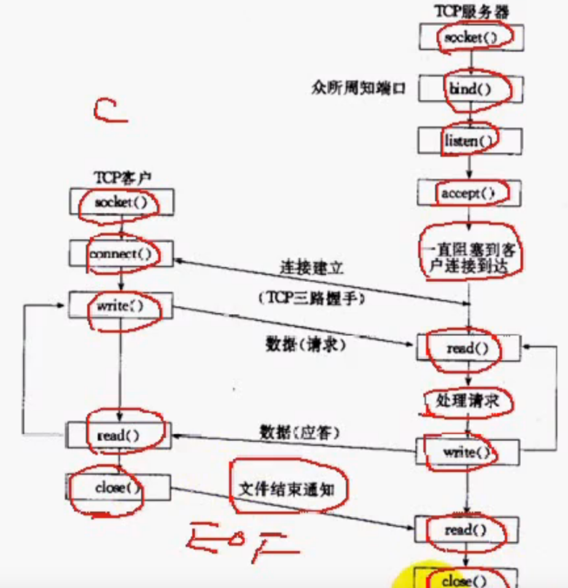
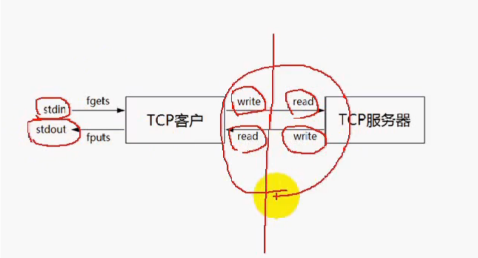
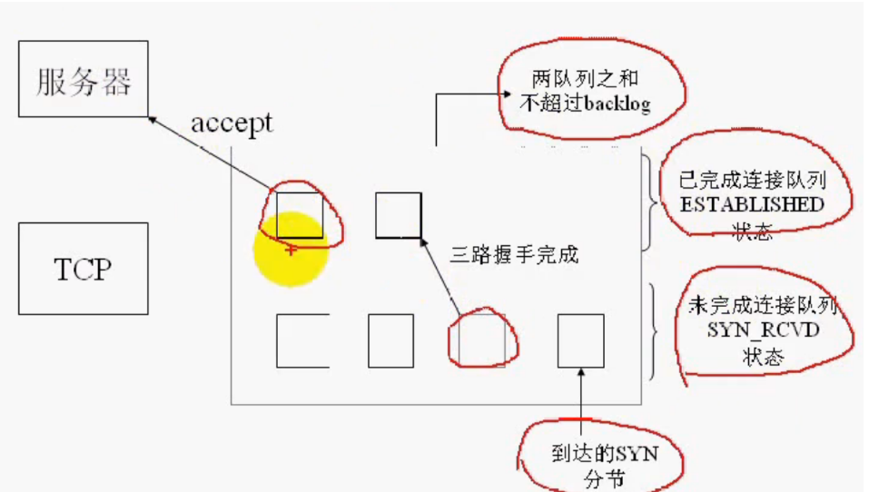
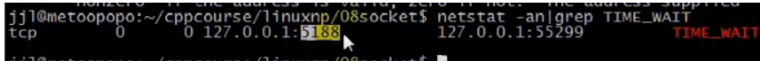
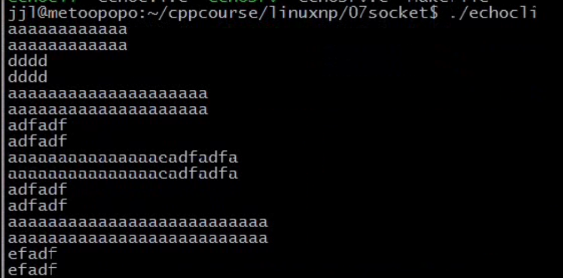

## 文章目录


[TOC]


## 1.TCP客户/服务端模型

- **任何一方都可以调用close函数进行终止，相当于发送EOF**  
  

## 2.回射客户/服务器

- **大红圈代表TCP/IP编程**  
  

## 3.socket，bind，listen，accept，connect

 -    socket函数  
        **（1）man socket**  
        **（2）PF\_INET：protocol family\_网际协议\(就是IPv4协议\)，等于AF\_INET**

```cpp
包含头文件<sys/socket.h>
功能：创建一个套接字用于通信

原型：
	int socket(int domain, int type, int protocol);

参数：
domain：指定通信协议族(protocol family)
type：指定socket类型，流式套接字SOCK_STREAM，数据报套接字SOCK_DGRAM，原始套接字SOCK_RAW
protocol：协议类型

返回值：
成功返回非负整数，他与文件描述符类似，我们把它称为套接口描述字，简称套接字。
失败返回-1

```

 -    bind函数

```cpp
包含头文件<sys/socket.h>
功能：绑定一个本地地址到套接字

原型：
int bind(int sockfd, const struct sockaddr *addr, socklen_t addrlen);

参数：
sockfd：socket函数返回的套接字
addr：要绑定服务端的地址
addrlen：地址长度

返回值：
成功返回0，失败返回-1

```

 -    listen函数

```cpp
包含头文件<syssocket.h>
功能：将套接字用于监听进入的连接

原型：int listen(int sockfd, int backlog);

参数：
sockfd：socket返回的套接字
backlog：规定内核为此套接字排队的最大连接个数 //somaxconnt

返回值：
成功返回0；
失败返回-1；
```

- listen函数  
  （1）**一般来说，listen函数应该在调用socket和bind函数之后，调用函数accept之前调用**  
  （2）**对于给定的监听套接口，内核要维护两个队列：**  
  **已由客户发出并到达服务器，服务器正在等待完成相应的TCP三次握手过程（未完成连接的队列）；  
  已完成连接的队列；**  
  
  - accept函数  
    （1）**并发连接数=已完成连接的数目+未完成连接的数目**  
    （2）**已完成连接的数目可能还没有被accept成功返回，只是三次握手完成了**  
    （3）man 2 accept

```cpp
包含头文件<sys/socket.h>
功能：从已完成连接队列返回第一个连接，如果已完成连接队列为空，则阻塞

原型：
int accept(int sockfd, struct sockaddr *addr, socklen_t *addrlen);

参数：
sockfd:服务器套接字
addr：将返回对等方的套接字地址
addrlen：返回对等方的套接字地址长度

返回值：
成功返回非负数，失败返回-1；
```

- REUSEADDR：**在TIME\_WAIT状态还未消失的时候，就允许他重启**  
  **（1）服务器端尽可能使用REUSEADDR**  
  （2）在**绑定之前**尽可能调用setsockopt来设置REUSEADDR套接字选项  
  **（3）使用REUSEADDR选项可以使得不必等待TIME\_WAIT状态消失就可以重启服务器**  
  **（4）服务器端处于TIME\_WAIT端是无法bind地址的**  
  
  - eg：NetworkProgramming-master \(1\)\\LinuxNetworkProgramming\\P7echosrv.c

```cpp
//
// Created by wangji on 19-7-17.
//
#include <iostream>
#include <stdio.h>
#include <string.h>
#include <unistd.h>
#include <sys/types.h>
#include <sys/socket.h>
#include <netinet/in.h>
#include <arpa/inet.h>
#include <errno.h>

using namespace std;

#define ERR_EXIT(m) \
        do  \
        {   \
            perror(m);  \
            exit(EXIT_FAILURE); \
        } while(0);

int main(int argc, char** argv) {
    // 1. 创建套接字
    int listenfd;
    //0表示内核去自动选择协议
    //if ((sockfd = socket(AF_INET, SOCK_STREAM, 0)) < 0)
    if ((listenfd = socket(AF_INET, SOCK_STREAM, IPPROTO_TCP)) < 0) {
        ERR_EXIT("socket");
    }

    // 2. 分配套接字地址
    struct sockaddr_in servaddr;
    memset(&servaddr, 0, sizeof(servaddr));
    servaddr.sin_family = AF_INET;//地址族一般用AF_INET
    servaddr.sin_port = htons(6666);//需要网络字节序的端口号
    servaddr.sin_addr.s_addr = htonl(INADDR_ANY);//INADDR_ANY表示本机任意地址
    // servaddr.sin_addr.s_addr = inet_addr("127.0.0.1");//接收一个网络字节序的ip地址：servaddr.sin_addr.s_addr
    // inet_aton("127.0.0.1", &servaddr.sin_addr);

    int on = 1;
    // 确保time_wait状态下同一端口仍可使用
    if (setsockopt(listenfd, SOL_SOCKET, SO_REUSEADDR, &on, sizeof(on)) < 0)
    {
        ERR_EXIT("setsockopt");
    }

    // 3. 绑定套接字地址
    if (bind(listenfd, (struct sockaddr*) &servaddr, sizeof(servaddr)) < 0) {
        ERR_EXIT("bind");
    }
    // 4. 等待连接请求状态
    //SOMAXCONN监听队列最大值
    //linsten将listenfd变成被动套接字，默认是主动套接字
    /*
    被动套接字：accept接收连接
    主动套接字：connect发起连接
    */
    if (listen(listenfd, SOMAXCONN) < 0) {
        ERR_EXIT("listen");
    }
    // 5. 允许连接
    struct sockaddr_in peeraddr;
    socklen_t peerlen = sizeof(peeraddr);
    int connfd;
    //从已连接条目的队头得到一个连接，三次握手完成后，会在已完成连接条目会有一条记录，
    //accept会将这条记录移走，以便更多的客户能连接过来
    //accept会返回一个新的套接字，connfd这里是主动套接字
    if ((connfd = accept(listenfd, (struct sockaddr *) &peeraddr, &peerlen)) < 0) {
        ERR_EXIT("accept");
    }

    printf("id = %s, ", inet_ntoa(peeraddr.sin_addr));
    printf("port = %d\n", ntohs(peeraddr.sin_port));

    // 6. 数据交换
    char recvbuf[1024];
    while (1)
    {
        memset(recvbuf, 0, sizeof(recvbuf));
        int ret = read(connfd, recvbuf, sizeof(recvbuf));

        fputs(recvbuf, stdout);//man fputs
        write(connfd, recvbuf, ret);
    }

    // 7. 断开连接
    close(connfd);
    close(listenfd);


    return 0;
}
```

 -    NetworkProgramming-master \(1\)\\LinuxNetworkProgramming\\P7echocli.c

```cpp
//
// Created by jxq on 19-7-17.
//

// 视频 1

#include <iostream>
#include <stdio.h>
#include <string.h>
#include <unistd.h>
#include <sys/types.h>
#include <sys/socket.h>
#include <netinet/in.h>
#include <arpa/inet.h>

#define ERR_EXIT(m) (perror(m),exit(EXIT_FAILURE))
using namespace std;

#define ERR_EXIT(m) \
        do  \
        {   \
            perror(m);  \
            exit(EXIT_FAILURE); \
        } while(0);

int main(int argc, char** argv) {
    // 1. 创建套接字
    int sockfd;
    //0表示内核去自动选择协议
    //if ((sockfd = socket(AF_INET, SOCK_STREAM, 0)) < 0)
    if ((sockfd = socket(AF_INET, SOCK_STREAM, IPPROTO_TCP)) < 0) {
        ERR_EXIT("socket");
    }

    // 2. 分配套接字地址
    struct sockaddr_in servaddr;
    memset(&servaddr, 0, sizeof(servaddr));
    servaddr.sin_family = AF_INET;//地址族一般用AF_INET
    servaddr.sin_port = htons(6666);//需要网络字节序的端口号
    // servaddr.sin_addr.s_addr = htonl(INADDR_ANY);//INADDR_ANY表示本机任意地址
     servaddr.sin_addr.s_addr = inet_addr("127.0.0.1");
    // inet_aton("127.0.0.1", &servaddr.sin_addr);


    // 3. 请求链接
    if (connect(sockfd, (struct sockaddr *) &servaddr, sizeof(servaddr)) < 0) {
        ERR_EXIT("connect");
    }

    // 4. 数据交换
    char recvbuf[1024]={0};
    char sendbuf[1024]={0};
    while (fgets(sendbuf, sizeof(sendbuf), stdin) != NULL)   // 键盘输入获取，fget一行数据默认有换行符
    {
//        memset(recvbuf, 0, sizeof(recvbuf));
//        memset(sendbuf, 0, sizeof(sendbuf));
        write(sockfd, sendbuf, sizeof(sendbuf)); // 写入服务器
        int ret = read(sockfd, recvbuf, sizeof(recvbuf));    // 服务器读取

        fputs(recvbuf, stdout); // 服务器返回数据输出

        // 清空缓冲区
        memset(recvbuf, 0, sizeof(recvbuf));
        memset(sendbuf, 0, sizeof(sendbuf));
    }

    // 5. 断开连接
    close(sockfd);


    return 0;
}

```

 -    测试  
        在服务端若出现bind: address already in use ，则需要等一会该地址才会被释放  
      
 -    makefile

```cpp
.PhONY:clean all
CC=gcc
CFLAGS=-Wall -g
BIN=echosrv echicli
all:$(BIN)
%.o:%.c
	$(CC) $(CFLAGS) -c $< -o $@
clean rm -f *.o $(BIN)
```