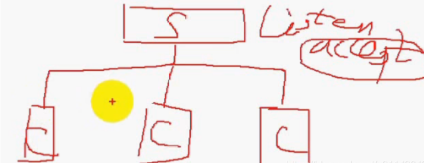
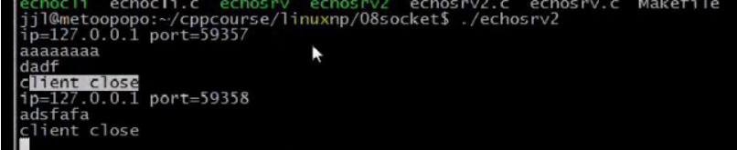
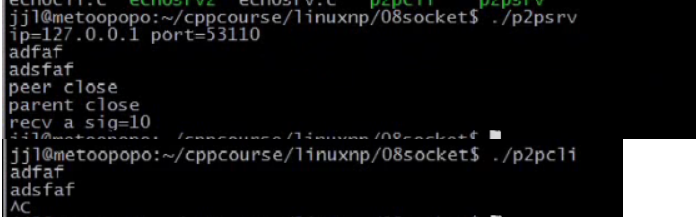
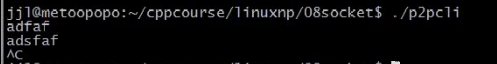

### 文章目录


[TOC]


## 1.处理多客户连接（process-per-connection）

 -    说明：  
        （1）父进程用来接收客户端的连接  
        （2）子进程处理与客户端的通信细节  
        （3）**服务端分为：监听套接字和已连接套接字**  
        监听套接字用来接收三次握手数据，三次握手完成，就将其放到已连接队列中，accept函数从已连接队列返回一个连接，即已连接套接字。  
        已连接套接字不能接收连接，他是主动套接字  
        （4）**客户端**只有已连接套接字  
      
 -    eg：NetworkProgramming-master \(1\)\\LinuxNetworkProgramming\\P8echosrv2.c

```cpp
//
// Created by wangji on 19-7-17.
//
#include <iostream>
#include <stdio.h>
#include <cstring>
#include <unistd.h>
#include <sys/types.h>
#include <sys/socket.h>
#include <netinet/in.h>
#include <arpa/inet.h>


using namespace std;


#define ERR_EXIT(m) \
        do  \
        {   \
            perror(m);  \
            exit(EXIT_FAILURE); \
        } while(0);

void do_service(int connfd)
{
    char recvbuf[1024];
    while (1)
    {
        memset(recvbuf, 0, sizeof(recvbuf));
        int ret = read(connfd, recvbuf, sizeof(recvbuf));
        if (ret == 0)//ret=0表明客户端关闭了
        {
            printf("client close\n");
            break;
        } else if (ret == -1)
        {
            ERR_EXIT("read");
        }
        fputs(recvbuf, stdout);
        write(connfd, recvbuf, ret);
    }

}

int main(int argc, char** argv) {
    // 1. 创建套接字
    int listenfd;
    if ((listenfd = socket(AF_INET, SOCK_STREAM, IPPROTO_TCP)) < 0) {
        ERR_EXIT("socket");
    }

    // 2. 分配套接字地址
    struct sockaddr_in servaddr;
    memset(&servaddr, 0, sizeof servaddr);
    servaddr.sin_family = AF_INET;
    servaddr.sin_port = htons(6666);
    servaddr.sin_addr.s_addr = htonl(INADDR_ANY);
    // servaddr.sin_addr.s_addr = inet_addr("127.0.0.1");
    // inet_aton("127.0.0.1", &servaddr.sin_addr);

    int on = 1;
    // 确保time_wait状态下同一端口仍可使用
    if (setsockopt(listenfd, SOL_SOCKET, SO_REUSEADDR, &on, sizeof(on)) < 0)
    {
        ERR_EXIT("setsockopt");
    }

    // 3. 绑定套接字地址
    if (bind(listenfd, (struct sockaddr*) &servaddr, sizeof(servaddr)) < 0) {
        ERR_EXIT("bind");
    }
    // 4. 等待连接请求状态
    if (listen(listenfd, SOMAXCONN) < 0) {
        ERR_EXIT("listen");
    }
    // 5. 允许连接
    struct sockaddr_in peeraddr;
    socklen_t peerlen = sizeof peeraddr;


    // 6. 数据交换
    pid_t pid;
    while (1)
    {
        int connfd;
        if ((connfd = accept(listenfd, (struct sockaddr *) &peeraddr, &peerlen)) < 0) {
            ERR_EXIT("accept");
        }

        printf("id = %s, ", inet_ntoa(peeraddr.sin_addr));
        printf("port = %d\n", ntohs(peeraddr.sin_port));

        pid = fork();

        if (pid == -1)
        {
            ERR_EXIT("fork");
        }
        if (pid == 0)   // 子进程处理通信
        {
            close(listenfd);//注意父子进程共享fd文件描述符，子进程不需要处理listenfd,所以close(listenfd)
            do_service(connfd);
            //printf("child exit\n");
            exit(EXIT_SUCCESS);//客户端关闭了，子进程要记住关闭，销毁子进程
        }
        else
        {
            //printf("parent exit\n");
            close(connfd);//注意父子进程共享fd文件描述符，父进程不需要处理连接，所以close(connfd)
        }


    }
    // 7. 断开连接
    close(listenfd);

    return 0;
}


```

 -    NetworkProgramming-master \(1\)\\LinuxNetworkProgramming\\P8echocli2.c

```cpp
//
// Created by wangji on 19-7-17.
//

#include <iostream>
#include <stdio.h>
#include <string.h>
#include <unistd.h>
#include <sys/types.h>
#include <sys/socket.h>
#include <netinet/in.h>
#include <arpa/inet.h>


using namespace std;

#define ERR_EXIT(m) \
        do  \
        {   \
            perror(m);  \
            exit(EXIT_FAILURE); \
        } while(0);

int main(int argc, char** argv) {
    // 1. 创建套接字
    int sockfd;
    if ((sockfd = socket(AF_INET, SOCK_STREAM, IPPROTO_TCP)) < 0) {
        ERR_EXIT("socket");
    }

    // 2. 分配套接字地址
    struct sockaddr_in servaddr;
    memset(&servaddr, 0, sizeof servaddr);
    servaddr.sin_family = AF_INET;
    servaddr.sin_port = htons(6666);
    // servaddr.sin_addr.s_addr = htonl(INADDR_ANY);
    servaddr.sin_addr.s_addr = inet_addr("127.0.0.1");
    // inet_aton("127.0.0.1", &servaddr.sin_addr);

    // 3. 请求链接
    if (connect(sockfd, (struct sockaddr *) &servaddr, sizeof servaddr) < 0) {
        ERR_EXIT("connect");
    }

    // 4. 数据交换
    char recvbuf[1024];
    char sendbuf[1024];
    while (fgets(sendbuf, sizeof sendbuf, stdin) != NULL)   // 键盘输入获取
    {
//        memset(recvbuf, 0, sizeof recvbuf);
//        memset(sendbuf, 0, sizeof sendbuf);
        write(sockfd, sendbuf, sizeof sendbuf); // 写入服务器
        int ret = read(sockfd, recvbuf, sizeof recvbuf);    // 服务器读取
        if (ret == 0)
        {
            printf("server close\n");
            break;
        } else if (ret == -1)
        {
            ERR_EXIT("read");
        }
        fputs(recvbuf, stdout); // 服务器返回数据输出

        // 清空
        memset(recvbuf, 0, sizeof recvbuf);
        memset(sendbuf, 0, sizeof sendbuf);
    }

    // 5. 断开连接
    close(sockfd);


    return 0;
}
```

- 测试：服务器端处理多个客户端连接



## 2.点对点聊天程序实现

 -    用多进程方式实现点对点聊天
 -    NetworkProgramming-master \(1\)\\LinuxNetworkProgramming\\P8p2pserv.c

```cpp
//
// Created by jxq on 19-7-17.
//
#include <iostream>
#include <stdio.h>
#include <string.h>
#include <unistd.h>
#include <sys/types.h>
#include <sys/socket.h>
#include <netinet/in.h>
#include <arpa/inet.h>
#include <signal.h>


using namespace std;

#define ERR_EXIT(m) \
        do  \
        {   \
            perror(m);  \
            exit(EXIT_FAILURE); \
        } while(0);

void do_service(int connfd)
{
    char recvbuf[1024];
    while (1)
    {
        memset(recvbuf, 0, sizeof recvbuf);
        int ret = read(connfd, recvbuf, sizeof recvbuf);
        if (ret == 0)
        {
            printf("client close\n");
            break;
        } else if (ret == -1)
        {
            ERR_EXIT("read");
        }
        fputs(recvbuf, stdout);
        write(connfd, recvbuf, ret);
    }

}

void handler(int sig)
{
    printf("recv a sig = %d\n", sig);
    exit(EXIT_SUCCESS);
}

int main(int argc, char** argv) {
    // 1. 创建套接字
    int listenfd;
    if ((listenfd = socket(AF_INET, SOCK_STREAM, IPPROTO_TCP)) < 0) {
        ERR_EXIT("socket");
    }

    // 2. 分配套接字地址
    struct sockaddr_in servaddr;
    memset(&servaddr, 0, sizeof servaddr);
    servaddr.sin_family = AF_INET;
    servaddr.sin_port = htons(6666);
    servaddr.sin_addr.s_addr = htonl(INADDR_ANY);
    // servaddr.sin_addr.s_addr = inet_addr("127.0.0.1");
    // inet_aton("127.0.0.1", &servaddr.sin_addr);

    int on = 1;
    // 确保time_wait状态下同一端口仍可使用
    if (setsockopt(listenfd, SOL_SOCKET, SO_REUSEADDR, &on, sizeof on) < 0)
    {
        ERR_EXIT("setsockopt");
    }

    // 3. 绑定套接字地址
    if (bind(listenfd, (struct sockaddr*) &servaddr, sizeof servaddr) < 0) {
        ERR_EXIT("bind");
    }
    // 4. 等待连接请求状态
    if (listen(listenfd, SOMAXCONN) < 0) {
        ERR_EXIT("listen");
    }
    // 5. 允许连接
    struct sockaddr_in peeraddr;
    socklen_t peerlen = sizeof peeraddr;
    int connfd;
    if ((connfd = accept(listenfd, (struct sockaddr *) &peeraddr, &peerlen)) < 0) {
        ERR_EXIT("accept");
    }

    // 6. 数据交换
    pid_t pid;
    pid = fork();
    char sendbuf[1024];
    char recvbuf[1024];
    if (pid == -1)
    {
        ERR_EXIT("fork");
    }
    if (pid == 0)   // 子进程
    {//发送数据进程
        signal(SIGUSR1, handler);
        while (fgets(sendbuf, sizeof(sendbuf), stdin) != NULL)
        {
            write(connfd, sendbuf, sizeof(sendbuf_);
            memset(sendbuf, 0, sizeof(sendbuf));//发送完数据清空，因为防止后面消息覆盖前面的消息
        }
        printf("child exit\n");
        exit(EXIT_SUCCESS);
    }
    else//接收数据的进程
    {
        while (1)
        {
            memset(recvbuf, 0, sizeof recvbuf);
            int ret = read(connfd, recvbuf, sizeof recvbuf);
            if (ret == -1)
            {
                ERR_EXIT("read");
            }
            else if (ret == 0)
            {
                printf("peer close\n");
                break;
            }
            fputs(recvbuf, stdout);
        }
        printf("parent exit\n");
        kill(pid, SIGUSR1);//父进程退出时，向子进程发送信号
        exit(EXIT_SUCCESS);
    }

    // 7. 断开连接
    close(connfd);
    close(listenfd);

    return 0;
}
```

 -    NetworkProgramming-master \(1\)\\LinuxNetworkProgramming\\P8p2pcli.c

```cpp
//
// Created by jxq on 19-7-17.
//
#include <iostream>
#include <stdio.h>
#include <string.h>
#include <unistd.h>
#include <sys/types.h>
#include <sys/socket.h>
#include <netinet/in.h>
#include <arpa/inet.h>
#include <signal.h>


using namespace std;

#define ERR_EXIT(m) \
        do  \
        {   \
            perror(m);  \
            exit(EXIT_FAILURE); \
        } while(0);

void do_service(int connfd)
{
    char recvbuf[1024];
    while (1)
    {
        memset(recvbuf, 0, sizeof recvbuf);
        int ret = read(connfd, recvbuf, sizeof recvbuf);
        if (ret == 0)
        {
            printf("client close\n");
            break;
        } else if (ret == -1)
        {
            ERR_EXIT("read");
        }
        fputs(recvbuf, stdout);
        write(connfd, recvbuf, ret);
    }

}

void handler(int sig)
{
    printf("recv a sig = %d\n", sig);
    exit(EXIT_SUCCESS);
}

int main(int argc, char** argv) {
     // 1. 创建套接字
    int sockfd;
    //0表示内核去自动选择协议
    //if ((sockfd = socket(AF_INET, SOCK_STREAM, 0)) < 0)
    if ((sockfd = socket(AF_INET, SOCK_STREAM, IPPROTO_TCP)) < 0) {
        ERR_EXIT("socket");
    }

    // 2. 分配套接字地址
    struct sockaddr_in servaddr;
    memset(&servaddr, 0, sizeof servaddr);
    servaddr.sin_family = AF_INET;//地址族一般用AF_INET
    servaddr.sin_port = htons(6666);//需要网络字节序的端口号
    // servaddr.sin_addr.s_addr = htonl(INADDR_ANY);//INADDR_ANY表示本机任意地址
     servaddr.sin_addr.s_addr = inet_addr("127.0.0.1");
    // inet_aton("127.0.0.1", &servaddr.sin_addr);


    // 3. 请求链接
    if (connect(sockfd, (struct sockaddr *) &servaddr, sizeof(servaddr)) < 0) {
        ERR_EXIT("connect");
    }

    // 6. 数据交换
    pid_t pid;
    pid = fork();
    
    
    if (pid == -1)
    {
        ERR_EXIT("fork");
    }
    if (pid == 0)   // 子进程
    {//接收数据进程
        while (1)
        {
            char recvbuf[1024];
            memset(recvbuf, 0, sizeof recvbuf);
            int ret = read(sockfd, recvbuf, sizeof recvbuf);
            if (ret == -1)
            {
                ERR_EXIT("read");
            }
            else if (ret == 0)
            {
                printf("peer close\n");
                break;
            }
            fputs(recvbuf, stdout);
        }
        close(sockfd);
        kill(getppid(), SIGUR1);//getppid获取父进程pid，这里通知父进程
    }
    else//发送数据的进程
    {
        signal(SIGUR1, handler);
        char sendbuf[1024];
        while (fgets(sendbuf, sizeof(sendbuf), stdin) != NULL)
        {
            write(sockfd, sendbuf, sizeof(sendbuf_);
            memset(sendbuf, 0, sizeof(sendbuf));//发送完数据清空，因为防止后面消息覆盖前面的消息
        }
        printf("child exit\n");
        close(sockfd);
    }

    // 7. 断开连接
    close(sockfd);

    return 0;
}
```

- 测试：  
    
  当服务端的父进程退出时，也可以通知服务端的子进程退出  
    
  
  - Makefile

```cpp
.PHONY:clean all
CC=gcc
CFLAGS=-Wall -g
BIN=echosrv echocli echosrv2 p2psrv p2pcli
all:$(BIN)
%.o:%.c
	$(CC) $(CFLAGS) -c $< -o $@
clean:
	rm -f *.o $(BIN)
```