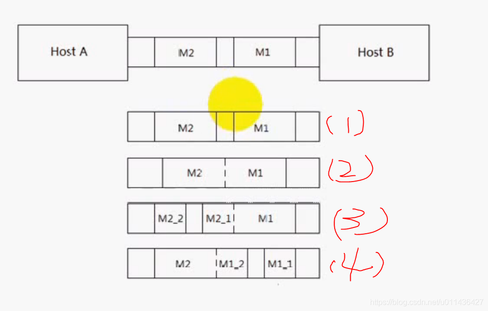
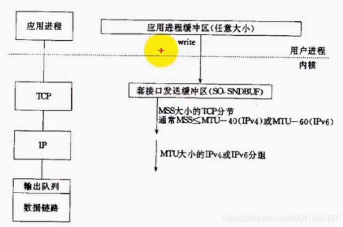
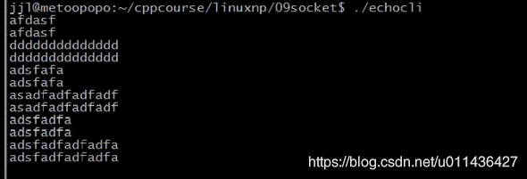

### 文章目录

- - [1.流协议与粘\(nian\)包](#1nian_2)
  - [2.粘包产生的原因](#2_10)
  - [4.粘包处理方案](#4_18)
  - [5.readn，writen](#5readnwriten_29)
  - [6.回射客户/服务器](#6_32)

## 1.流协议与粘\(nian\)包

- tcp是基于字节流的传输服务\(字节流是无边界的\)，**像流水一样，无法区分边界**，他不能保证对等方一次读操作能够返回多少字节。  
  eg：hostA发送两个数据包给hostB，对于hostB来讲，他可能有以下四种情况：例如第\(2\)，一次性读取M1和M2的所有消息，这里M1和M2就粘在一起了。  
  第（3）第一次读操作返回M1消息的全部和M2条消息的一部分\(M2\_1\)，第二次读操作返回M2条消息的一部分\(M2\_2\)

- udp是基于消息的报文，是有边界的  
  

## 2.粘包产生的原因

- tcp会有粘包问题  
  （1）write将应用进程缓冲区的数据拷贝到套接口发送缓冲区中，当应用进程缓冲区的大小超过了套接口发送缓冲区SO\_SNDBUF的大小，就有可能产生粘包问题，可能一部分已经发送出去了，对方已经接收，另外一部分才发送套接口发送缓冲区进行发送，**对方延迟接收后一部分数据，导致粘包问题，这里的原因是：数据包的分割**  
  （2）TCP最大段MSS的限制，可能会对发送的消息进行分割，可能会产生粘包问题  
  （3）应用层的最大传输单元MTU的限制，若发送的数据包超过MTU，会在IP层进行分组或分片，可能会对发送的消息进行分割，可能会产生粘包问题  
  （4）tcp的流控，拥塞控制，延迟发送机制都有可能产生粘包问题  
  

## 4.粘包处理方案

- 本质上是要在应用层维护消息与消息的边界  
  **（1）定长包**  
  （2）包尾加\\r\\n（ftp就是这么用的）  
  消息若本来就有\\r\\n，\\r\\n本来就是消息的一部分的话，则需要转义的方式  
  **（3）包头加上包体长度**  
  可以先接收包头，然后通过包头计算出包体的长度，然后才接收包体所对应的数据包  
  （4）更复杂的应用层协议

## 5.readn，writen

- 具体实现已经在6中回射服务器中了

## 6.回射客户/服务器

### （1）以定长的方式收发数据

  NetworkProgramming-master \(1\)\\LinuxNetworkProgramming\\P9echosrv.c  
  NetworkProgramming-master \(1\)\\LinuxNetworkProgramming\\P9echocli.c

```cpp
==================NetworkProgramming-master (1)\LinuxNetworkProgramming\P9echosrv.c=============================
//
// Created by wangji on 19-7-21.
//

#include <iostream>
#include <stdio.h>
#include <string.h>
#include <unistd.h>
#include <sys/types.h>
#include <sys/socket.h>
#include <netinet/in.h>
#include <arpa/inet.h>


using namespace std;

struct packet
{
    int len;
    char buf[1024];
};

#define ERR_EXIT(m) \
        do  \
        {   \
            perror(m);  \
            exit(EXIT_FAILURE); \
        } while(0);

//参考man 2 read声明写出来的
//ssize_t是无符号整数
ssize_t readn(int fd, void *buf, size_t count)
{
    size_t nleft = count;   // 剩余字节数
    ssize_t nread;//已接收字节数
    char *bufp = (char*) buf;

    while (nleft > 0)
    {
        if ((nread = read(fd, bufp, nleft)) < 0)
        {
            if (errno == EINTR)
                continue;
            return  -1;
        } 
        else if (nread == 0)//表示读取到了EOF，表示对方关闭
            return count - nleft;//表示剩余的字节数

        bufp += nread;//读到的nread，要将bufp指针偏移
        nleft -= nread;
    }
    return count;
}

//参考man 2 write声明写出来的
ssize_t writen(int fd, const void *buf, size_t count)
{
    size_t nleft = count;//剩余要发送的字节数
    ssize_t nwritten;
    char* bufp = (char*)buf;

    while (nleft > 0)
    {
        //write一般不会阻塞，缓冲区数据大于发送的数据，就能够成功将数据拷贝到缓冲区中
        if ((nwritten = write(fd, bufp, nleft)) < 0)
        {
            if (errno == EINTR)
            {
                continue;
            }
            return -1;
        }
        else if (nwritten == 0)
        {
            continue;
        }
        bufp += nwritten;//已发送字节数
        nleft -= nwritten;//剩余字节数
    }
    return count;
}

void do_service(int connfd)
{
    char recvbuf[1024];
    int n;
    while (1)
    {
        memset(&recvbuf, 0, sizeof(recvbuf));
        int ret = readn(connfd, recvbuf, sizeof(recvbuf));
        if (ret == -1)
        {
            ERR_EXIT("read");
        }
        else if (ret == 0)
        {
            printf("client close\n");
            break;
        }

        fputs(recvbuf.buf, stdout);
        writen(connfd, recvbuf, 1024);
    }

}

int main(int argc, char** argv) {
    // 1. 创建套接字
    int listenfd;
    if ((listenfd = socket(AF_INET, SOCK_STREAM, IPPROTO_TCP)) < 0) {
        ERR_EXIT("socket");
    }

    // 2. 分配套接字地址
    struct sockaddr_in servaddr;
    memset(&servaddr, 0, sizeof(servaddr));
    servaddr.sin_family = AF_INET;
    servaddr.sin_port = htons(6666);
    servaddr.sin_addr.s_addr = htonl(INADDR_ANY);
    // servaddr.sin_addr.s_addr = inet_addr("127.0.0.1");
    // inet_aton("127.0.0.1", &servaddr.sin_addr);

    int on = 1;
    // 确保time_wait状态下同一端口仍可使用
    if (setsockopt(listenfd, SOL_SOCKET, SO_REUSEADDR, &on, sizeof(on)) < 0)
    {
        ERR_EXIT("setsockopt");
    }

    // 3. 绑定套接字地址
    if (bind(listenfd, (struct sockaddr*) &servaddr, sizeof(servaddr)) < 0) {
        ERR_EXIT("bind");
    }
    // 4. 等待连接请求状态
    if (listen(listenfd, SOMAXCONN) < 0) {
        ERR_EXIT("listen");
    }
    // 5. 允许连接
    struct sockaddr_in peeraddr;
    socklen_t peerlen = sizeof(peeraddr);


    // 6. 数据交换
    pid_t pid;
    while (1)
    {
        int connfd;
        if ((connfd = accept(listenfd, (struct sockaddr *) &peeraddr, &peerlen)) < 0) {
            ERR_EXIT("accept");
        }

        printf("id = %s, ", inet_ntoa(peeraddr.sin_addr));
        printf("port = %d\n", ntohs(peeraddr.sin_port));

        pid = fork();

        if (pid == -1)
        {
            ERR_EXIT("fork");
        }
        if (pid == 0)   // 子进程
        {
            close(listenfd);
            do_service(connfd);
            //printf("child exit\n");
            exit(EXIT_SUCCESS);
        }
        else
        {
            //printf("parent exit\n");
            close(connfd);
        }


    }
    // 7. 断开连接
    close(listenfd);


    return 0;
}


```

```cpp
==================NetworkProgramming-master (1)\LinuxNetworkProgramming\P9echocli.c=============================
//
// Created by wangji on 19-7-21.
//

#include <iostream>
#include <stdio.h>
#include <string.h>
#include <unistd.h>
#include <sys/types.h>
#include <sys/socket.h>
#include <netinet/in.h>
#include <arpa/inet.h>


using namespace std;

#define ERR_EXIT(m) \
        do  \
        {   \
            perror(m);  \
            exit(EXIT_FAILURE); \
        } while(0);

//参考man 2 read声明写出来的
//ssize_t是无符号整数
ssize_t readn(int fd, void *buf, size_t count)
{
    size_t nleft = count;   // 剩余字节数
    ssize_t nread;//已接收字节数
    char *bufp = (char*) buf;

    while (nleft > 0)
    {
        if ((nread = read(fd, bufp, nleft)) < 0)
        {
            if (errno == EINTR)
                continue;
            return  -1;
        } 
        else if (nread == 0)//表示读取到了EOF，表示对方关闭
            return count - nleft;//表示剩余的字节数

        bufp += nread;//读到的nread，要将bufp指针偏移
        nleft -= nread;
    }
    return count;
}

//参考man 2 write声明写出来的
ssize_t writen(int fd, const void *buf, size_t count)
{
    size_t nleft = count;//剩余要发送的字节数
    ssize_t nwritten;
    char* bufp = (char*)buf;

    while (nleft > 0)
    {
        //write一般不会阻塞，缓冲区数据大于发送的数据，就能够成功将数据拷贝到缓冲区中
        if ((nwritten = write(fd, bufp, nleft)) < 0)
        {
            if (errno == EINTR)
            {
                continue;
            }
            return -1;
        }
        else if (nwritten == 0)
        {
            continue;
        }
        bufp += nwritten;//已发送字节数
        nleft -= nwritten;//剩余字节数
    }
    return count;
}

int main(int argc, char** argv) {
    // 1. 创建套接字
    int sockfd;
    if ((sockfd = socket(AF_INET, SOCK_STREAM, IPPROTO_TCP)) < 0) {
        ERR_EXIT("socket");
    }

    // 2. 分配套接字地址
    struct sockaddr_in servaddr;
    memset(&servaddr, 0, sizeof(servaddr));
    servaddr.sin_family = AF_INET;
    servaddr.sin_port = htons(6666);
    // servaddr.sin_addr.s_addr = htonl(INADDR_ANY);
    servaddr.sin_addr.s_addr = inet_addr("127.0.0.1");
    // inet_aton("127.0.0.1", &servaddr.sin_addr);

    // 3. 请求链接
    if (connect(sockfd, (struct sockaddr *) &servaddr, sizeof(servaddr)) < 0) {
        ERR_EXIT("connect");
    }

    // 4. 数据交换
   char recvbuf[1024]={0};
   char sendbuf[1024]={0};
    int n = 0;
    while (fgets((sendbuf), sizeof(sendbuf), stdin) != NULL)   // 键盘输入获取
    {
        //发送定长包，缺点：若发送数据小，但是发的是定长包，会对网络造成负担
        writen(sockfd, sendbuf,sizeof(sendbuf));//发送和接收都是1024个字节
        readn(sockfd, recvbuf,sizeof(recvbuf));

        fputs(recvbuf, stdout);
        memset(sendbuf, 0, sizeof(sendbuf));
        memset(recvbuf, 0, sizeof(recvbuf));
    }

    // 5. 断开连接
    close(sockfd);


    return 0;
}


```

 -    


### （2） 发送的数据包是头部+包体

 -    （2）<font color='red'>发送的数据包是头部+包体，接收的时候：先接收包头，接收完毕后，将数据包的长度计算出来，再接收对应的长度，**对消息与消息之间进行了区分**  </font>
 -      NetworkProgramming-master \(1\)\\LinuxNetworkProgramming\\P9echosrv3.c  
        NetworkProgramming-master \(1\)\\LinuxNetworkProgramming\\P9echocli3.c

```cpp
=====================================NetworkProgramming-master (1)\LinuxNetworkProgramming\P9echosrv3.c=============

//
// Created by wangji on 19-7-21.
//

#include <iostream>
#include <stdio.h>
#include <string.h>
#include <unistd.h>
#include <sys/types.h>
#include <sys/socket.h>
#include <netinet/in.h>
#include <arpa/inet.h>


using namespace std;

struct packet
{
    int len;
    char buf[1024];
};

#define ERR_EXIT(m) \
        do  \
        {   \
            perror(m);  \
            exit(EXIT_FAILURE); \
        } while(0);

//参考man 2 read声明写出来的
//ssize_t是无符号整数
ssize_t readn(int fd, void *buf, size_t count)
{
    size_t nleft = count;   // 剩余字节数
    ssize_t nread;//已接收字节数
    char *bufp = (char*) buf;

    while (nleft > 0)
    {
        if ((nread = read(fd, bufp, nleft)) < 0)
        {
            if (errno == EINTR)
                continue;
            return  -1;
        } 
        else if (nread == 0)//表示读取到了EOF，表示对方关闭
            return count - nleft;//表示剩余的字节数

        bufp += nread;//读到的nread，要将bufp指针偏移
        nleft -= nread;
    }
    return count;
}

//参考man 2 write声明写出来的
ssize_t writen(int fd, const void *buf, size_t count)
{
    size_t nleft = count;//剩余要发送的字节数
    ssize_t nwritten;
    char* bufp = (char*)buf;

    while (nleft > 0)
    {
        //write一般不会阻塞，缓冲区数据大于发送的数据，就能够成功将数据拷贝到缓冲区中
        if ((nwritten = write(fd, bufp, nleft)) < 0)
        {
            if (errno == EINTR)
            {
                continue;
            }
            return -1;
        }
        else if (nwritten == 0)
        {
            continue;
        }
        bufp += nwritten;//已发送字节数
        nleft -= nwritten;//剩余字节数
    }
    return count;
}

void do_service(int connfd)
{
    // char recvbuf[1024];
    struct packet recvbuf;
    int n;
    while (1)
    {
        memset(&recvbuf, 0, sizeof recvbuf);
        int ret = readn(connfd, &recvbuf.len, 4);//先接收头部
        if (ret == -1)
        {
            ERR_EXIT("read");
        }
        else if (ret < 4)
        {
            printf("client close\n");
            break;
        }

        n = ntohl(recvbuf.len);//转换程主机字节序，包体实际长度n
        ret = readn(connfd, recvbuf.buf, n);//接收包体
        if (ret == -1)
        {
            ERR_EXIT("read");
        }
        else if (ret < n)
        {
            printf("client close\n");
            break;
        }
        fputs(recvbuf.buf, stdout);
        writen(connfd, &recvbuf, 4+n);
    }

}

int main(int argc, char** argv) {
    // 1. 创建套接字
    int listenfd;
    if ((listenfd = socket(AF_INET, SOCK_STREAM, IPPROTO_TCP)) < 0) {
        ERR_EXIT("socket");
    }

    // 2. 分配套接字地址
    struct sockaddr_in servaddr;
    memset(&servaddr, 0, sizeof servaddr);
    servaddr.sin_family = AF_INET;
    servaddr.sin_port = htons(6666);
    servaddr.sin_addr.s_addr = htonl(INADDR_ANY);
    // servaddr.sin_addr.s_addr = inet_addr("127.0.0.1");
    // inet_aton("127.0.0.1", &servaddr.sin_addr);

    int on = 1;
    // 确保time_wait状态下同一端口仍可使用
    if (setsockopt(listenfd, SOL_SOCKET, SO_REUSEADDR, &on, sizeof(on)) < 0)
    {
        ERR_EXIT("setsockopt");
    }

    // 3. 绑定套接字地址
    if (bind(listenfd, (struct sockaddr*) &servaddr, sizeof(servaddr)) < 0) {
        ERR_EXIT("bind");
    }
    // 4. 等待连接请求状态
    if (listen(listenfd, SOMAXCONN) < 0) {
        ERR_EXIT("listen");
    }
    // 5. 允许连接
    struct sockaddr_in peeraddr;
    socklen_t peerlen = sizeof(peeraddr);


    // 6. 数据交换
    pid_t pid;
    while (1)
    {
        int connfd;
        if ((connfd = accept(listenfd, (struct sockaddr *) &peeraddr, &peerlen)) < 0) {
            ERR_EXIT("accept");
        }

        printf("id = %s, ", inet_ntoa(peeraddr.sin_addr));
        printf("port = %d\n", ntohs(peeraddr.sin_port));

        pid = fork();

        if (pid == -1)
        {
            ERR_EXIT("fork");
        }
        if (pid == 0)   // 子进程
        {
            close(listenfd);
            do_service(connfd);
            //printf("child exit\n");
            exit(EXIT_SUCCESS);
        }
        else
        {
            //printf("parent exit\n");
            close(connfd);
        }


    }
    // 7. 断开连接
    close(listenfd);


    return 0;
}

```

```cpp
=================================NetworkProgramming-master (1)\LinuxNetworkProgramming\P9echocli3.c=============

//
// Created by wangji on 19-7-21.
//

#include <iostream>
#include <stdio.h>
#include <string.h>
#include <unistd.h>
#include <sys/types.h>
#include <sys/socket.h>
#include <netinet/in.h>
#include <arpa/inet.h>


using namespace std;

struct packet
{
    int len;//包头：存放包体实际的数据长度
    char buf[1024];//包体
};

#define ERR_EXIT(m) \
        do  \
        {   \
            perror(m);  \
            exit(EXIT_FAILURE); \
        } while(0);

/参考man 2 read声明写出来的
//ssize_t是无符号整数
ssize_t readn(int fd, void *buf, size_t count)
{
    size_t nleft = count;   // 剩余字节数
    ssize_t nread;//已接收字节数
    char *bufp = (char*) buf;

    while (nleft > 0)
    {
        if ((nread = read(fd, bufp, nleft)) < 0)
        {
            if (errno == EINTR)
                continue;
            return  -1;
        } 
        else if (nread == 0)//表示读取到了EOF，表示对方关闭
            return count - nleft;//表示剩余的字节数

        bufp += nread;//读到的nread，要将bufp指针偏移
        nleft -= nread;
    }
    return count;
}

//参考man 2 write声明写出来的
ssize_t writen(int fd, const void *buf, size_t count)
{
    size_t nleft = count;//剩余要发送的字节数
    ssize_t nwritten;
    char* bufp = (char*)buf;

    while (nleft > 0)
    {
        //write一般不会阻塞，缓冲区数据大于发送的数据，就能够成功将数据拷贝到缓冲区中
        if ((nwritten = write(fd, bufp, nleft)) < 0)
        {
            if (errno == EINTR)
            {
                continue;
            }
            return -1;
        }
        else if (nwritten == 0)
        {
            continue;
        }
        bufp += nwritten;//已发送字节数
        nleft -= nwritten;//剩余字节数
    }
    return count;
}

int main(int argc, char** argv) {
    // 1. 创建套接字
    int sockfd;
    if ((sockfd = socket(AF_INET, SOCK_STREAM, IPPROTO_TCP)) < 0) {
        ERR_EXIT("socket");
    }

    // 2. 分配套接字地址
    struct sockaddr_in servaddr;
    memset(&servaddr, 0, sizeof(servaddr));
    servaddr.sin_family = AF_INET;
    servaddr.sin_port = htons(6666);
    // servaddr.sin_addr.s_addr = htonl(INADDR_ANY);
    servaddr.sin_addr.s_addr = inet_addr("127.0.0.1");
    // inet_aton("127.0.0.1", &servaddr.sin_addr);

    // 3. 请求链接
    if (connect(sockfd, (struct sockaddr *) &servaddr, sizeof(servaddr)) < 0) {
        ERR_EXIT("connect");
    }

    // 4. 数据交换
//    char recvbuf[1024];
//    char sendbuf[1024];
    struct packet recvbuf;
    struct packet sendbuf;
    memset(&recvbuf, 0, sizeof(recvbuf));
    memset(&sendbuf, 0, sizeof(sendbuf));
    int n = 0;
    while (fgets(sendbuf.buf, sizeof(sendbuf.buf), stdin) != NULL)   // 键盘输入获取
    {
        n = strlen(sendbuf.buf);//n是包体的长度
        sendbuf.len = htonl(n); // 主机字节序转换为网络字节序
        writen(sockfd, &sendbuf, 4+n); // 头部4字节+包体

        int ret = readn(sockfd, &recvbuf.len, 4); //先接收头部
        if (ret == -1)
        {
            ERR_EXIT("read");
        }
        else if (ret < 4)
        {
            printf("server close\n");
            break;
        }

        n = ntohl(recvbuf.len);//转换程主机字节序
        ret = readn(sockfd, &recvbuf.buf, n);//接收包体
        if (ret == -1)
        {
            ERR_EXIT("read");
        }
        else if (ret < n)
        {
            printf("server close\n");
            break;
        }

        fputs(recvbuf.buf, stdout); //将接收到的数据输出

        // 清空
        memset(&recvbuf, 0, sizeof(recvbuf));
        memset(&sendbuf, 0, sizeof(sendbuf));
    }

    // 5. 断开连接
    close(sockfd);


    return 0;
}
```

 -    测试：  
        
 -    Makefile

```cpp
.PHONY:clean all
CC=gcc
CFLAGS=-Wall -g
BIN=echosrv echocli
all:$(BIN)
%.o:%.c
	$(CC) $(CFLAGS) -c $< -o $@
clean:
	rm -f *.o $(BIN)
```

